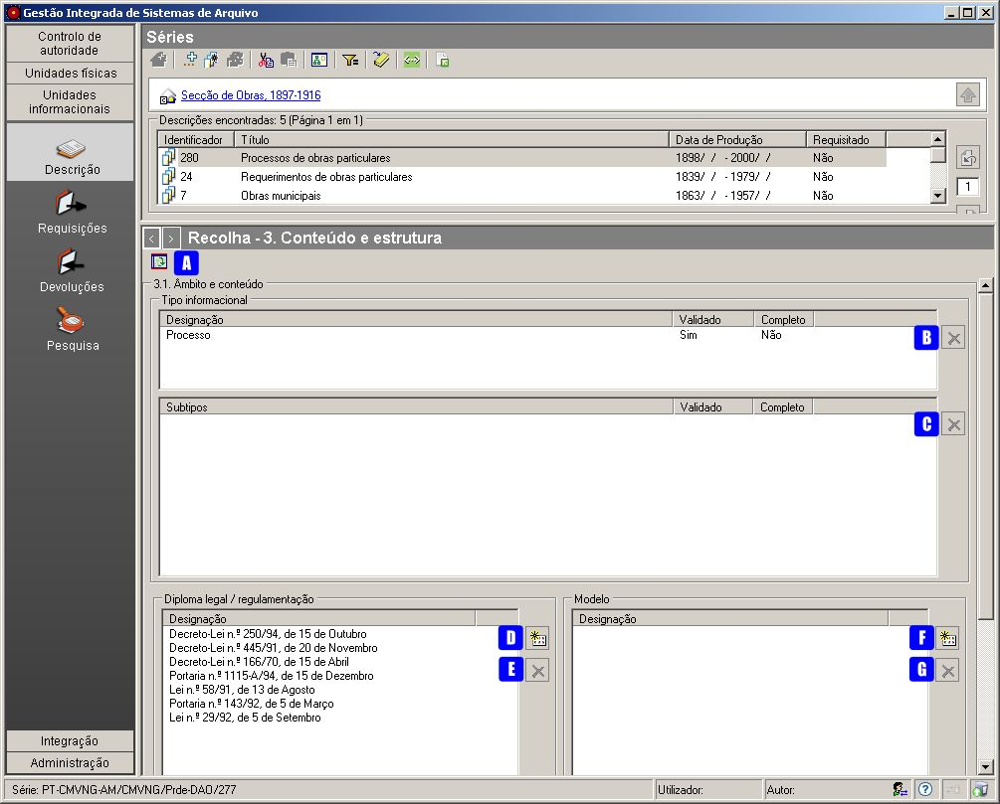
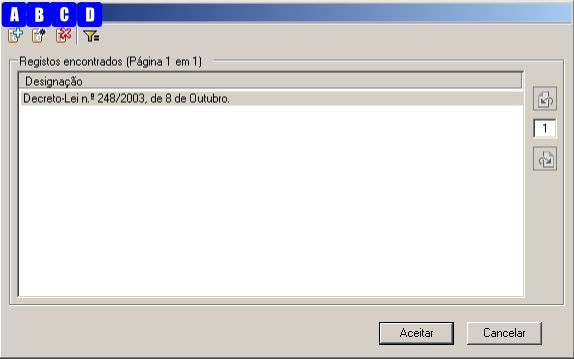
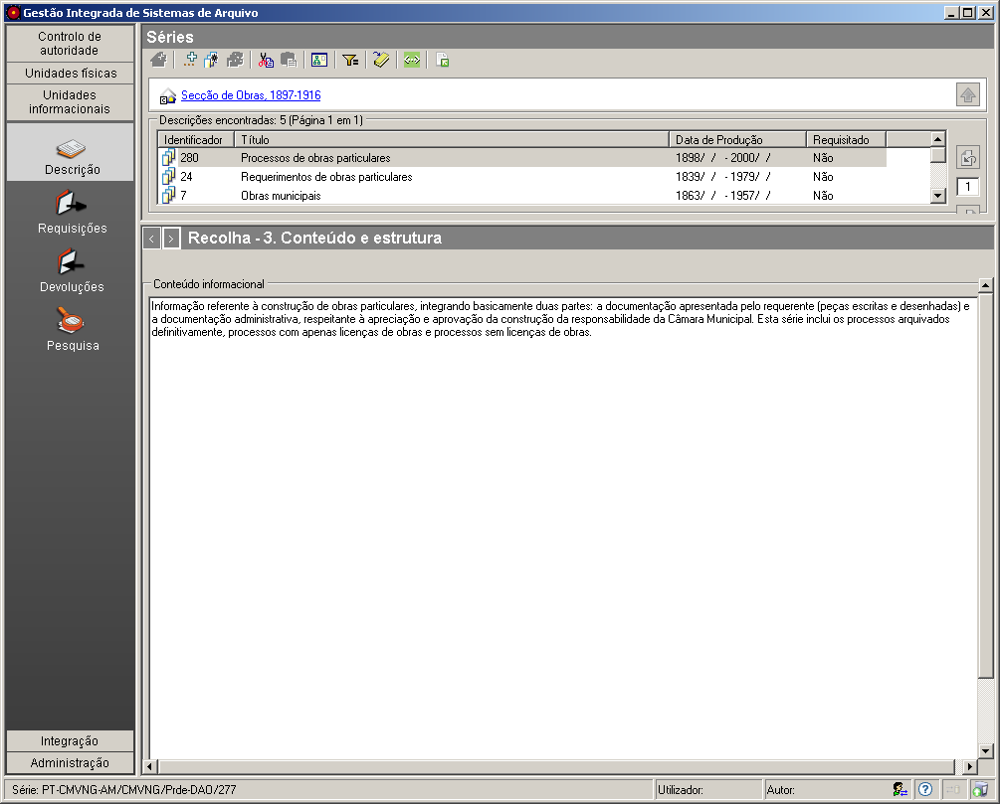

3.1 Âmbito e conteúdo
=====================

*Âmbito e conteúdo* é um painel da zona *Conteúdo e estrutura* que faz
parte da `descrição
multinível <descricao_ui.html#descricao-multinivel>`__ da ISAD(G).

|image0|

A: ``Apresentar/esconder painel de apoio`` - Botão que apresenta ou
esconde a lista de todas as entidades produtoras existentes.

B: ``Apagar item`` - Remove do campo ``Tipo informacional`` a tipologia
informacional associada à unidade de descrição de contexto. Em vez deste
botão, também se pode utilizar a tecla ``DEL``. C: ``Apagar item`` -
Remove do campo ``Subtipos informacionais`` as tipologias
informacionais, associadas à unidade de descrição de contexto. Em vez
deste botão, também se pode utilizar a tecla ``DEL``.

D: ``Adicionar item`` - Permite associar um diploma de uma lista de
diplomas.

E: ``Apagar item`` - Permite remover um diploma associado. Em vez deste
botão também se pode utilizar a tecla ``DEL``.

F: ``Adicionar item`` - Permite associar um modelo de uma lista de
modelos.

G: ``Apagar item`` - Permite remover um modelo associado. Em vez deste
botão também se pode utilizar a tecla ``DEL``.

Tipo informacional
------------------

Para preencher o *Tipo informacional* ou os *Subtipos informacionais*:

1. Clicar no botão ``Apresentar/esconder painel de apoio`` para na área
de contexto ser mostrada a lista de todas ``Tipologias informacionais``
criadas como registos de autoridade.

2. Selecionar da lista paginada o termo correspondente ao registo de
autoridade que se pretende associar ao nível de descrição, podendo
recorrer-se ao filtro. Se o termo não existir na lista, deve ser criado
e para isso consultar a página `Tipologia
informacional <tipologia_informacional.html>`__. 3. Arrastar o termo
para o campo ``Tipo informacional`` ou ``Subtipos informacionais``,
conforme se pretenda.

Para apagar qualquer termo associado à unidade de descrição, basta
selecioná-lo no campo e clicar no botão ``Apagar item`` que se encontra
à direita (B ou C).

Diplomas e modelos
------------------

Os campos ``Diploma legal/regulamentação`` e ``Modelo`` são preenchidos
da mesma forma, clicando no botão ``Adicionar item``, ao lado direito de
cada campo.

|image1|

A janela mostra a lista de ``Diplomas`` existentes para se poder
selecionar o que se pretende inserir no campo
``Diploma Legal/regulamentação``.

Seleciona-se um elemento da lista de ``Diplomas`` (ou de *Modelos*) e
clica-se no botão ``Aceitar`` para adicionar ou ``Cancelar`` para
desistir.

A gestão desta lista é feita através da barra de ferramentas que
apresenta os seguintes botões de comando:

A: ``Novo diploma/modelo`` - Permite adicionar novos diplomas ou
modelos, consoante a lista que se está a visualizar.

B: ``Editar diploma/modelo`` - Permite alterar o diploma ou o modelo
selecionado, consoante a lista que se está a visualizar.

C: ``Apagar diploma/modelo`` - Remove o diploma ou o modelo selecionado,
consoante a lista que se está a visualizar.

D: ``Filtrar dados`` - Permite visualizar parte da lista.

Conteúdo informacional
----------------------

|image2|

O campo ``Conteúdo informacional``, onde se insere um texto resumido
sobre o conteúdo da unidade informacional, permitindo aos utilizadores
avaliar a potencial relevância da informação descrita.

