3.2 Avaliação, seleção e eliminação
===================================

*Avaliação, seleção e eliminação* é um conjunto de painéis, destinado à
avaliação documental, que fazem parte da zona *Conteúdo e estrutura*
pertencente à `descrição
multinível <descricao_ui.html#descricao-multinivel>`__ da ISAD(G).

São três os painéis que permitem o registo de informação sobre qualquer
ação relativa à ``Avaliação, seleção e eliminação`` das unidades
documentais e à ``Publicação`` de todas as unidades de descrição.

Existem duas etapas distintas relacionadas com a
``Avaliação, seleção e eliminação`` de unidades documentais:

1. `Avaliação de um nível
documental <avaliacao.html#avaliacao-de-um-nivel-documental>`__ do tipo
*Série*, *Subsérie* ou *Documento/Processo* que não constitua série.

2. `Avaliação, seleção e eliminação do conteúdo (documentos ou unidades
físicas) de um nível documental do tipo Série ou
Subsérie <avaliacao.html#avaliacao-selecao-eliminacao-e-publicacao-dos-conteudos-de-um-nivel-documental>`__,
com base na avaliação efetuada na etapa anterior.

Avaliação de um nível documental
--------------------------------

A decisão sobre o destino final da informação, pode ter duas abordagens
diferentes:

-  abordagem sistémica ou

\* abordagem baseada numa tabela de seleção (estipulada por portaria).

No painel a seguir mostra-se o ambiente de trabalho para executar a 1ª
etapa da operação de avaliação.

|image0|

A: ``Área de avaliação sistémica`` - Permite a recolha de dados para
decidir, segundo esta abordagem, o destino final da informação. Esta
área só aparece ativa no caso de níveis do tipo ``Série`` ou
``Subsérie`` ou então do tipo ``Documento/Processo`` quando este não
constitui série.

B: ``Área de avaliação baseada numa tabela de seleção`` - Permite
indicar os termos legais em que foi decidido o destino da informação.
Esta área também só aparece ativa no caso de níveis do tipo *Série* ou
*Subsérie* ou então do tipo *Documento/Processo* quando este não
constitui série.

C: ``Destino final`` - Destino final atribuído à informação em questão e
prazo de eliminação. Esta área só aparece ativa nos níveis documentais,
exceto no caso de níveis do tipo
``Documento subordinado/Ato informacional``, cujo destino depende sempre
do nível do tipo ``Documento/Processo`` ao qual pertence.

D: ``Auto de eliminação`` - Campo que permite incluir um nível
arquivístico selecionado num auto de eliminação . Este campo só fica
ativo quando o nível selecionado é do tipo ``Documento/Processo`` e o
``Destino final`` é ``Eliminação``.

E: ``Publicação`` - Permite publicar ou não o nível de descrição
arquivística em questão, ou seja, torná-lo visível ou não no módulo de
pesquisa web.

F: ``Observações`` - Observações ao processo de avaliação do nível em
questão.

Abordagem sistémica
~~~~~~~~~~~~~~~~~~~

Numa abordagem sistémica, o objeto de análise é a informação, dando
especial importância ao contexto produtor dessa informação e tendo como
principais critérios a pertinência, a densidade, a frequência de uso da
informação e a comparação entre informação relacionada.

Para ilustrar este tipo de abordagem na avaliação, escolhe-se o caso
prático de avaliação de duas séries documentais: *Boletins de matrícula
e inscrição* e *Processos individuais de alunos*.

Avaliação sistémica da série *Boletins de matrícula e inscrição*:

|image1|

Avaliação sistémica da série *Processos individuais de alunos*:

|image2|

**Pertinência**

A *Pertinência* deve transmitir a proximidade da informação com os
objetivos primordiais da instituição (os quais constam de sucessivos
diplomas estatutários) e o contributo dessa informação para a criação de
uma memória institucional, sendo mensurável numa gradação de três
níveis.

O campo ``Nível`` pode assumir um dos seguintes valores:

-  ``A`` - quando há uma relação direta entre os atos informacionais e
   os objetivos da instituição.

\* ``B`` - quando há uma relação indireta entre os atos informacionais e
os objetivos da instituição.

-  ``C`` - quando há uma relação periférica ou redundante da informação
   com os objetivos da instituição.

A ``Ponderação`` dada à Pertinência, indica se a informação é para
conservar ou eliminar, sendo um valor automático que depende do valor
atribuído ao campo ``Nível``:

+----------+--------------+---------------------------------+
| Nível    | Ponderação   | Sugestão                        |
+==========+==============+=================================+
| A ou B   | 1            | informação é para conservar     |
+----------+--------------+---------------------------------+
| C        | 0            | informação pode ser eliminada   |
+----------+--------------+---------------------------------+

**Frequência de uso**

A *Frequência de uso* quantifica a utilização da informação pela
instituição produtora. Considera-se que a sua ponderação é:

-  ``1`` - quando o uso é máximo/médio, correspondendo a uma ou mais que
   uma vez por semana.

\* ``0`` - quando o uso é mínimo, correspondendo a menos que uma vez por
semana.

**Densidade**

A avaliação de uma unidade arquivística implica saber, em termos
informacionais, se concentra a informação mais completa. Para isso, será
necessário definir algumas características de densidade da informação em
análise e, sempre que possível, compará-las com as características de
outras unidades arquivísticas.

|image3|

A: ``Adicionar item`` - Botão que permite associar informação à
informação em análise.

B: ``Editar item`` - Botão que permite editar dados da unidade de
informação associada que estiver selecionada na lista.

C: ``Apagar item`` - Botão que permite apagar a associação a uma unidade
de informação.

***Informação em análise***

Relativamente à *Densidade* da informação em análise deve definir-se o
``Tipo de produção`` e o respetivo ``Grau de densidade``. Se o
``Tipo de produção`` for:

+--------------------+--------------------------------------------------------------------------------------------------------------------------------------------------------------------------------------------------------------------------------------------------+---------------------------+--------------------------------------+
| Tipo de produção   | Grau de densidade                                                                                                                                                                                                                                | Ponderação da densidade   | Sugestão                             |
+====================+==================================================================================================================================================================================================================================================+===========================+======================================+
| *Primária*         | informação duplicada                                                                                                                                                                                                                             | 0                         | pode ser substituído pelo original   |
+--------------------+--------------------------------------------------------------------------------------------------------------------------------------------------------------------------------------------------------------------------------------------------+---------------------------+--------------------------------------+
| *Primária*         | informação original                                                                                                                                                                                                                              | 1                         | deve ser guardada                    |
+--------------------+--------------------------------------------------------------------------------------------------------------------------------------------------------------------------------------------------------------------------------------------------+---------------------------+--------------------------------------+
| *Secundária*       | informação do tipo resumo/ficheiro/base de dados e do tipo cumulativo, de que são exemplo muito comum relatórios anuais que concentram a informação dispersa por outros documentos parcelares, elaborados mensal, trimestral ou semestralmente   | 1                         | deve ser guardada                    |
+--------------------+--------------------------------------------------------------------------------------------------------------------------------------------------------------------------------------------------------------------------------------------------+---------------------------+--------------------------------------+
| *Secundária*       | restante informação parcelar, ou cumulativa de informação primária                                                                                                                                                                               | 1                         | pode ser substituída pela primária   |
+--------------------+--------------------------------------------------------------------------------------------------------------------------------------------------------------------------------------------------------------------------------------------------+---------------------------+--------------------------------------+

***Informação relacionada***

Para atribuir uma ponderação adequada ao critério *Densidade*, deve
também registar-se o ``Tipo de produção`` e o ``Grau de densidade`` de
toda a informação relacionada.

O campo ``Informação relacionada`` é uma lista estruturada sobre a qual
se pode adicionar, editar e apagar unidades arquivísticas (níveis
documentais da estrutura) cuja informação está de alguma forma
relacionada com a unidade em análise.

Quando se pretende adicionar uma unidade arquivística relacionada,
clica-se no botão ``Adicionar item`` (A) e aparece o seguinte diálogo:

|image4|

1. Selecionar o nível documental pretendido na hierarquia apresentada na
janela.

2. Caracterizar a densidade dessa unidade arquivística
(``Tipo de produção`` e ``Grau de densidade``) tal como foi feito na
unidade informacional em avaliação.

3. Atribuir a ponderação ``1`` ou ``0``, indicando se a informação é
mais ou menos densa, respectivamente (ver subsecção anterior).

4. O botão ``Adicionar`` adiciona a informação relacionada e o
``Cancelar`` permite desistir dessa adição.

Para editar uma unidade arquivística relacionada, clica-se botão
``Editar item`` (B) e aparece o seguinte diálogo:

|image5|

Pode alterar-se a densidade dessa unidade arquivística
(``Tipo de produção`` e ``Grau de densidade``) e a ponderação. Por fim,
clica-se no botão ``Atualizar`` para alterar a informação relacionada ou
no ``Cancelar`` para desistir dessa alteração.

**Destino final**

A decisão sobre o ``Destino final`` da informação rege-se pela seguinte
tabela:

+---------------+--------------+-------------+--------------------------+-----------------+-----------------------+
| Pertinência   | Frequência   | Densidade   | Resultado da avaliação   | Destino final   | Prazo de eliminação   |
+===============+==============+=============+==========================+=================+=======================+
| 1             | 1 ou 0       | 1           | Conservação permanente   | Conservação     | -                     |
+---------------+--------------+-------------+--------------------------+-----------------+-----------------------+
| 1             | 1            | 0           | Conservação temporária   | Eliminação      | Nº anos a conservar   |
+---------------+--------------+-------------+--------------------------+-----------------+-----------------------+
| 1             | 0            | 0           | Eliminação               | Eliminação      | 0                     |
+---------------+--------------+-------------+--------------------------+-----------------+-----------------------+
| 1             | 1 ou 0       | 1           | Conservação permanente   | Conservação     | -                     |
+---------------+--------------+-------------+--------------------------+-----------------+-----------------------+
| 1             | 1            | 0           | Conservação temporária   | Eliminação      | Nº anos a conservar   |
+---------------+--------------+-------------+--------------------------+-----------------+-----------------------+
| 1             | 0            | 0           | Eliminação               | Eliminação      | 0                     |
+---------------+--------------+-------------+--------------------------+-----------------+-----------------------+
| 0             | 1            | 1 ou 0      | Conservação temporária   | Eliminação      | Nº anos a conservar   |
+---------------+--------------+-------------+--------------------------+-----------------+-----------------------+
| 0             | 0            | 1 ou 0      | Eliminação               | Eliminação      | 0                     |
+---------------+--------------+-------------+--------------------------+-----------------+-----------------------+

Analisando os dois exemplos, para o caso da série:

-  *Boletins de matrícula e inscrição* o resultado é ``Eliminação``,
   visto a ``Pertinência`` ser ``0``, a ``Frequência`` ser ``0`` e a
   ``Densidade`` também ser ``0``.

\* *Processos individuais de alunos* o resultado é ``Conservação``,
visto a ``Pertinência`` ser ``1``, a ``Frequência`` ser ``0`` e a
``Densidade`` ser ``1``.

Abordagem baseada numa tabela de seleção
~~~~~~~~~~~~~~~~~~~~~~~~~~~~~~~~~~~~~~~~

Outra abordagem, é a definição do destino final e dos prazos de
conservação para os documentos, tendo como instrumento de apoio uma
tabela de seleção (normalmente lançada por portaria) construída de uma
forma empírica, considerando o valor administrativo, fiscal, jurídico,
legal e histórico dos documentos.

|image6|

**Enquadramento legal** Nesta área regista-se o quadro legislativo
regulamentar que suporta a decisão sobre o destino final da unidade
arquivística. Existem dois campos, ``Diploma`` e
``Referência na tabela de seleção``, um para indicar o diploma pelo qual
se regeu a avaliação e o outro a entrada, na tabela de seleção do
diploma em causa, correspondente à informação que está a ser avaliada.

Destino final
~~~~~~~~~~~~~

O resultado da avaliação é registado no campo ``Destino final``, que
pode assumir os seguintes valores:

-  ``<>`` - destino ainda por definir.

\* ``Conservação`` - conservação permanente de toda a informação que se
revelou pertinente face aos objetivos da instituição, densa em matéria
de conteúdo informativo, independentemente da frequência da sua
utilização;

-  ``Eliminação`` - eliminação da informação marginal, periférica ou
   redundante, depois de confrontada com os objetivos da instituição;
   contudo, sempre que a frequência de uso justifique a sua retenção
   durante algum tempo ou haja alguma regulamentação nesse sentido, é
   estabelecido um prazo para a sua conservação temporária.

**Prazo de conservação**

O ``Prazo de conservação`` é um campo que só fica disponível no caso de
o ``Destino final`` ser ``Eliminação`` e é aí que se define o nº de anos
que a documentação deve ser conservada antes de ser abatida.

Nº Auto de eliminação
~~~~~~~~~~~~~~~~~~~~~

Depois de efetuada a avaliação e a seleção de um conjunto de documentos
para eliminar, é preciso elaborar um auto de eliminação referindo esses
documentos. Este auto deverá ser aprovado antes de dar sequência ao
abate físico dos documentos por ele referidos e passará a servir de
prova da eliminação.

Este campo ``Nº Auto de eliminaçao`` só está ativo quando o nível de
descrição selecionado no contexto é do tipo *Documento/Processo* , e o
nível já tenha sido avaliado com o destino final de ``Eliminação``,
sendo assim possível selecionar de uma lista o auto onde o documento a
eliminar vai constar.

|image7|

Se o auto ainda não existir na lista, este deve ser criado clicando no
botão ``Editar item`` mostrado à direita do campo. A janela seguinte
permite a criação, edição e remoção de autos:

|image8|

Para criar um ``Auto de eliminação``, clicar no botão ``Adicionar``,
preencher a designação no campo de texto e clicar no botão ``Aplicar``
para adicionar à lista de autos ou ``Cancelar`` para desistir da
criação.

Para editar um ``Auto de eliminação``, seleciona-se o auto a editar da
lista de autos, clica-se no botão ``Editar``, altera-se a designação no
campo de texto e clica-se no botão ``Aplicar`` para alterar ou
``Cancelar`` para desistir da alteração. Para remover um
``Auto de eliminação``, seleciona-se o auto a remover da lista de autos,
clica-se no botão ``Remover``. Se o auto já tem documentos associados,
não é possível ser removido, a não ser que se retirem todos os
documentos. Quando não há documentos associados, clica-se no botão
``Ok`` para remover ou no ``Cancelar`` para desistir da remoção.

Observações
~~~~~~~~~~~

No campo ``Observações`` introduzem-se elementos relativos à avaliação,
cujo conteúdo não se adequa a nenhum dos campos anteriormente referidos.

Publicação de um nível de descrição
~~~~~~~~~~~~~~~~~~~~~~~~~~~~~~~~~~~

Ao criar uma unidade de descrição, por omissão, não fica publicada, ou
seja, não fica passível de ser acedida pelo público em geral.

Para se publicar ou despublicar uma unidade de descrição, usa-se o campo
``Publicação``. Este campo encontra-se sempre ativo para registo, em
qualquer nível de descrição.

A publicação de um nível do tipo “Documento/Processo” reflete-se também
a publicação de todos os seus subdocumentos.

Avaliação, seleção, eliminação e publicação dos conteúdos de um nível documental
--------------------------------------------------------------------------------

Esta 2ª etapa da operação de avaliação, isto é, a avaliação, seleção e
eliminação sobre os conteúdos de um nível documental, pressupõe que esse
nível seja do tipo *Série* ou *Subsérie*, que esteja selecionado na área
de contexto e que já tenha passado pela 1ª etapa (da qual resulta um
destino final atribuído). Caso um destes pressupostos falhe, os painéis
onde se efetua esta etapa ficam inibidos.

Os conteúdos do nível selecionado (do tipo *Série* ou *Subsérie*) a
serem avaliados tanto podem ser níveis do tipo *Documento/Processo* ou
então *Unidades Físicas*. Esta avaliação baseia-se na avaliação efetuada
ao nível selecionado na 1ª etapa, a qual constituirá um mero indicador
na definição do destino final a atribuir ao seu conteúdo.

Para a avaliação desses conteúdos existem dois painéis:

-  `Passo 1: Avaliação e seleção dos conteúdos da unidade de
   descrição <avaliacao.html#passo-1avaliacao-e-selecao-dos-conteudos-da-unidade-de-descricao>`__,
   para avaliar, em lote ou não, os documentos pertencentes a uma série
   ou subsérie já avaliada.

\* `Passo 2: Seleção das unidades físicas
associadas <avaliacao.html#passo-2selecao-das-unidades-fisicas>`__, para
completar os autos de eliminação com unidades físicas, por o
recenseamento se ter feito ao nível da unidade física e não ao nível da
unidade de informação documento.

Passo 1: Avaliação e seleção dos conteúdos da unidade de descrição
~~~~~~~~~~~~~~~~~~~~~~~~~~~~~~~~~~~~~~~~~~~~~~~~~~~~~~~~~~~~~~~~~~

|image9|

A: ``Próximo»`` - Botão que permite avançar do painel
``Passo 1: Avaliação e seleção dos conteúdos da unidade de descrição``
para o painel ``Passo 2: Seleção das unidades físicas``.

B: ``Unidades físicas`` - Lista contendo todas as unidades físicas
diretamente associadas aos documentos pertencentes ao nível de contexto.

C: ``Documentos`` - Lista contendo todos os documentos pertencentes ao
nível de contexto e filtrados segundo o valor do destino final atribuído
no filtro. Por omissão, o filtro tem o valor ``Por avaliar`` no destino
final .

D: ``Filtros`` - Área de filtros, podendo filtrar a lista anterior por:
destino final, prazo ou auto de eliminação atribuídos ao documento.

E: ``Resultado conteúdos`` - Campos destinados à atribuição de um
destino final, prazo e auto de eliminação aos documentos selecionados e
também definição se são públicos ou não.

Estando selecionado um nível do tipo *Série* ou *Subsérie*, depois de
avaliado e com o destino final atribuído, este painel fica ativo e
permite a seleção dos documentos pertencentes a esse nível para
determinar o destino final de cada um, o qual pode ser, por algum
motivo, diferente do definido para o nível superior. Esta atribuição de
destino final pode ser feita em bloco, isto é, de uma só vez para um
conjunto de documentos selecionados.

**Seleção dos documentos**

A seleção de documentos é feito na lista do painel intitulada
``Documentos`` e pode ser múltipla. Para se efetuar a seleção múltipla:

-  colocar um visto na caixa de verificação de uma (ou mais) unidades
   físicas da lista apresentada, que ficarão automaticamente
   selecionados todos os documentos nela incluídos.

\* selecionar um ou vários elementos da lista, recorrendo-se às teclas
de ``Shift`` e ``Ctrl`` para seleções múltiplas adjacentes ou não.

A lista de documentos apresentada encontra-se inicialmente filtrada,
mostrando só os documentos por avaliar, isto é, sem destino final
atribuído. De forma a facilitar esta operação de avaliação, esta lista
pode ser filtrada pelos seguintes critérios:

-  ``Destino Final``, mostrando somente os documentos por avaliar ou os
   para eliminar ou os para conservar.
-  ``Prazo``, permitindo mostrar todos os documentos, ou só os que se
   encontram fora do prazo ou então só os que se encontram dentro do
   prazo. Quando os documentos não têm datas de produção final, não são
   apresentados como fora de prazo.
-  ``Auto de eliminação``, permitindo visualizar todos os documentos, ou
   só os que já constam num auto, ou então só os que não constam em
   qualquer auto.

**Atribuição de destino final, auto de eliminação ou publicação aos
documentos selecionados**

Os campos ``Destino final``, ``Publicado`` ou ``Auto eliminação``, da
área ``Resultado conteúdos``, podem se utilizados para atribuir valores
em bloco a vários documentos ao mesmo tempo, desde que estejam
selecionados na lista ``Documentos``. No entanto, quando são
selecionados vários documentos com diferentes valores no campo
``Destino final``, a atribuição de um valor a esse campo passa a estar
inibida, não sendo possível fazê-la.

O campo ``Destino final`` pode assumir os seguintes valores:

-  Destino ainda não definido (por avaliar).
-  ``Conservação`` permanente do documento.
-  ``Eliminação`` do documento.

Tendo em conta que um auto de eliminação é um documento que serve de
prova da eliminação de um conjunto de documentos, o campo
``Auto de eliminação`` só fica ativo quando estão selecionados
documentos cujo destino final é ``Eliminação``, permitindo selecionar da
lista de autos o auto onde os documentos a eliminar vão constar. Se o
auto ainda não existir na lista, deve ser criado clicando no botão
``Editar item`` apresentado à direita do campo. Para mais detalhes ver
secção ``Nº Auto de eliminação``. A impressão de um
``Auto de eliminação`` para um ficheiro pode ser feita com a ajuda do
botão ``Gerar relatórios da barra de ferramentas`` existente na barra de
ferramentas da área ``Unidades informacionais``.

A publicação de um nível torna-o acessível da parte do público,
afetando-o em termos de acesso, passando a ter sempre permissão de
leitura. A ``Publicação`` também pode ser feita nesta área a um grupo de
documentos, selecionado os documentos a publicar e de seguida clicando a
caixa de verificação ``Publicar``.

**Exemplo de avaliação de documentos**

No caso de se pretender eliminar alguns documentos que já se encontram
fora do prazo de conservação, por consequência da avaliação atribuída à
série aos quais eles pertencem, o procedimento poderá ser o apresentado
a seguir.

Primeiro, selecionar essa série na área de contexto. A seguir,
selecionar os documentos para eliminar, usando os filtros para esse
efeito. Neste caso, a lista de documentos pode ser filtrada usando o
``Destino final`` com o valor ``Por avaliar`` e o ``Prazo`` com o valor
``Fora de prazo``. Na lista filtrada, selecionar os documentos que se
pretende eliminar:

|image10|

Depois de atribuir ao ``Destino final`` o valor ``Eliminação``, deixam
de estar visíveis na lista, por esta estar filtrada com o valor
``Por avaliar`` no ``Destino final``.

|image11|

Mudando o filtro ``Destino final`` para ``Eliminação``, mostra os
documentos acabados de eliminar:

|image12|

A seguir pode ser atribuído um auto de eliminação aos documentos
selecionados, se for caso disso.

Passo 2: Seleção das unidades físicas
~~~~~~~~~~~~~~~~~~~~~~~~~~~~~~~~~~~~~

O ideal seria ter todo o conteúdo das séries registado em termos de
unidades informacionais, ou seja, ao nível dos documentos e a avaliação
ser sobre os documentos, mas a realidade é bem diferente. Este painel
existe, porque podem haver séries cujo conteúdo é registado em termos de
existências físicas e não em termos de existências informacionais, ou
seja, as séries terem associadas unidades físicas em vez de documentos.
Neste tipo de caso, a avaliação pode ser feita sobre as unidades
físicas. Assim, este painel permite a seleção de unidades físicas, da
série em foco, para as incluir num auto de eliminação.

Cada unidade física pode ser incluída em mais que um auto de eliminação,
se o seu conteúdo for eliminado em alturas diferentes. É óbvio que isto
não aconteceria se a descrição fosse feita ao nível do documento,
permitindo assim a sua avaliação.

|image13|

A: ``«Anterior`` - Botão que permite passar do painel
``Passo 2': Seleção das unidades físicas`` para o painel
``Passo 1: Avaliação e seleção dos conteúdos da unidade de descrição``.

B: ``Lista de unidades físicas`` - Lista contendo todas as unidades
físicas diretamente associadas à série ou subsérie de contexto.

C: ``Adicionar item`` - Associa um auto de eliminação à unidade física
selecionada, adicionando à lista do campo
``Autos de eliminação restantes``.

D: ``Apagar item`` - Elimina autos de eliminação, removendo-os da lista
do campo ``Autos de eliminação restantes``.

A lista de unidades físicas apresentada tem as seguintes colunas:

-  ``Código parcial``, referindo o código parcial de cada unidade física
   da lista.
-  ``Designação``, com a designação de cada unidade física da lista.
-  ``Autos de eliminação dos documentos``, em que para cada unidade
   física, este campo contém todos os autos de eliminação, onde
   documentos pertencentes a essa unidade física vigoram como
   eliminados.
-  ``Autos de eliminação restantes``, que vai conter todos os autos de
   eliminação onde a unidade física selecionada deve constar, devido a
   um ou mais dos seus documentos terem sido eliminados sem terem sido
   descritos.

Para se adicionar uma unidade física a um auto de eliminação, selecionar
a unidade física e clicar no botão ``Adicionar item``:

|image14|

Selecionar o auto de eliminação e de seguida clicar no botão ``Ok`` para
adicionar.

Para se remover uma unidade física de um auto de eliminação, selecionar
a unidade física e clicar no botão ``Apagar item``:

|image15|

Colocar visto nos autos de eliminação pretendidos e de seguida clicar no
botão ``Ok`` para remover.

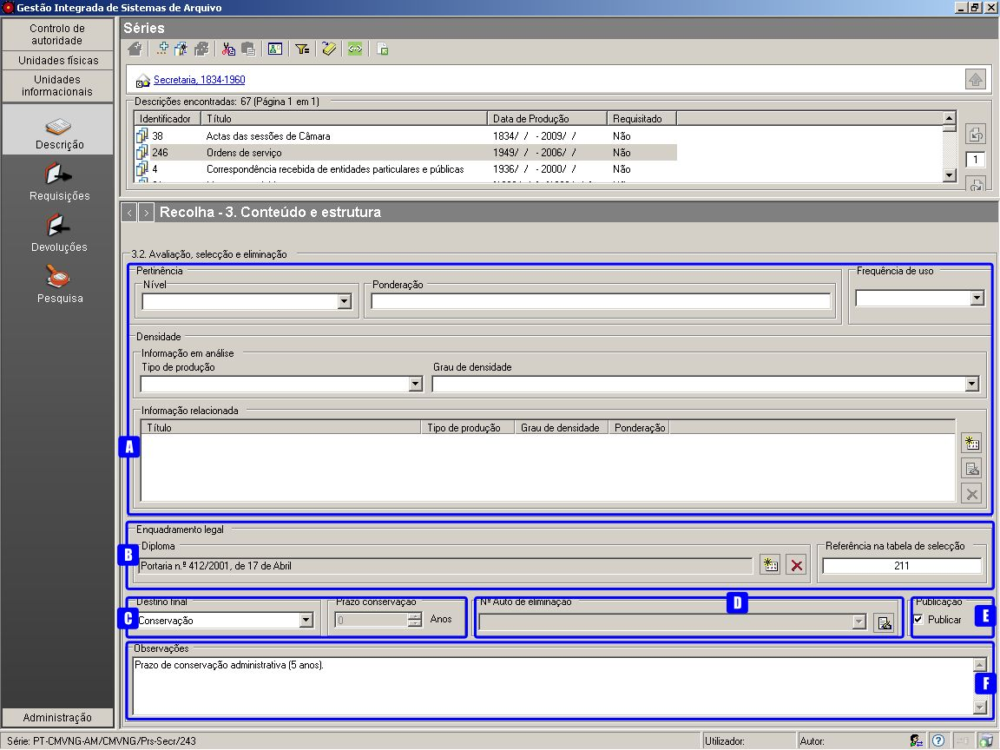
.. |image1| image:: _static/images/avaliacaosistemica.png
   :width: 500px
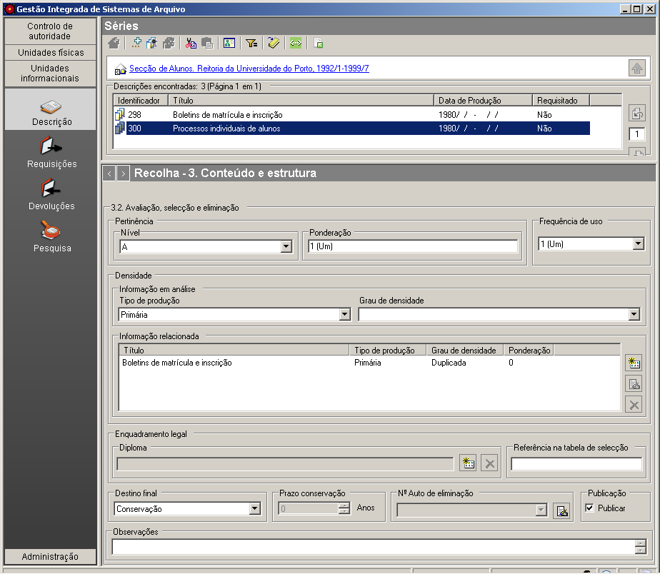
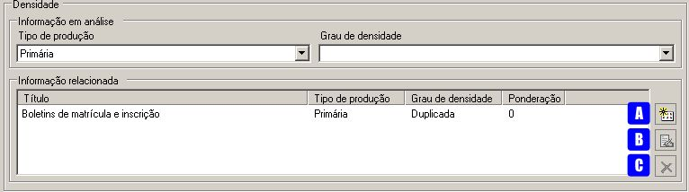
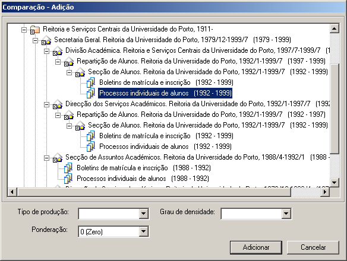
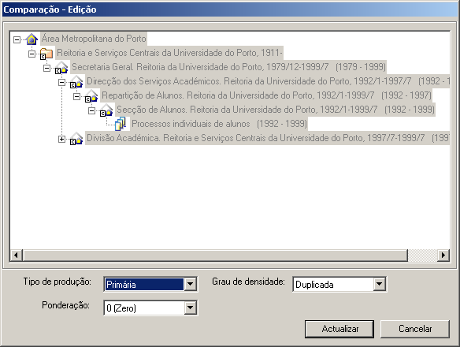
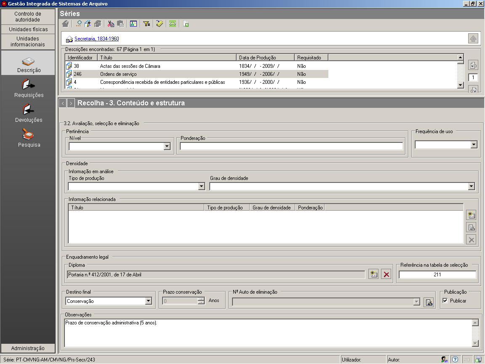
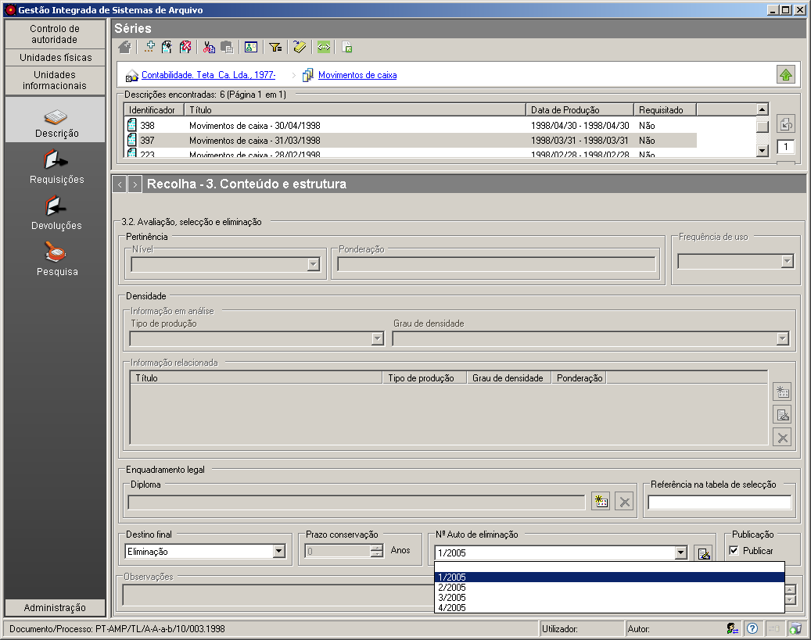
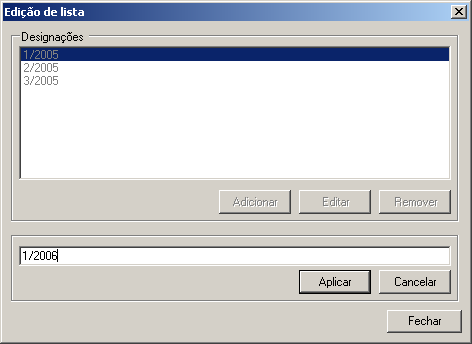
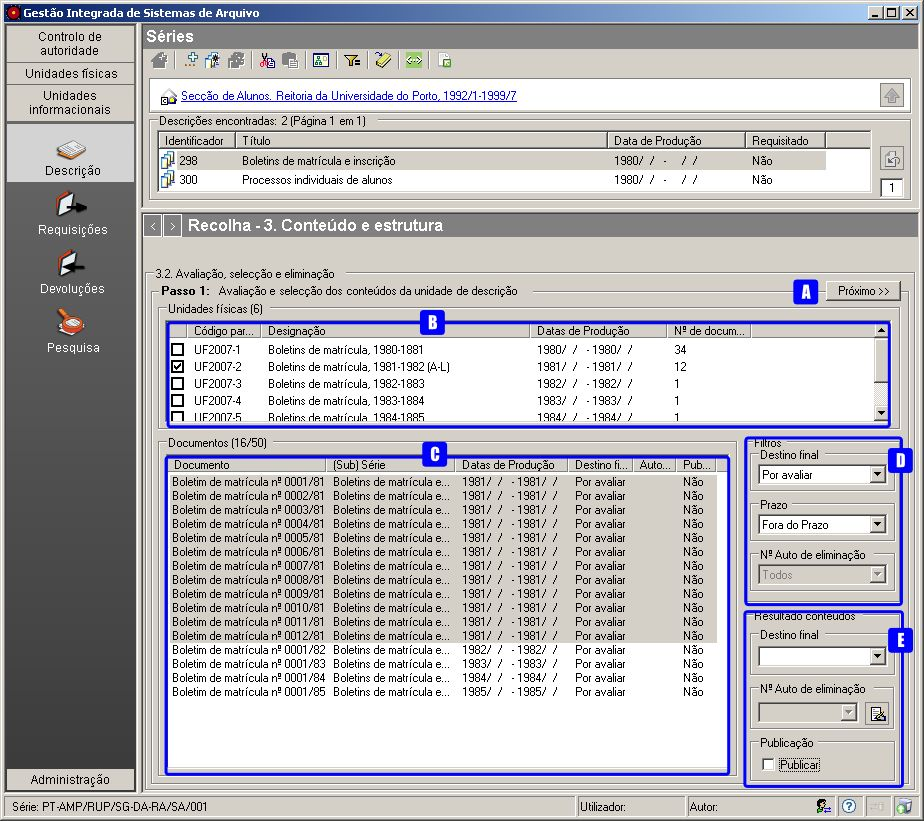
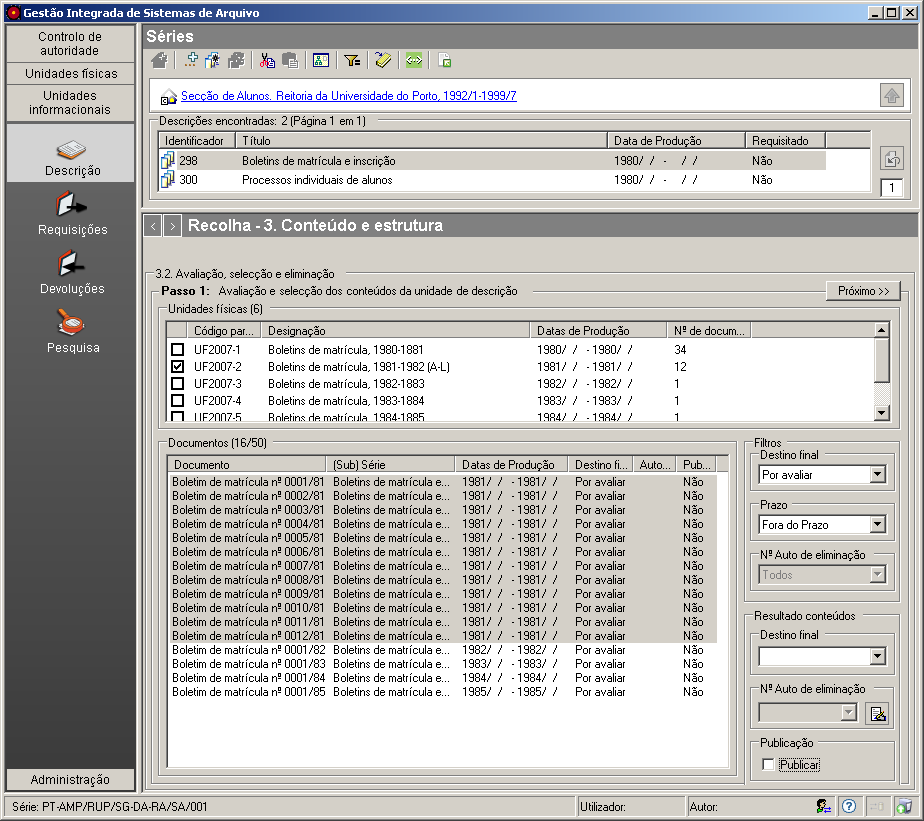
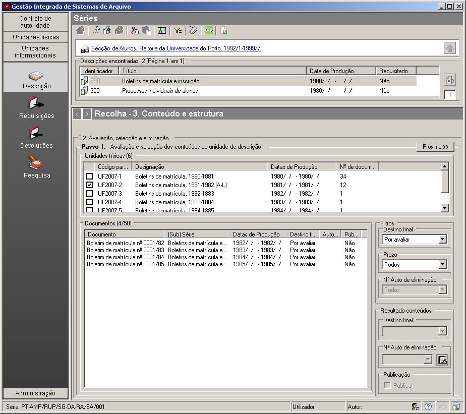
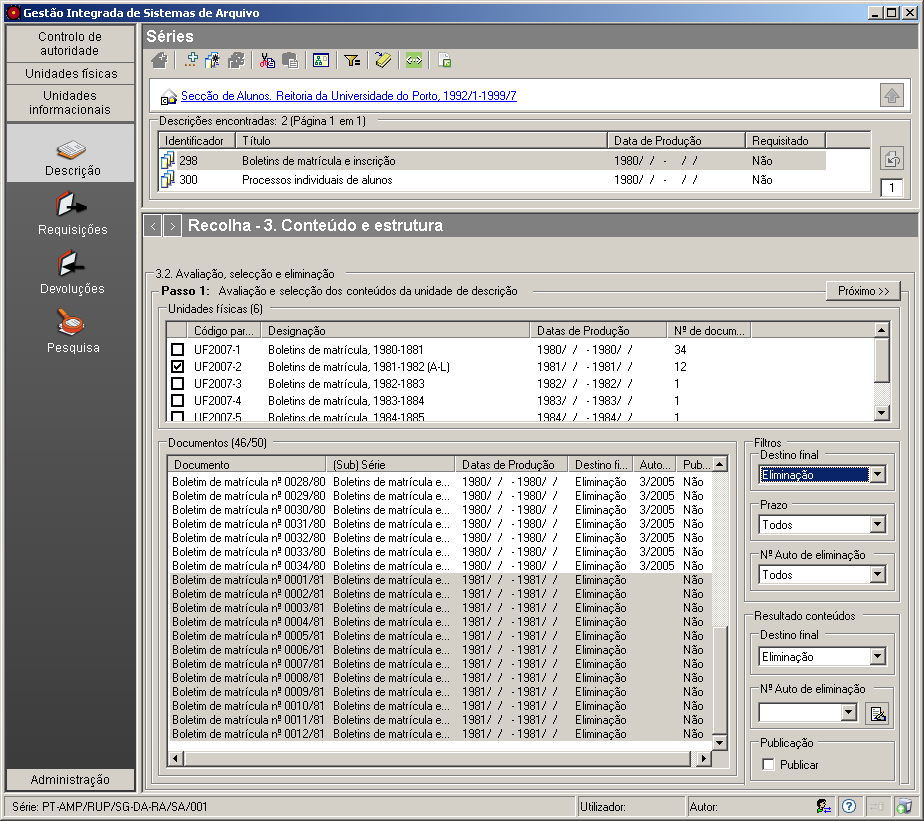
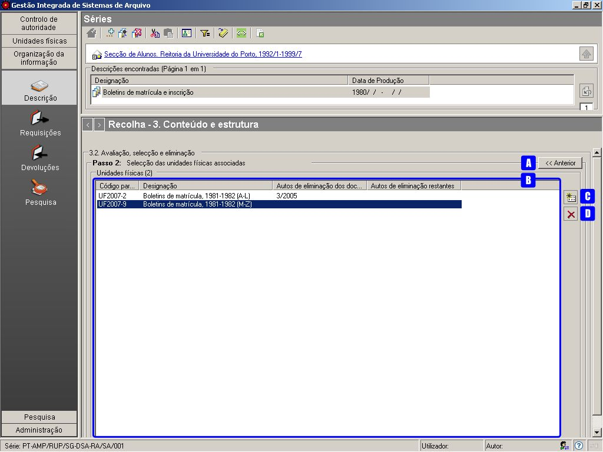
.. |image14| image:: _static/images/adicionarautopasso2.png
   :width: 500px
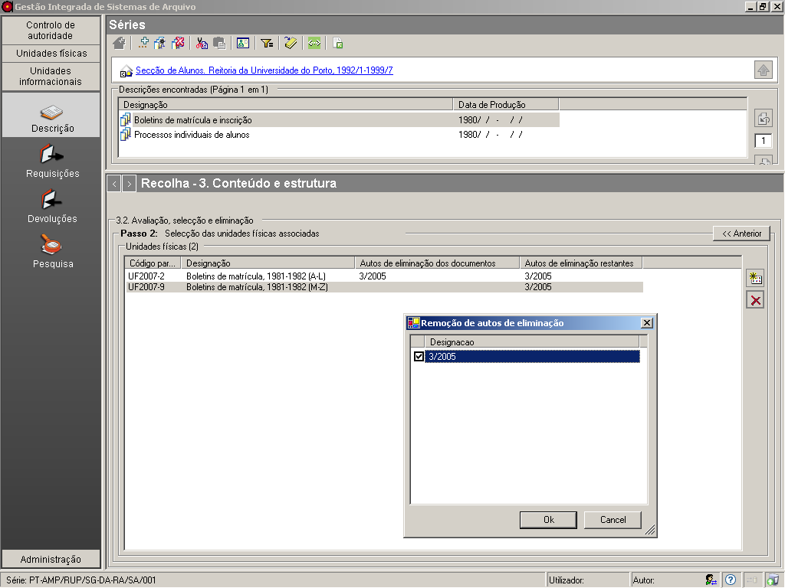
