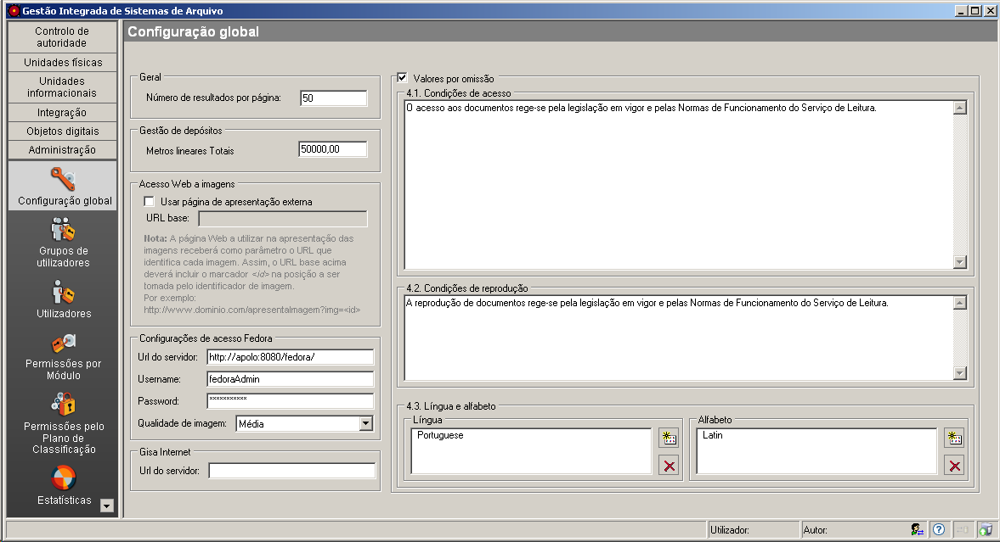

Configuração global
===================

É neste módulo, que cada Arquivo onde se encontra instalada a aplicação,
configura as características de uso de forma personalizada.

|image0|

Geral
-----

Pode indicar-se o nº de elementos a aparecer em cada página das listas
paginadas, os quais, por omissão, são 20.

Gestão de depósitos
-------------------

Se se pretender usar o módulo de *Gestão de depósitos*, deve indicar-se
os metros lineares totais de prateleira que o Arquivo tem.

Acesso Web a imagens
--------------------

Quando as descrições arquivísticas estão associadas a imagens via Web,
não diretamente ao ficheiro da imagem, mas a uma página web que
apresenta a imagem, deve ser indicado nesta área o URL base dessa
página. Este URL recebe como parâmetro o identificador da imagem a
apresentar, por isso, deve ser indicado o marcador <id> na posição
correcta.

Por exemplo,

``http://arquivo.abc.pt/rep/gisa/<id>``

Configurações de acesso Fedora
------------------------------

Caso os objetos digitais relativos às descrições arquivísticas
existentes no GISA estejam armazenados no Repositório FedoraCommons,
através do GISA-MOD (Módulo de Objetos Digitais), será necessário
configurar esse acesso, definindo:

-  ``Url do servidor`` - endereço URL do servidor onde se encontra o
   repositório.
-  ``Username`` - Nome do utilizador no servidor onde se encontra o
   repositório.
-  ``Password`` - Palavra chave no servidor onde se encontra o
   repositório.
-  ``Qualidade de imagem`` - permite definir qual a qualidade da imagem
   apresentada por omissão no interface do módulo de *`Objetos
   Digitais <objetos_digitais.html>`__*, a qual pode ser ``Mínima``,
   ``Baixa``, ``Média`` e ``Alta``. No repositório encontram-se as
   imagens na sua qualidade máxima, mas para visualização diária de PDfs
   correspondentes a objetos digitais, quer na aplicação, quer na
   internet, estes terão de ser gerados numa qualidade mais baixa e
   guardados em *cache* para poderem ser rapidamente apresentados. A
   qualidade escolhida por omissão convém que esteja de acordo com a
   usada para gerar os objetos guardados em *cache*, a qual normalmente
   é a ``Baixa``.

GISA Internet
-------------

Quando a aplicação GISA possui o módulo de pesquisa via Internet
instalado, deve ser indicado o endereço URL do servidor onde este módulo
se encontra instalado.

Valores por omissão
-------------------

Há quatro campos de descrição de unidades informacionais que podem ser
preenchidos automaticamente, sendo para isso necessário assinalar a
caixa de verificação desta área e preencher os campos disponíveis:

-  Condições de acesso
-  Condições de reprodução
-  Língua e
-  Alfabeto

Se assim for, no momento de criação da unidade informacional estes
preenchidos com a descrição existente nesta área.

