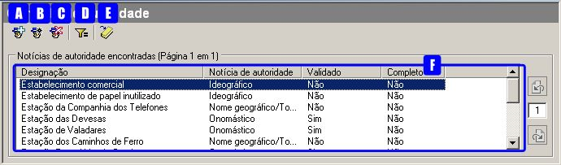
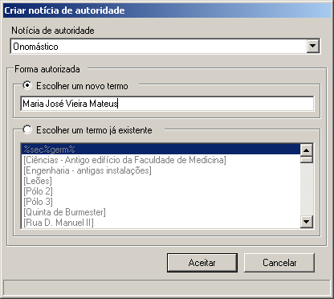
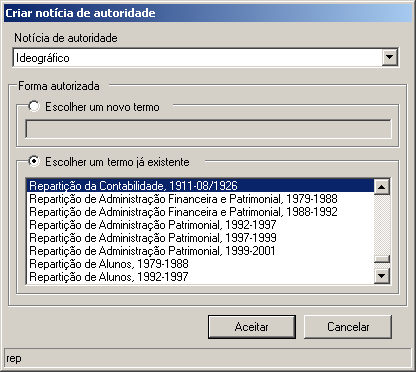
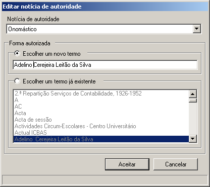
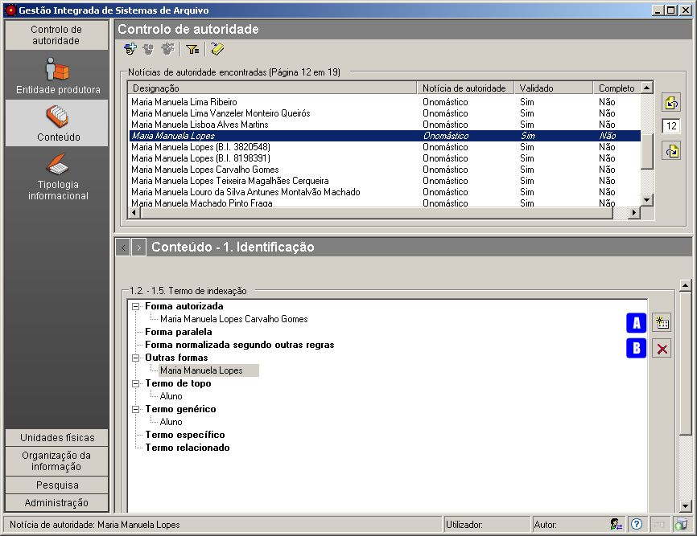
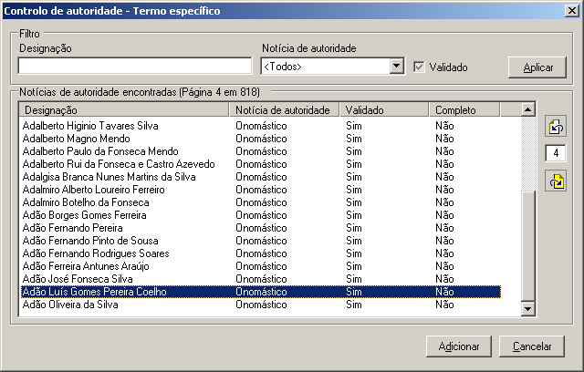
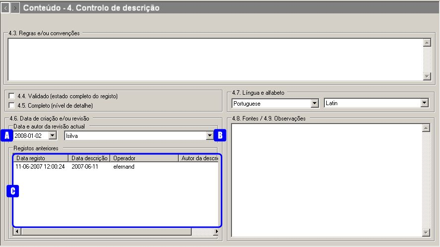

Conteúdos
=========

Este módulo encontra-se na área do **Controlo de Autoridade** e possui a
seguinte área de contexto:

|image0|

A: ``Novo termo de autoridade`` - Criar um novo registo de autoridade,
escolhendo um dos seguintes tipos de notícia de autoridade:
``Ideográfico``, ``Onomástico`` ou
``Nome geográfico ou topónimo citadino``.

B: ``Editar controlo de autoridade`` - Alterar a forma autorizada do
termo do registo de autoridade selecionado na lista.

C: ``Apagar controlo de autoridade`` - Apagar o registo de autoridade
selecionado na lista.

D: ``Filtrar dados`` - Ativar ou desativar a área de filtragem,
permitindo a restrição do número de registos a visualizar. Os registos
de autoridade a visualizar podem ser filtrados por: ``Designação``,
``Notícia de autoridade`` e ``Validado``.

E: ``Gerar relatório`` - Gera PDF ou RTF com a lista dos registos de
autoridade apresentados. Esta lista poderá ter todos os registos ou
parte, se filtrada.

F: ``Área de seleção do contexto`` - Lista todos os termos, autorizados
e não autorizados, que constam nos registos de autoridade do tipo de
notícia selecionado. Os termos que estão em *itálico* são as formas não
autorizadas.

Criação de um conteúdo
----------------------

Para criar um registo de autoridade usa-se o botão
``Novo termo de autoridade``.

|image1|

A criação de um registo de autoridade implica o preenchimento
obrigatório da sua forma autorizada com um termo. Para o caso de um
conteúdo também é necessário a escolha do tipo de notícia de autoridade.

**Notícia de autoridade**

Neste caso, de um ``Conteúdo``, é necessário decidir se o tipo de
notícia de autoridade é:

-  ``Ideográfico``,
-  ``Onomástico`` ou
-  ``Nome geográfico ou topónimo citadino``.

**Forma autorizada**

Ao criar um registo de autoridade, pode introduzir-se um *termo novo* ou
escolher um *termo já existente* na lista de termos, como forma
autorizada. A lista de termos é uma lista com todos os termos usados
como formas autorizadas ou não autorizadas nas diferentes notícias de
autoridade. A partir do momento que deixem de ser usados, estes
desaparecem da lista.

|image2|

Ao selecionar ``Escolher um novo termo`` deve ser digitado um termo que
não conste na lista. Ao clicar no botão ``Aceitar`` o termo será
adicionado à lista. Se o botão ``Aceitar`` não estiver ativo é porque o
termo introduzido já consta na lista e aí ter-se-á de selecionar
``Escolher um termo já existente``.

|image3|

Para escolher um termo já existente na lista de termos, seleciona-se a
opção ``Escolher um termo já existente``, que apresenta uma lista com
todos os termos existentes, exceto os que constituem forma autorizada de
outros registos com o mesmo tipo de notícia. Pode digitar-se o início do
termo para este ser localizado rapidamente na lista, sendo apresentado
na barra de rodapé (ver exemplo em cima), o que se for digitando. Depois
de selecionar o termo, clica-se no botão ``Aceitar`` e o novo registo de
autoridade é acrescentado à lista de conteúdos.

Para se criar um termo novo baseado num já existente, seleciona-se a
opção ``Escolher um termo já existente``, escolhe-se o termo desejado e
volta-se a clicar em ``Escolher um novo termo``, passando a ser possível
escrever um novo termo tendo como base o já existente. O botão
``Aceitar`` só fica ativo quando o termo digitado não existir na lista.

Edição de um conteúdo
---------------------

A edição através do botão ``Editar notícia de autoridade`` só é
permitida quando se seleciona da lista da
``Área de seleção do contexto`` um termo na sua forma autorizada (que
não esteja em itálico). Esta edição permite alterar a designação do
termo autorizado e a notícia de autoridade.

A janela de edição é a seguinte:

|image4|

A ``Notícia de autoridade`` pode ser alterada.

Para alterar a forma autorizada, deve escolher-se um outro termo da
lista ou selecionar-se ``Escolher um novo termo`` para o poder alterar.
O procedimento é idêntico ao da criação de um registo de autoridade.

Remoção de um conteúdo
----------------------

Para remover um conteúdo, deve selecionar-se na
``Área de seleção do contexto`` a sua forma autorizada e clicar no botão
``Apagar controlo de autoridade`` ou pressionar a tecla ``DEL``. Tal
como na edição, o botão de remoção só fica ativo quando se seleciona um
termo na sua forma autorizada (ou seja, não deve estar em itálico).

Quando se apaga um registo de autoridade associado a alguma unidade de
descrição, o GISA confirma com o utilizador se este deseja prosseguir e
eliminar também essa(s) associação(ões).

|image5|

O botão ``Detalhes`` mostra as unidades de descrição que referem o
registo de autoridade a ser removido.

|image6|

Ao clicar no botão ``OK``, o registo de autoridade será removido assim
como todas as referências com ele estabelecidas.

Filtragem de conteúdos
----------------------

A lista de registos de autoridade pode ser filtrada pelos seguintes
campos:

-  ``Designação`` - os termos que aparecem na lista, na sua forma
   autorizada ou não, devem obedecer à expressão introduzida neste
   campo.

\* ``Notícia de autoridade`` - Este campo só está ativo para filtragem
neste caso, de *Conteúdos*, permitindo filtrar os registos por notícia
de autoriadde do tipo *Ideográfico* ou *Onomástico* ou *Nome
geográfico/Topónimo citadino*.

-  ``Validado``, permitindo visualizar *todos* os registos de autoridade
   quando a caixa de verificação tem fundo cinza e um visto, ou só
   visualizar os registos de autoridade *validados* quando a caixa de
   verificação tem fundo branco e um visto, ou então, visualizar os
   registos de autoridade *não validados*, em que a caixa de verificação
   tem fundo branco e não tem visto.

Para mais detalhe consultar
`Filtros <ambiente_trabalho.html#filtros>`__.

Geração de relatório de conteúdos
---------------------------------

Através do botão ``Gerar relatório`` da barra de ferramentas é possível
gerar um ficheiro do tipo PDF ou RTF com a lista de todos os registos de
autoridade desta área.

|image7|

Nesta janela selecionar a localização, o nome e o tipo de ficheiro a
gerar. Por fim clica-se no botão ``Guardar`` para gerar o ficheiro ou no
botão ``Cancelar`` para desistir.

Construção do tesauro
---------------------

Nesta área podem detalhar-se as formas de designação de determinado
conteúdo e estabelecer-se as relações entre conteúdos, contribuindo para
a construção de um tesauro.

As zonas de preenchimento são:

`1. Identificação <conteudo.html#identificacao>`__

`4. Controlo de descrição <conteudo.html#controlo-de-descricao>`__

Identificação
~~~~~~~~~~~~~

A janela ilustra a zona de identificação de um registo de autoridade do
tipo *Conteúdo*.

|image8|

A: ``Adicionar item`` - Permite adicionar formas não autorizadas ao
termo de indexação e estabelecer relações com outros termos. O botão
encontra-se inibido, enquanto não estiver selecionado nenhum tipo de
forma ou tipo de termo.

B: ``Apagar item`` - Apaga qualquer forma (exceto a autorizada) ou termo
relacionado que esteja selecionado. Em vez deste botão também se pode
utilizar a tecla ``DEL``.

**Termo de indexação**

Com base nas relações de um *tesauro*, cada registo de autoridade do
tipo ``Conteúdo`` tem uma forma autorizada e outras não autorizadas e
pode estar relacionado com outros registos de autoridade, através de
relações hierárquicas ou indistintamente de qualquer outro tipo. Os
termos usados como forma autorizada ou como outras formas, poderão
servir como termos de indexação e de pesquisa.

A *forma autorizada* deve identificar de forma unívoca o registo de
autoridade do tipo ``Conteúdo`` e é estabelecida no momento da sua
criação. Para além da forma autorizada, cada registo, pode ter os
seguintes tipos de forma:

-  ``Forma paralela``, que permite indicar diferentes formas nas quais a
   forma autorizada do nome ocorre noutras línguas,

\* ``Forma normalizada segundo outras regras``, permitindo formas
normalizadas construídas segundo outras normas que não as utilizadas
pelo serviço de arquivo que criou o registo de autoridade,

-  ``Outras formas``, abrangendo os restantes casos.

Estando um destes tipos de forma selecionado, se se clicar no botão
``Adicionar item``, aparece a seguinte janela com a lista de todos os
termos existentes no sistema:

|image9|

Neste momento, deve escolher-se uma das seguintes hipóteses:

-  ``Escolher um novo termo`` - Neste caso, digitar o termo e clicar no
   botão ``Aceitar``. O botão ``Aceitar`` com fica ativo se o termo não
   existir.

\* ``Escolher um termo já existente`` - Para esta opção, digitar o
início do termo a editar para posicionar a lista na zona desejada.
Verificar que ao digitar o texto, este vai aparecendo em rodapé.

Em cada tipo de forma, podem ser criados ou removidos um ou mais termos.
Para apagar um termo, basta selecioná-lo e clicar de seguida no botão
``Apagar item``. Para alterar um termo, a única forma, é remover o
antigo e adicionar o novo.

O ``Termo de topo`` é inferido em função das relações hierárquicas
existentes, podendo existir mais do que um. No caso da janela anterior,
o termo *Pessoal docente* tem como termo genérico e de topo, o termo
*Pessoal* e como termo específico, *Alberto Carlos de Brito*. Pode então
concluir-se que o termo de topo de *Alberto Carlos de Brito* será o
termo *Pessoal*.

Tendo no GISA um registo de autoridade selecionado, é possível
estabelecer relações com outros registos de autoridade:

-  *Relação hierárquica*, representando uma relação entre dois termos
   com características comuns entre si, em que um tem um significado
   mais abrangente que o outro. Qualquer termo específico reúne todas as
   características do termo genérico e mais algumas (pe. *História* e
   *Curso*). Se, por exemplo, ao termo *Pessoal docente* é associado o
   *termo genérico* *Pessoal*, automaticamente, o termo *Pessoal* fica
   com o termo específico *Pessoal docente*.

\* *Relação de outro tipo qualquer*, representando uma relação entre
termos que nada têm em comum a nível conceptual, mas que de alguma forma
estão relacionados. Podem ser, por exemplo, contíguos no tempo, quando
um objeto dá origem a outro (pe. Lagarta e Borboleta) ou um processo que
desencadeia outro (pe. Plano I / Plano II) , ou contíguos no espaço (pe.
Faca e Garfo). Esta relação é bidirecional, pois sendo criado *Café*
como termo relacionado de *Restaurante*, automaticamente, o termo
*Restaurante* tem como termo relacionado o termo *Café*.

Assim, para adicionar uma relação hierárquica, pode ser via
``Termo genérico`` ou ``Termo específico``, conforme o caso. O
``Termo relacionado`` destina-se a adicionar qualquer relação de outro
tipo qualquer. Em cada tipo de relação, podem ser criados ou removidos
um ou mais termos. Para alterar um termo, a única forma, é remover e
tornar a adicionar.

Supondo que se pretende associar *Adão Luís Gomes Pereira Coelho* como
específico do termo *Pessoal docente* deve-se:

-  primeiro, selecionar o registo de autoridade *Pessoal docente* na
   área de contexto;
-  de seguida, na área de detalhe, selecionar o tipo
   ``Termo específico`` e clicar no botão ``Adicionar`` item, abrindo-se
   a seguinte janela:

|image10|

-  estabelecer a relação, selecionando o termo *Adão Luís Gomes Pereira
   Coelho* e clicando no botão ``Adicionar``.

Depois desta relação estabelecida, o termo *Adão Luís Gomes Pereira
Coelho* terá como genérico o termo *Pessoal docente* e de topo o termo
*Pessoal*.

Controlo de descrição
~~~~~~~~~~~~~~~~~~~~~

|image11|

A: ``Data da revisão atual`` - Botão que permite abrir o calendário para
selecionar a data de descrição, que pode não coincidir com a data de
registo.

B: ``Autor da revisão atual`` - Botão que permite abrir a lista dos
autores para selecionar o autor da descrição.

C: ``Registos anteriores`` - Sempre que se efetua um registo aparece
automaticamente uma linha nova na lista com as colunas:
``Data de registo``, ``Data de descrição``, ``Operador`` e
``Autor da descrição``.

**Regras e/ou convenções**

Este campo serve para identificar as regras e/ou convenções aplicadas na
criação do registo de autoridade.

**Validado**

Esta caixa de verificação, quando assinalada, indica que a descrição do
registo de autoridade está finalizado e revisto.

**Completo**

Esta caixa de verificação indica o nível de detalhe, que será elevado
quando ela estiver assinalada.

**Data de criação e/ou revisão**

Sempre que for criado ou alterado um registo de autoridade deve
indicar-se a data em que foi feita a descrição e o autor dessa
descrição. Por omissão, a data e hora assumidas são as do computador e o
autor é o pré-definido no GISA, existente na barra de estado. Caso sejam
diferentes, deve introduzir-se outra data através de um calendário e
outro autor, escolhendo da lista de autores existentes (usando os botões
``Data da revisão atual`` e ``Autor da revisão atual``).

Sempre que for criado ou alterado um registo de autoridade, na lista
``Registos anteriores`` aparece uma linha com as seguintes colunas:

-  ``Data de registo``, a data em que foi efetuada a criação ou
   alteração da Entidade Produtora.
-  ``Data de descrição``, data introduzida no campo anterior referente à
   data em que foi feita a descrição (pode ser anterior à
   ``Data de regist``\ o).
-  ``Operador``, responsável pela introdução/alteração dos dados (no
   caso da versão monoposto não existe operador).
-  ``Autor da descrição``, responsável pela descrição existente, que
   pode ser diferente do operador.

**Língua e alfabeto**

Serve para indicar a língua e o alfabeto utilizados.

**Fontes/Observações**

Neste campo indica-se como foi criado o registo de autoridade, incluindo
as fontes consultadas para a sua criação e outras notas importantes à
manutenção do registo.

.. |image5| image:: _static/images/eliminarca1.png
   :width: 400px
.. |image6| image:: _static/images/eliminarcadetalhes.png
   :width: 400px
.. |image7| image:: _static/images/guardarrelatorio.png
   :width: 400px

.. |image9| image:: _static/images/seleccaotermo.png
   :width: 300px

