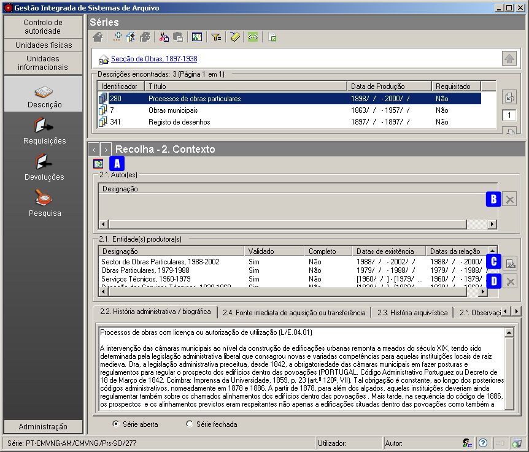
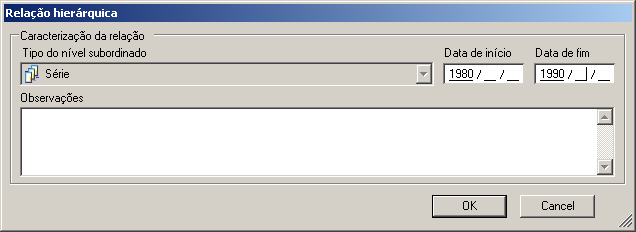
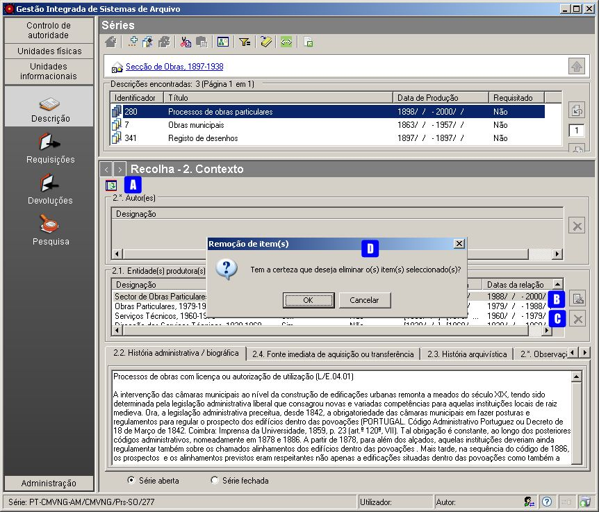

2. Contexto
===========

Esta é uma das zonas da `descrição
multinível <descricao_ui.html#descricao-multinivel>`__ da ISAD(G).

|image0|

A: ``Apresentar/esconder painel de apoio`` - Botão que apresenta ou
esconde a lista de todas as ``Entidades Produtoras`` existentes.

B: ``Apagar item`` - Remove a relação selecionada na lista de
``Autores``. Em vez deste botão também se pode utilizar a tecla ``DEL``.

C: ``Editar item`` - Permite alterar a ``Data de início`` e/ou
``Data de fim`` e a ``Descrição`` da relação hierárquica selecionada. D:
``Apagar item`` - Remove a relação selecionada na lista de Entidades
produtoras. Em vez deste botão também se pode utilizar a tecla ``DEL``.

Autor(es)
---------

Este campo só fica disponível para preenchimento em unidades de
descrição de documentos (compostos ou simples), permitindo referir o(s)
autor(es) de cada documento, caso seja conhecido. Não é um campo
específico da *ISAD-G*, mas é suficientemente genérico para ser incluído
no GISA como campo de descrição arquivística.

**Associação de Autores a um nível documental**

A associação de autores só é possível se o nível de descrição for do
tipo\ ``Documento/Processo`` ou
``Documento subordinado/Ato informacional``. Cada autor é considerado um
registo de autoridade do tipo ``Entidade Produtora``, tendo de ser
previamente criado antes de preencher este campo. Para a criação de
autores, consultar a página `Entidades
produtoras <entidade_produtora.html>`__.

Para se associar um autor:

1. Clicar no botão ``Apresentar/esconder painel de apoio``, mostrando na
área de contexto a lista de todas ``Entidades produtoras`` existentes.

2. Selecionar da lista (pode ser usado o filtro) um termo correspondente
ao Autor que se pretende associar. Se o termo não existir na lista, deve
ser criado.

3. Arrastar o elemento selecionado para o campo ``2.* Autor(es)`` da
área de detalhes.

**Remoção da associação de Autores à unidade informacional**

Para remover algum autor, que tenha sido indevidamente associado,
selecionar o autor pretendido no campo 2.\* e, de seguida, clicar no
botão ``Apagar item`` ou pressionar na tecla ``DEL``. Na janela
``Remoção de item(s)`` clicar em ``Ok`` para confirmar ou ``Cancelar``
para desistir da remoção. É possível remover as associações de vários
autores ao mesmo tempo, através de seleção múltipla.

Entidade(s) Produtora(s)
------------------------

No GISA, e segundo a *ISAD-G*, este campo deve mostrar o(s) nome(s)
da(s) pessoa(s) colectiva(s), singular(es) ou família responsável pela
produção, acumulação e conservação do(s) documento(s) da unidade de
descrição selecionada. Assim, neste campo apresentam-se os termos
autorizados de registos de autoridade do tipo ``Entidade produtora``,
criados no módulo de *Controlo de autoridade/Entidades produtoras*.

Para qualquer nível documental de topo, diretamente relacionado com um
nível orgânico, este campo é de preenchimento, sendo possível
associar-lhe várias entidades produtoras. Nas subsecções seguintes
detalha-se como estabelecer ou alterar esta associação.

Para os restantes tipos de nível, este campo é somente de visualização.
Se for um nível orgânico, o que aparece neste campo é a própria entidade
produtora. Qualquer nível documental, que não seja de topo, mostra neste
campo as entidades produtoras, diretamente associadas ao nível
documental de topo, hierarquicamente superior a ele.

**Associação de mais entidades produtoras a um nível documental**

A associação de mais entidades produtoras a um nível documental só é
possível se for um nível de topo da hierarquia documental, diretamente
associado a uma entidade produtora, ou seja, um nível do tipo ``Série``
ou do tipo ``Documento/Processo`` quando este não constitui série.

Para se associar uma entidade produtora a um nível documental:

1. Clicar no botão ``Apresentar/esconder painel de apoio``, mostrando na
área de contexto a lista de todas ``Entidades produtoras`` existentes.
Este botão só aparece nos níveis de topo, onde é possível fazer a
associação de entidades produtoras. 2. Selecionar da lista (pode ser
usado o filtro) um termo correspondente à entidade produtora que se
pretende associar. Se o termo não existir na lista, deve ser criado e
para isso deverá consultar a página `Controlo de
Autoridade <entidade_produtora.html>`__.

3. Arrastar o elemento selecionado para o campo
``2.1 Entidade(s) produtora(s)`` da área de detalhes. Ao arrastar, é
apresentada a janela da figura a seguir:

|image1|

4. Preencher os campos da janela: ``Data de início``, ``Data de fim`` e
``Observações``. A data de início e de fim deve definir o período no
qual a unidade informacional objeto de descrição foi produzida por esse
produtor.

5. Clica-se no botão ``OK`` para associar ou ``Cancelar`` para desistir.

Não é possível estabelecer uma associação entre um mesmo nível
documental e uma mesma entidade produtora, mais que uma vez em períodos
diferentes. Para estes casos de hiatos temporais na produção de
informação, aconselhamos na única associação permitida, preencher a
``Data inicial`` do primeiro período, da ``Data final`` do segundo
período e referir na ``História administrativa`` o hiato temporal.

**Edição da associação de entidades produtoras a um nível documental**

Para editar uma associação neste campo, basta selecionar a entidade
produtora associada e clicar no botão ``Editar item``. É aberta uma
janela (ver figura abaixo) que deve ser preenchida com as datas extremas
e observações relativas à associação.

|image2|

A primeira associação entre um determinado nível documental e uma
unidade orgânica é estabelecida no momento de criação da unidade
documental, no entanto, as datas extremas e as observações relativas à
associação deverão ser preenchidas nesta área, clicando no botão
``Editar item``.

**Remoção da associação de entidades produtoras a um nível documental**

No caso de um nível documental possuir uma única entidade produtora
associada, a remoção da associação não é efetuada neste campo. A remoção
desta associação só acontece no momento em que se remove o nível
documental propriamente dito. Para mais detalhe ver secção
``Remoção de um nível documental``.

No caso de um nível documental possuir várias entidades produtoras
associadas, podem apagar-se todas as associações neste campo, exceto a
associação estabelecida com a entidade produtora pela qual se navegou na
estrutura para chegar a este nível documental, apresentada na barra de
navegação como topo do caminho percorrido.

|image3|

A: ``Apresentar/esconder painel de apoio`` - Botão que apresenta ou
esconde a lista de todas as ``Entidades Produtoras`` existentes.

B: ``Editar item`` - Permite alterar a ``Data de início`` e/ou
``Data de fim`` e a ``Descrição`` da relação hierárquica selecionada. C:
``Apagar item`` - Remove a relação selecionada na lista. Em vez deste
botão também se pode utilizar a tecla ``DEL``.

D: ``Remoção de item(s)`` - Janela ``Remoção de item(s)`` de confirmação
da remoção da associação a uma ou mais ``Entidade Produtora``.

No exemplo da figura, no campo de descrição 2.1 da série *Processos de
obras particulares* que está a ser descrita, podem ser removidas todas
as associações a entidades produtoras, exceto a associação a *Secção de
Obras, 1897-1938*, uma vez que ao constar na barra de navegação, quer
dizer que foi utilizada na navegação pela estrutura para se chegar a
esta série.

Para se remover uma associação a uma entidade produtora, selecionar essa
entidade no campo 2.1 e de seguida clicar no botão ``Apagar item`` ou
pressionar na tecla ``DEL``. Na janela ``Remoção de item(s)`` clicar em
``Ok`` para confirmar ou ``Cancelar`` para desistir da remoção. É
possível remover várias entidades associações ao mesmo tempo, através de
seleção múltipla.

História administrativa / biográfica
------------------------------------

A história administrativa ou os dados biográficos do(s) produtor(es) da
unidade de descrição servem para contextualizar a produção da informação
e torná-la mais compreensível.

Se for uma unidade de descrição documental a ser selecionada como
contexto, este campo, é um campo de texto (ver segunda figura da secção
anterior).

Se for uma unidade de descrição orgânica a ser selecionada como
contexto, este campo passa a visualizar a informação introduzida na zona
``2. Descrição`` do módulo *Controlo de autoridade/Entidade Produtora*.

Fonte imediata de aquisição ou transferência
--------------------------------------------

Este campo de texto permite identificar a origem imediata de aquisição
ou transferência da unidade de descrição.

História arquivística
---------------------

Neste campo regista-se toda informação sobre a história da unidade de
descrição, que seja significativa para a sua autenticidade, integridade
e interpretação.

Observações aos produtores
--------------------------

Este campo não faz parte da *ISAD-G* e só mostra meta-informação, se
esta existir, nos níveis de descrição documentais de topo (série ou
documento solto). Essa meta-informação refere-se aos dados introduzidos
no campo ``Observações`` de cada associação entre esse nível e as suas
entidades produtoras (diretas) no campo `2.1 Entidades
produtoras <contexto.html#entidade-s-produtora-s>`__.

Série aberta ou fechada
-----------------------

No caso de o nível de descrição ser do tipo ``Série``, enquanto houver
produção de documentos, que lhe pertençam, deve registar-se que a série
é *aberta*, caso contrário, deve registar-se que é *fechada*.

