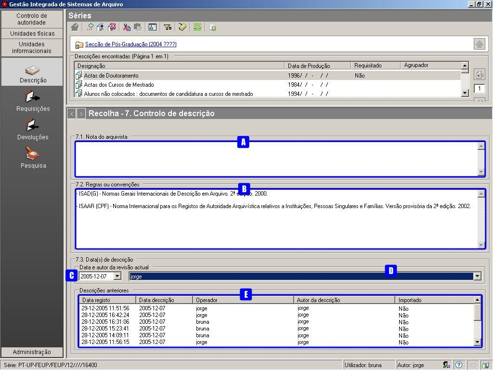

7. Controlo de descrição
========================

Esta é uma das zonas da `descrição
multinível <descricao_ui.html#descricao-multinivel>`__ da ISAD(G). É
onde Neste se regista como, quando e quem elaborou a descrição, bem como
as fontes consultadas.

|image0|

A: ``Nota do arquivista`` - Campo para registar notas do próprio
arquivista, nomeadamente informação sobre as fontes consultadas.

B: ``Regras ou convenções`` - Campo que serve para indicar regras ou
normas utilizadas para a elaboração da descrição.

C: ``Data da revisão atual`` - Campo com a data da criação ou revisão da
descrição em questão, selecionada do calendário.

D: ``Autor da revisão atual`` - Campo com o responsável pela elaboração
ou revisão da descrição em questão, selecionado da lista dos autores.

E: ``Lista de registos anteriores`` - Sempre que se efetua um registo
aparece automaticamente uma linha nova nesta lista.

Data da descrição ou revisão
----------------------------

Por omissão, este campo assume a data definida no computador, a qual,
deverá corresponder à data real, ou seja, a que em que é feito o
registo.

Quando a data em que a descrição foi elaborada ou revista é diferente da
assumida por omissão, esta deve ser selecionada.

Autor da descrição
------------------

Sempre que se faz uma descrição ou a revisão de uma descrição, deve ser
indicado o responsável pela sua elaboração. Para preencher este campo
basta selecionar da lista pendente ``Autor da revisão atual`` (D) com
todos os autores ativos existentes, o autor da descrição.

Em caso de não se indicar qualquer autor neste campo, caso no sistema
esteja definido um ``Autor de descrição por omissão``, é esse que fica.

Os autores são definidos no módulo *Administração/Utilizadores* e para
mais detalhes consultar a página `Utilizadores <utilizadores.html>`__.

Na versão monoposto do GISA, como não existe o módulo
*Administração/Utilizadores*, o procedimento de atribuir um autor de
descrição ao registo que se efetuou é diferente. Para mais detalhes
consultar `Autores de descrição na versão
monoposto <ambiente_trabalho.html#autores-de-descricao-na-versao-monoposto>`__.

O ``Autor de descrição por omissão`` é atribuído ou alterado por um
operador, permanecendo a última atribuição em todas as sessões iniciadas
por esse operador. Para mais detalhes, ver `Autor de descrição por
omissão <ambiente_trabalho.html#autor-de-descricao-por-omissao>`__.

Descrições anteriores
---------------------

Este campo é meramente informativo e mostra uma lista que representa o
historial dos registos feitos numa unidade de descrição, com a seguinte
informação:

-  ``Data de registo``, a data em que foi efetuada a criação ou
   alteração do nível de descrição arquivística selecionado.

\* ``Data de descrição``, data introduzida no campo anterior referente à
data em que foi feita a descrição, a qual pode ser anterior à
``Data de registo``.

-  ``Operador``, responsável pela introdução/alteração dos dados (no
   caso da versão monoposto não existe operador).

\* ``Autor da descrição``, responsável pela descrição existente, o qual
pode ser diferente do operador.

-  ``Importado``, indica se o registo é efetuado via importação ou não.

