Unidades Físicas
================

O recenseamento de unidades físicas faz-se no módulo de *Descrição* da
área de *Unidades físicas*, facultando a identificação e descrição da
parte física que serve de suporte à informação.

|image0|

Na área de contexto existe uma barra de ferramentas que permite a
criação, edição e remoção de unidades físicas:

A: ``Nova unidade física`` - Criar uma unidade física.

B: ``Duplicar unidade física selecionada`` - Criar uma unidade física em
duplicado, exatamente igual à selecionada, mas com um código diferente.

C: ``Editar unidade física`` - Alterar a entidade detentora ou o título
da unidade física selecionada.

D: ``Apagar unidade física`` - Apagar uma unidade física e todas as suas
referências a unidades informacionais.

E: ``Filtrar dados`` - A lista das unidades físicas pode ser filtrada
através de vários campos. Este botão ativa/desativa a área de filtragem.

F: ``Área de filtragem`` - É possível filtrar a lista de unidades
físicas por título, código, cota, código de barras, conteúdo, existência
de unidades informacionais associadas, existência física (só as
existentes em depósito ou então também as eliminadas).

G: ``Área de seleção do contexto`` - Lista paginada de todas as unidades
físicas existentes.

H: ``Área de detalhe`` - Área de descrição da unidade física selecionada
na ``Área de seleção do contexto``.

Criação de uma Unidades física
------------------------------

Para se criar uma unidade física, deve clicar-se no botão
``Nova unidade física``.

|image1|

Cada unidade física deve ter associada uma ``Entidade detentora``, à
qual pertence. Por omissão, fica associada a primeira da lista (ordenada
alfabeticamente). Se a entidade detentora não existir, para se poder
criar a unidade física, terá de ser previamente criada (ver detalhe em
`Entidade detentora <descricao_ui.html#entidade-detentora>`__).

O ``Código`` de uma unidade física é gerado automaticamente e é único,
sendo composto pelo código da entidade detentora e por um código
específico da unidade física, que combina a sigla ``UF``, o ano do
registo e um nº sequencial dentro de cada ano (por exemplo:
``PT-CMVNG-AM/UF2006-1233``). Poderão haver duas (ou mais) unidades
físicas, cujo código específico é igual, mas pertencendo a entidades
detentoras diferentes.

O ``Título`` também é um campo obrigatório e deverá corresponder à
designação apresentada na etiqueta, normalmente existente na lombada, da
unidade física a recensear.

Para facilitar o trabalho, se numa mesma sessão se criar uma unidade
física depois de se ter criado uma outra, a última terá, por omissão, a
mesma ``Entidade detentora`` e o mesmo ``Título`` que a anterior,
distinguindo-se pelo código de referência, no qual o número sequencial
da mais recente foi incrementado.

Duplicação de uma Unidade física
--------------------------------

Para se duplicar uma unidade física, seleciona-se essa unidade física e
a seguir clica-se no botão ``Duplicar unidade física selecionada``. A
nova unidade física fica com todos os dados e associações a unidades
informacionais iguais aos da selecionada, exceto o código, cujo número
sequencial é automaticamente incrementado.

Edição de uma Unidades física
-----------------------------

Se se selecionar uma unidade física na área de contexto e se clicar no
botão ``Editar unidade física`` aparece uma janela idêntica à de
criação, sendo possível alterar-se a sua ``Entidade detentora`` e o
``Título``.

|image2|

Remoção de uma Unidade física
-----------------------------

Para remover uma unidade física, esta deve ser selecionada da lista da
área de contexto, clicando-se de seguida no botão
``Apagar unidade física`` ou pressionar a tecla ``DEL``.

Se a unidade física não estiver associada a nenhuma unidade
informacional, é apresentada a seguinte janela:

|image3|

Clicar no botão ``Sim`` para aceitar a remoção ou ``Não`` para cancelar
a operação.

Quando se apaga uma unidade física associada a uma ou várias unidades
informacionais, o GISA confirma com o utilizador se este deseja
prosseguir eliminando todas as relações existentes.

|image4|

O botão ``Detalhes`` mostra todas as unidades informacionais que estão
diretamente relacionadas com a unidade física que se pretende remover,
como se pode ver na imagem em baixo.

|image5|

Ao clicar no botão ``OK``, a unidade física será removida assim como
todas as relações com ela estabelecidas.

Filtragem de Unidades Físicas
-----------------------------

A lista de unidades físicas pode ser filtrada pelos seguintes campos:

|image6|

-  ``Título``, selecionando unidades físicas cuja designação obedeça à
   expressão introduzida neste campo.
-  ``Código``, selecionando unidades físicas pelo ``Código``.
-  ``Cota``, selecionando unidades físicas com determinada localização
   física.
-  ``Código de barras``, permitindo selecionar uma unidade física usando
   o leitor de código de barras.
-  ``Conteúdo``, recuperando as unidades físicas cujo campo
   ``Conteúdo informacional`` contenha a expressão introduzida neste
   campo do filtro.
-  ``Sem unidades de descrição``, em que *sem visto* são apresentadas
   todas as unidades físicas e *com visto* são apresentadas as que não
   têm unidades informacionais associadas.
-  ``Mostrar eliminadas``, em que *sem visto* só são apresentadas as
   unidades físicas registadas no sistema existentes em depósito, e *com
   visto*, são apresentadas todas as que foram registadas até ao
   momento, tanto as existentes em depósito como as que entretanto foram
   abatidas. Por omissão, esta caixa de verificação não apresenta visto.

Descrição de Unidades Físicas
-----------------------------

É nesta área que consta o formulário de recenseamento das unidades
físicas permitindo o registo das suas principais características. As
zonas de preenchimento são as seguintes:

-  `Identificação <descricao_uf.html#identificacao>`__
-  `Unidades de descrição <descricao_uf.html#unidades-de-descricao>`__
-  `Controlo de descrição <descricao_uf.html#controlo-de-descricao>`__

Identificação
~~~~~~~~~~~~~

|image7|

**Código de referência**

Este campo é somente de visualização, pois é gerado no momento de
criação da unidade física.

**Título**

Este campo é somente de visualização, pois é preenchido no momento de
criação da unidade física.

**Entrega**

Caso a unidade física, tenha sido entregue no depósito, acompanhada de
uma guia, deve ser registado o nº da guia (pe 2/1999) no campo
``Guia nº`` e o tipo de entrega no campo ``Tipo`` (incorporação,
transferência, depósito, doação ou compra).

**Cota**

O campo ``Cota`` refere a localização física da unidade que se está a
descrever. Quando o utilizador está a colocar uma cota que já existe, é
dado um sinal de alerta, tal como se mostra na figura a seguir, para que
o utilizador possa decidir se pretende manter ou corrigir o valor
introduzido.

|image8|

**Código de barras**

Campo reservado para o código de barras associado à unidade física,
aceitando somente dígitos numéricos. É tipicamente preenchido através de
um leitor de códigos de barras.

**Datas de produção**

Campos para registar uma data única ou datas extremas, conforme o caso.
Se a data não for explícita, deve ser colocado um visto na caixa de
verificação ``Atribuída``.

Deve-se ter em conta que uma *data não preenchida* é diferente de uma
*data desconhecida*. O campo de data vazio quer dizer que ainda não foi
preenchido, mas que o poderá ser mais tarde. Quando a data é
desconhecida na sua totalidade, o campo data deverá ser preenchido com ?
(pontos de interrogação). O GISA admite *datas incompletas*, as quais
deverão ser preenchidas com ? (pontos de interrogação) nos dígitos
desconhecidos.

Assim, os campos de datas podem ser preenchidos da seguinte forma:

+-----------------+---------------------------------------------------------------------+-----------------------------------+
| Data            | Preenchimento do campo                                              | Exemplo                           |
+=================+=====================================================================+===================================+
| Completa        | Campos ano, mês e dia preenchidos                                   | 1910/03/23                        |
+-----------------+---------------------------------------------------------------------+-----------------------------------+
| Indeterminada   | Campos ano, mês e dia preenchidos com data desconhecida             | ????/??/??                        |
+-----------------+---------------------------------------------------------------------+-----------------------------------+
| Incompleta      | Campos ano, mês e dia preenchidos com data parcialmente conhecida   | 19??/??/?? (séc XX)               |
|                 |                                                                     | 2000/12/?? (dezembro de 2000)     |
|                 |                                                                     | 196?/??/?? (anos 60 do séc. XX)   |
+-----------------+---------------------------------------------------------------------+-----------------------------------+
| Vazia           | Campos ano, mês e dia ainda por preencher                           | \_ \_ \_ \_ /\_ \_ /\_ \_         |
+-----------------+---------------------------------------------------------------------+-----------------------------------+

**Dimensões**

Campos para indicar a altura, a largura e a profundidade em metros.
Estas dimensões devem ser recolhidas tendo em conta a unidade física
colocada na prateleira e que a sua largura contribui para a contagem de
metros lineares de documentos em prateleira.

**Tipo**

O campo ``Tipo`` indica o tipo de suporte físico usado para registar
informação e é preenchido escolhendo um dos elementos de uma lista de
suportes físicos: pasta, livro, etc.. Esta lista é gerida pelo
utilizador através do botão lateral, o qual com um clique faz aparecer:

|image9|

A: ``Adicionar`` - clicando neste botão o campo ``Designação`` (D) de
preenchimento da designação fica ativo. Depois de se preencher este
campo, o botão ``Aplicar`` fica ativo e serve para adicionar o item à
lista, ou então, pode-se sempre desistir através do botão ``Cancelar``.

B: ``Editar`` - este botão permite editar o item que está selecionado na
lista. Depois de se alterar o campo ``Designação`` (D), o botão
``Aplicar`` fica ativo e serve para aceitar a alteração, ou então,
pode-se sempre desistir através do botão ``Cancelar``.

C: ``Remover`` - este botão permite remover o item que está selecionado
na lista. Aparece sempre um diálogo para se poder confirmar o desistir
da remoção.

D: ``Designação`` - Campo que permite introduzir ou alterar a designação
do suporte físico.

E: ``Aplicar`` - Botão que permite aceitar a adição ou alteração da
designação de um suporte físico que se encontra no campo ``Designação``
(D).

F: ``Cancelar`` - Botão que permite cancelar a adição ou alteração da
designação de um suporte físico que se encontra no campo ``Designação``
(D).

G: ``Fechar`` - Botão que permite fechar o diálogo onde se faz a gestão
de suportes físicos.

**Local de consulta**

O campo ``Local de consulta`` indica o local onde o requerente pode
consultar a unidade física, o qual pode não corresponder ao depósito
onde se encontra a mesma. Os locais de consulta podem ser adicionados,
editados e removidos pelo utilizador, da mesma forma que os valores de
preenchimento do campo ``Tipo``.

**Conteúdo informacional**

Campo destinado a fornecer um pequeno resumo do conteúdo ou notas
relativas à unidade física selecionada na área de contexto.

Unidades de descrição
~~~~~~~~~~~~~~~~~~~~~

Este painel serve para indicar quais as unidades informacionais que se
encontram numa determinada unidade física.

|image10|

A: ``Apresentar/esconder painel de apoio`` - Permite apresentar ou
esconder, na área de contexto, o painel com a estrutura arquivística,
servindo de apoio à seleção da unidade informacional a mover para o
preenchimento do campo ``Unidades de descrição associadas``.

B: ``Filtrar dados`` - Permite ativar ou desativar o filtro da lista
``Unidades de descrição associadas``. A lista pode ser filtrada por
título da unidade informacional e por tipo de nível de descrição.

C: ``Apagar item`` - Permite apagar a(s) unidade(s) informacional(is)
selecionadas na lista ``Unidades de descrição associadas``.

D: ``Unidades de descrição associadas`` - Lista de todas as unidades
informacionais associadas à unidade física selecionada na área de
contexto. Para cada unidade informacional são apresentados o título, o
código de referência, o nível de descrição, as datas de produção e se a
informação está ou não requisitada.

Na janela em cima, pode verificar-se que a capilha do *Processo de
Centro Recreativo das Devesas* está associada à série *Processos de
licenciamento de recintos para espectáculos*.

Sabendo que existe a unidade informacional *Processo de Centro
Recreativo das Devesas* já descrita, pretende-se associá-la à capilha
correspondente. Para isso, basta clicar no botão ``Apresentar/esconder``
painel de apoio e navegar/filtrar de forma a selecionar a unidade
informacional pretendida.

|image11|

Depois de selecionada, basta arrastar a unidade informacional para
dentro da lista ``Unidades de descrição associadas``.

|image12|

Para apagar alguma associação, selecionar a unidade informacional (ou
grupo de unidades) da lista ``Unidades de descrição associadas`` e
clicar no botão ``Apagar item`` ou pressionar a tecla ``DEL``. Abre-se
uma janela, onde se clica no botão ``OK`` para confirmar a remoção ou no
botão ``Cancelar`` para desistir.

Controlo de descrição
~~~~~~~~~~~~~~~~~~~~~

Zona que permite controlar os registos efetuados no sistema, as
descrições de unidades físicas no sistema.

|image13|

A: ``Data da revisão atual`` - Botão que permite abrir o calendário para
selecionar a data da descrição (pode ser diferente da data de registo no
sistema).

B: ``Autor da revisão atual`` - Botão que permite abrir a lista dos
autores para selecionar o autor da descrição (pode ser diferente do
operador do sistema).

C: ``Registos anteriores`` - Lista de registos efetuados: data de
registo, data da descrição, operador e autor da descrição.

**Data e autor da revisão atual**

Sempre que for criada ou alterada uma unidade física deve ser indicada a
data em que foi feita a descrição e o autor dessa descrição. Por
omissão, a data e hora assumidas são as do computador e o autor é o
pré-definido no GISA, apresentado na barra de estado. Caso sejam
diferentes, deve introduzir-se outra data através de um calendário e
outro autor, escolhendo da lista de autores existentes (usando os campos
``Data da revisão atual`` e ``Autor da revisão atual``). A lista de
autores contém os autores definidos no módulo
*Administração/Utilizadores* por um utilizador com permissões de
administração.

**Registos anteriores**

Sempre que se grava alguma criação/edição efetuada pelo utilizador, fica
automaticamente registada uma linha nova na lista
``Registos anteriores``, referindo as seguintes colunas:

-  ``Data de registo``, indicando a data em que o utilizador efetuou a
   criação ou edição do registo da unidade física de contexto;
-  ``Data de descrição``, mostrando a data referida no campo
   ``Data e autor da revisão atual``;
-  ``Autor da descrição``, mostrando o autor referido no campo
   ``Data e autor da revisão atual``.
-  ``Importado``, indicando se o registo foi importado ou não.

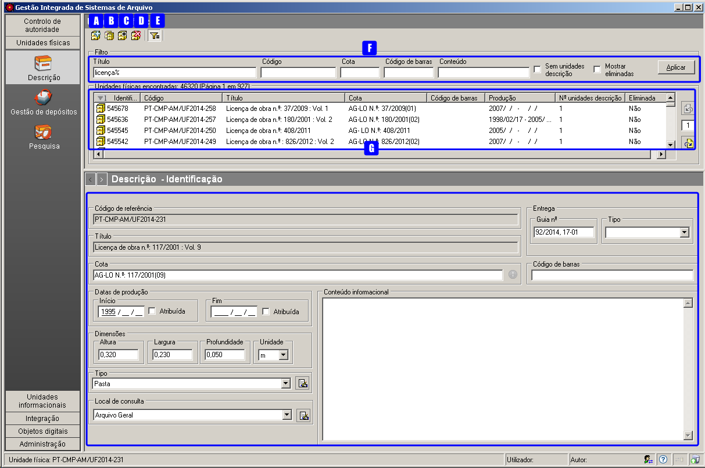
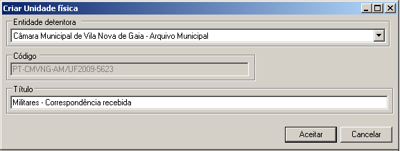
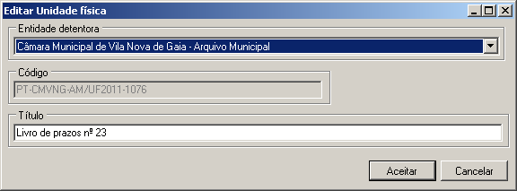
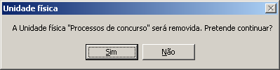
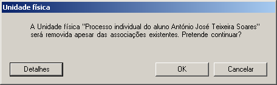
.. |image5| image:: _static/images/apagarufdetalhes.png
   :width: 400px
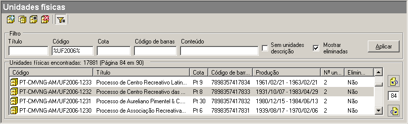
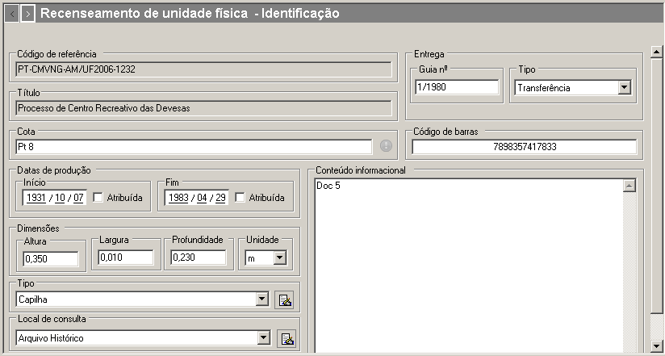
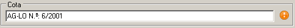
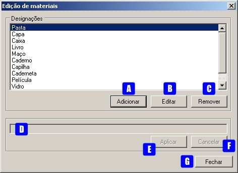
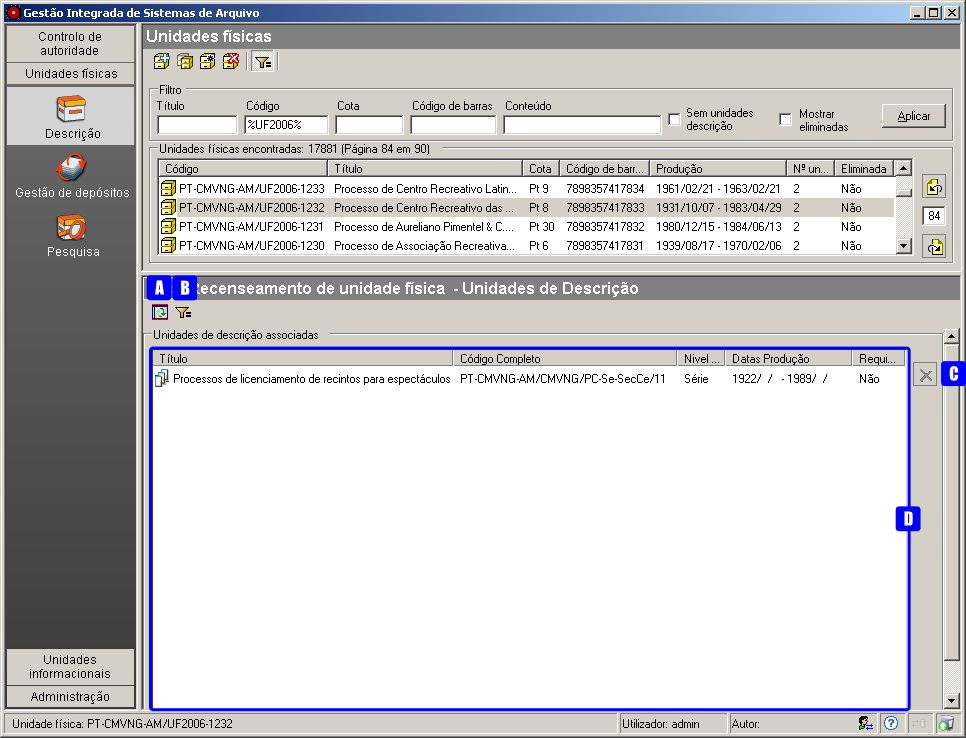
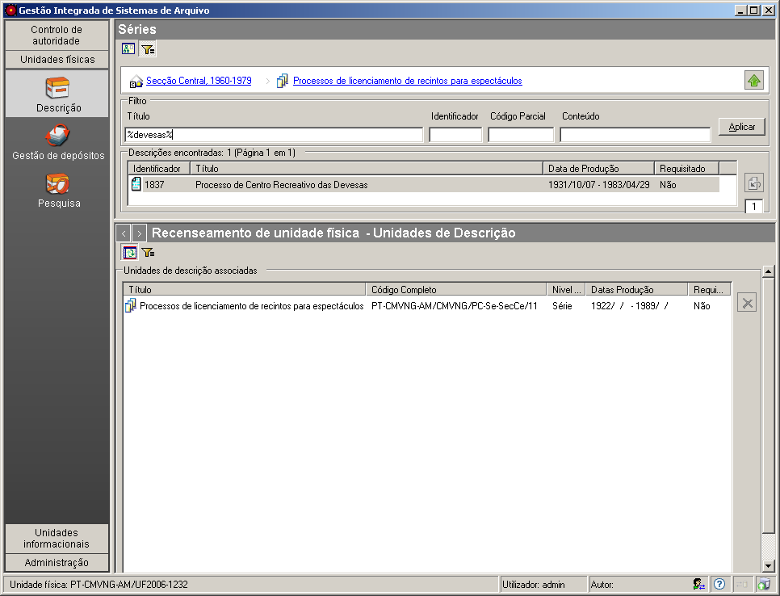
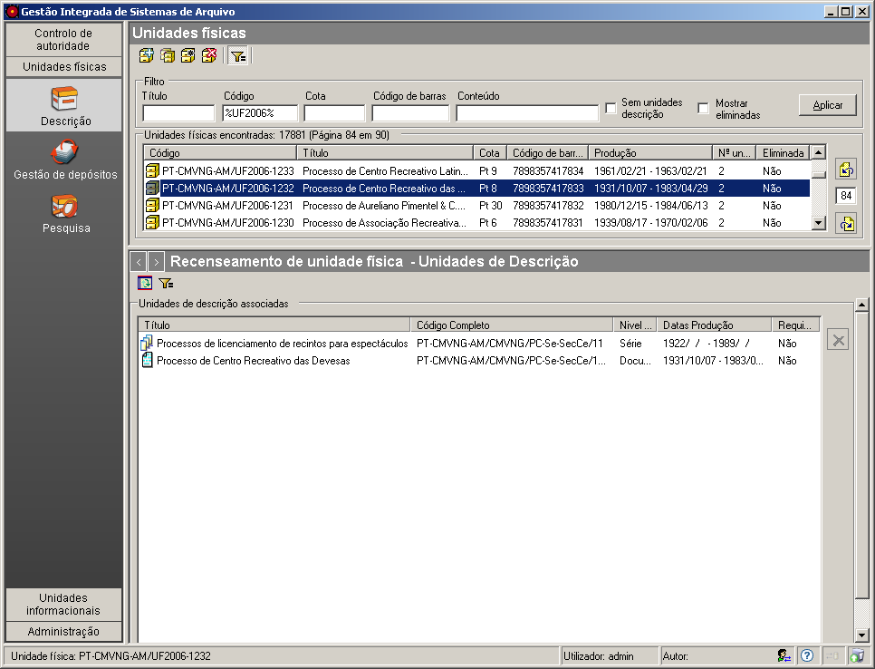
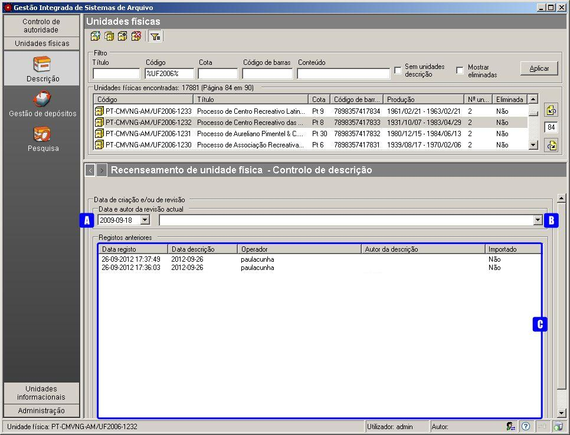
