Estrutura arquivística
======================

A *área de contexto* do módulo *Descrição* das *Unidades informacionais*
permite a navegação pelo `plano de
classificação <introducao.html#plano-de-classificacao>`__, de modo a ser
possível localizar a unidade informacional que se pretende. Nesta área é
possível criar os níveis do tipo ``Entidade detentora`` e
``Grupo de arquivos``, bem como a sua associação à estrutura orgânica,
previamente definida noutra área. A criação da estrutura documental
(séries e documentos) também é integralmente feita nesta área .

A barra de ferramenta da área de contexto apresenta as seguintes opções:

|image0|

A: ``Criar entidade detentora`` - Este botão permite criar o nível do
tipo ``Entidade detentora``.

B: ``Criar subnível`` - Este botão só se encontra ativo se estiver
selecionado qualquer nível do tipo ``Entidade detentora`` ou
``Grupo de arquivos``, permitindo criar um subnível do tipo
``Grupo de arquivos`` debaixo do nível selecionado ou associar um nível
do tipo ``Arquivo`` já existente. Caso a entidade produtora do tipo
``Arquivo`` já esteja relacionado com outras entidades produtoras,
constituindo a estrutura orgânica, esta associação a um arquivo
possibilita a visualização da estrutura orgânica em árvore permitindo a
navegação pelos seus diferentes níveis.

C: ``Editar nível`` - Botão que permite editar o ``Código parcial`` e o
``Título`` de um nível do tipo ``Entidade detentora`` ou
``Grupo de arquivos``, quando selecionado.

D: ``Eliminar nível`` - Este botão permite eliminar níveis do tipo
``Entidade detentora`` ou ``Grupo de arquivos`` e eliminar a associação
de um um nível do tipo ``Arquivo`` com qualquer nível superior. Este
botão encontra-se inativo se estiver selecionado qualquer outro tipo de
nível.

E: ``Recortar nível`` - Quando se pretende mover uma subhierarquia para
outro lado, recorta-se o nível superior a mover, para depois se colar
debaixo do nível selecionado. Nesta vista, este botão só fica ativo
quando o nível selecionado é um nível do tipo ``Grupo de arquivos``.

F: ``Colar nível`` - Este botão permite colar a hierarquia recortada,
debaixo do nível selecionado. Este botão só fica ativo se se tiver já
recortado uma subhierarquia com o botão anterior e se o nível onde se
pretende colar permitir ter como subjacente o nível topo da
sub-hierarquia recortada.

G: ``Ver níveis documentais`` - Botão que aparece na vista orgânica e
permite passar para a vista documental. A vista documental, por omissão,
só mostra os níveis documentais subjacentes ao nível estrutural
selecionado. Na vista documental aparece o botão
``Ver níveis estruturais`` para passar para a vista estrutural. Este
botão alterna com o anterior.

H: ``Filtrar dados`` - Botão inativo na vista da estrutura orgânica, só
permitindo a `filtragem de dados na vista
documental <descricao_ui.html#filtragem-de-niveis-documentais>`__ pelos
seguintes critérios: ``Título``, ``Identificador``, ``Código parcial``,
``Conteúdo``, ``Esconder níveis não diretos``.

I: ``Gerar relatórios`` - Botão que permite a geração de vários tipos de
relatório em formato PDF ou RTF. Ver
`Relatórios <descricao_ui.html#relatorios>`__ para um maior detalhe.

J: ``Exportar para EAD`` - Botão que permite a exportação dos dados do
GISA para um ficheiro apresentando um formato EAD. Ver `Exportar para
EAD <descricao_ui.html#exportar-para-ead>`__ para um maior detalhe.

K: ``Importação`` - botão que faculta a importação de dados, existentes
num ficheiro Excel, para o GISA, desde que obedeçam às regras definidas
em `Importação de dados em
Excel <descricao_ui.html#importacao-de-dados-em-excel>`__ para um maior
detalhe.

Entidade detentora
------------------

Cada estrutura arquivística tem obrigatoriamente como nível de topo, um
nível do tipo ``Entidade detentora``, representando a entidade que detém
os documentos. O GISA dá a possibilidade de gerir várias entidades
detentoras, correspondendo, cada uma, a uma estrutura arquivística
fundamental na classificação do conjunto de documentos debaixo da sua
alçada.

Uma entidade detentora é um nível sem qualquer descrição associada.

Para criar uma entidade detentora, clicar no botão da barra de
ferramentas ``Criar entidade detentora``, abrindo-se a seguinte janela:

|image1|

O botão ``Aceitar`` só aparece ativo quando se tiver preenchido o
``Código parcial`` e o ``Título``.

O ``Código parcial`` serve para identificar a entidade detentora de
forma unívoca, o qual normalmente e é constituído pela sigla do país e
pela sigla da entidade separados por hífen (pe PT-CMVNG). O ``Título`` é
a designação dessa entidade.

Uma entidade detentora, quando selecionada, poderá ser editada com o
botão ``Editar nível`` ou removida com o botão ``Eliminar nível``. Uma
remoção só é possível quando não há mais nenhum nível subjacente nem
nenhuma unidade física associada, caso contrário, o botão não fica
ativo.

Quando na estrutura arquivística está selecionada uma entidade
detentora, o botão ``Criar subnível`` mostra um menu com duas opções:

-  ``Criar Grupo de arquivos`` - permitindo criar um nível do tipo
   ``Grupo de arquivos`` debaixo dessa entidade.

\* ``Criar Arquivo`` - permitindo associar uma entidade produtora do
tipo ``Arquivo``, o topo da estrutura orgânica, já existente.

Grupo de arquivos
-----------------

Contrariamente ao anterior, este nível é opcional. Para se criar um
nível do tipo ``Grupo de arquivos`` deve selecionar-se uma entidade
detentora na área de contexto, debaixo da qual ele vai ficar subjacente
e, só depois, clicar-se no botão ``Criar subnível`` e escolher a opção
``Criar Grupo de arquivos``.

A janela que aparece é idêntica à da criação de um nível do tipo
``Entidade Detentora``, onde o botão ``Aceitar`` só fica ativo quando se
tiver preenchido o ``Código parcial`` e o ``Título``. O
``Código parcial`` serve para identificar o grupo de arquivos de forma
unívoca, e o ``Título`` para denominar esse grupo.

Um grupo de arquivos, quando selecionado, poderá ser editado com o botão
``Editar nível`` ou removido com o botão ``Eliminar nível``. Uma remoção
só é possível quando não há mais nenhum nível subjacente, caso
contrário, o botão não fica ativo.

É possível mover uma sub-hierarquia, cujo topo é um grupo de arquivos,
para debaixo de outra entidade detentora, recorrendo aos botões
``Recortar`` e ``Colar``.

Quando na estrutura arquivística está selecionado um grupo de arquivos,
o botão ``Criar subnível`` só tem como possibilidade:

-  ``Criar Arquivo`` - permite associar, como subnível, uma entidade
   produtora do tipo ``Arquivo`` já existente e que por sua vez será o
   topo da estrutura orgânica.

Estrutura orgânica
------------------

A estrutura orgânica é constituída por diversos níveis orgânicos
relacionados entre si, fornecendo o contexto produtor de informação.

Estes níveis são entidades produtoras, cuja criação e descrição pela
norma internacional *ISAAR-CPF* é registada na área de `Entidades
produtoras <entidade_produtora.html>`__.

Ao mesmo tempo, estes níveis podem constituir um nível descrição
arquivística, segundo a ISAD-G, cuja descrição tem como objeto o
conjunto de todos os documentos produzidos por esse nível. Para um maior
detalhe consultar `Descrição
multinível <descricao_ui.html#descricao-multinivel>`__.

Navegação na estrutura orgânica
~~~~~~~~~~~~~~~~~~~~~~~~~~~~~~~

Apesar dos vários tipos de relação entre as entidades produtoras, na
área de contexto deste módulo, só se conseguem visualizar as relações do
tipo hierárquico.

Cada unidade orgânica, dependendo do tipo de nível, é representada por
ícones diferentes. Os ícones aparecem com um **C** no canto inferior
esquerdo, indicando que o nível em causa é um nível controlado, ou seja,
um registo de autoridade cuja construção e gestão é feita no módulo
*Entidade produtora* do *Controlo de Autoridade*, detalhada em
`Entidades produtoras <entidade_produtora.html>`__.

Se ao lado de cada nível estiver um intervalo de datas entre parêntesis,
isso indica o período em que esse nível foi subordinado do nível
hierarquicamente superior. As datas foram atribuídas no campo `3.
Relações <entidade_produtora.html#relacoes>`__ do módulo *Entidade
produtora* do *Controlo de Autoridade* e são importantes no
estabelecimento de uma ordem na apresentação da estrutura. Debaixo de um
mesmo nível, as entidades produtoras serão ordenadas por ordem
decrescente de datas de fim de relação, ficando à cabeça as datas mais
recentes. |image2|

Neste exemplo, dada a representação em árvore, a entidade *Repartição de
alunos. Reitoria da Universidade do Porto, 1992/1-1999/7* aparece em
dois pontos diferentes, mas na realidade é uma única. A secção
*Repartição de alunos. Reitoria da Universidade do Porto, 1992/1-1999/7*
esteve durante 1992/1-1997/7 subjacente à *Direcção dos Serviços
Académicos. Reitoria da Universidade do Porto, 1992/1-1997/7* e, durante
1997/7-1999/7, subjacente à *Divisão Académica. Reitoria da Universidade
do Porto, 1997/7-1999/7*. Na realidade, o que se passa é o representado
na figura:

|image3|

Definição de nível de topo
~~~~~~~~~~~~~~~~~~~~~~~~~~

O nível de topo da estrutura orgânica é do tipo ``Arquivo``, o qual
deverá estar subjacente a uma ``Entidade detentora`` ou a um
``Grupo de arquivos`` já existente.

Para isso, basta selecionar o nível ao qual se pretende associar o
arquivo e escolher a opção da barra de ferramentas
``Criar subnível``/``Criar Arquivo``, abrindo-se a seguinte janela:

|image4|

Seleciona-se da lista, a entidade produtora de *topo* da estrutura
hierárquica, recorrendo-se ao filtro se necessário, e clica-se no botão
``Aceitar``. Essa entidade produtora passará a ser um nível de descrição
arquivística do tipo ``Arquivo``.

Se a estrutura orgânica já estiver criada, ou seja, todas as entidades
produtoras (registos de autoridade) e relações entre elas, ficará
imediatamente visível. Por outro lado, deixará de estar visível, se for
removida a associação do nível de topo da estrutura orgânica, o que não
quer dizer que não exista, simplesmente não é apresentada.

|image5|

Construção da estrutura orgânica
~~~~~~~~~~~~~~~~~~~~~~~~~~~~~~~~

A criação, edição e remoção dos níveis orgânicos e das relações entre
eles, são feitas no módulo *Entidade Produtora* da área do *Controlo de
autoridade*, encontrando-se o processo detalhado em `Entidades
produtoras <entidade_produtora.html>`__.

Para qualquer nível orgânico selecionado, o botão ``Eliminar nível``
fica sempre inibido, exceto no caso de um nível de topo do tipo
``Arquivo``. A ação deste botão ``Eliminar nível``, na realidade, só
elimina a associação desse nível ao nível superior, mas faz com que toda
a estrutura deixe de ficar visível nesta área.

Os botões ``Recortar`` e ``Colar`` também não estão disponíveis quando
se seleciona algum nível da estrutura orgânica, pois toda a alteração
das relações entre as entidades produtoras é feita na zona *3. Relações*
do módulo *Controlo de autoridade/Entidade Produtora*. Mais informações
em `Relações entre entidades
produtoras <entidade_produtora.html#relacoes>`__.

Estrutura documental
--------------------

Cada unidade orgânica pode ter associada uma estrutura documental. Esta
estrutura é hierárquica, sendo constituída por vários tipos de nível:
``Série``, ``Subsérie``, ``Documento/processo`` e
``Documento subordinado/Ato informacional``.

Para se criar, editar ou simplesmente visualizar a estrutura documental
subjacente a um determinado nível orgânico, primeiro, seleciona-se esse
nível.

|image6|

De seguida, passa-se para a vista documental com o botão
``Ver níveis documentais``, o que permite a visualização dos níveis
documentais diretamente associados. Por omissão, o critério do filtro,
``Esconder níveis não diretos`` encontra-se assinalado.

|image7|

Para se poderem visualizar todos os níveis documentais, direta e
indiretamente associados, deve usar-se o filtro, retirando o visto de
``Esconder níveis não diretos``.

|image8|

Navegação na estrutura documental
~~~~~~~~~~~~~~~~~~~~~~~~~~~~~~~~~

|image9|

A: ``Ver níveis estruturais`` - botão que aparece na vista documental e
permite passar para a vista estrutural. Na vista estrutural aparece o
botão ``Ver níveis documentais`` para passar para a vista documental.
Este botão alterna com o anterior.

B: ``Barra de navegação`` - permite a navegação na estrutura documental
subjacente a uma entidade produtora, mostrando o caminho do nível
selecionado até à entidade produtora.

C: ``Subir nível documental`` - botão que permite subir de nível de
descrição.

D: ``Lista paginada`` - lista paginada de níveis documentais subjacentes
ao nível selecionado.

A janela anterior mostra, na barra de navegação, a entidade produtora
selecionada, *Contabilidade. Teta Ca. Lda., 1977-* e na lista paginada,
todos os níveis hierarquicamente inferiores a esse produtor, entre os
quais a série *Movimentos de caixa*.

Para se visualizar os níveis hierarquicamente inferiores ao nível
selecionado na lista paginada, por exemplo *Movimentos de caixa*, basta
clicar duas vezes em cima desse nível. Neste caso, a barra de navegação
passa a mostrar o caminho hierárquico da entidade produtora,
*Contabilidade. Teta Ca. Lda., 1977-*, até esse nível selecionado,
*Movimentos de caixa*, e a lista paginada passa a mostrar todos os
níveis hierarquicamente subordinados ao nível selecionado:

|image10|

Para subir de nível, ou seja, selecionar o nível hierarquicamente
superior, deve clicar-se no botão ``Subir nível documental``. Os níveis
do caminho apresentado na barra de navegação, têm hiperligações que
permitem a seleção de um nível superior hierárquico não adjacente ao
selecionado, sem ter de percorrer todo o caminho via botão
``Subir nível documental``.

Para maior detalhe na utilização desta lista paginada com barra de
navegação ver em `Listas paginadas com barra de
navegação <ambiente_trabalho.html#listas-paginadas-com-barra-de-navegacao>`__.
Para se selecionar determinado elemento da lista paginada, pode
recorrer-se ao `filtro <ambiente_trabalho.html#filtros>`__.

Criação de um nível documental
~~~~~~~~~~~~~~~~~~~~~~~~~~~~~~

O procedimento para criar um nível documental subjacente a um nível
hierarquicamente superior, é sempre o mesmo:

1. Selecionar o nível orgânico ou documental, hierarquicamente superior,
debaixo do qual se pretende criar o nível documental.

2. Clicar no botão ``Criar subnível`` da barra de ferramentas. O menu
apresentado, depende do tipo de nível anteriormente selecionado,
apresentando apenas como opção os tipos de nível possíveis criar. A
regra para atribuição dos tipos de nível a constar no menu é a seguinte:

+-----------------------------------------------+-----------------------------------------------+
| Nível selecionado                             | Nível subjacente possível criar               |
+===============================================+===============================================+
| *Nível orgânico*                              | ``Série`` ou ``Documento/Processo``           |
+-----------------------------------------------+-----------------------------------------------+
| ``Série``                                     | ``Subsérie`` ou ``Documento/Processo``        |
+-----------------------------------------------+-----------------------------------------------+
| ``Subsérie``                                  | ``Subsérie`` ou ``Documento/Processo``        |
+-----------------------------------------------+-----------------------------------------------+
| ``Documento/Processo``                        | ``Documento subordinado/Ato informacional``   |
+-----------------------------------------------+-----------------------------------------------+
| ``Documento subordinado/Ato informacional``   | -                                             |
+-----------------------------------------------+-----------------------------------------------+

Se por exemplo estiver selecionado um nível orgânico, o menu apresentado
é o seguinte:

|image11|

3. Escolher do menu o *tipo* de nível a criar, por exemplo
``Documento/Processo``. Abre-se a seguinte janela:

|image12|

A: ``Código parcial`` - Parte do *Código de referência* relativa ao
nível a ser criado. Para níveis do tipo ``Série`` ou ``Subsérie``, este
é um número sequencial, gerado automaticamente pelo sistema. Para o caso
de níveis do tipo ``Documento/Processo`` e
``Documento subordinado/Ato informacional`` é de preenchimento
obrigatório, utilizando sempre que possível o número estabelecido pelo
produtor do documento.

B: ``Título`` - Título do nível de descrição a ser criado.

C: ``Unidade física associada`` - Caixa de verificação que, quando
assinalada, indica que para além da unidade documental a ser criada,
também será criada uma unidade física que lhe ficará associada de forma
automática.

D: ``Título da unidade física associada`` - Título da unidade física, se
também criada .

E: ``Sincronizar`` - Caixa de verificação que, quando assinalada,
permite sincronizar os campos ``Título`` e
``Título da unidade física associada``, ou seja, quando um deles é
preenchido o outro fica preenchido de igual forma. No caso de se
pretender que estes dois campos sejam diferentes, ter-se-á de retirar o
visto desta caixa.

4. Preencher pelo menos os campos obrigatórios.

O ``Código parcial`` é um alfanumérico e tem de ser único no conjunto de
todas as unidades documentais subjacentes ao nível selecionado. O
sistema acusa quando se está a introduzir um elemento repetido. Apesar
do campo ``Código parcial`` admitir qualquer tipo de caracter,
aconselha-se a não introdução da barra (/), nem do hífen (-), para não
se confundir com os separadores de níveis do *Código de referência*.

|image13|

5. Clicar no botão ``Aceitar``. O botão ``Aceitar`` só aparece ativo
depois de preenchidos os campos obrigatórios.

Um nível do tipo ``Série`` ou
``Documento subordinado/Ato informacional`` (documento solto) pode estar
associado a mais que uma entidade produtora. A primeira associação
estabelece-se no momento da criação do nível, mas qualquer outra
associação deve ser estabelecida no campo `2.1 Entidade(s)
produtora(s) <contexto.html#entidade-s-produtora-s>`__ do módulo
*Unidades informacionais/Descrição*.

|image14|

Edição de um nível documental
~~~~~~~~~~~~~~~~~~~~~~~~~~~~~

O botão ``Editar nível`` da barra de ferramentas permite editar o
``Título`` de qualquer nível selecionado e o ``Código parcial`` de
níveis do tipo ``Documento/Processo`` ou
``Documento subordinado/Ato informacional``.

Remoção de um nível documental
~~~~~~~~~~~~~~~~~~~~~~~~~~~~~~

A remoção de um nível documental selecionado na lista paginada é feita
através do botão ``Eliminar nível`` ou pressionar a tecla ``DEL``, que
para além de eliminar o nível também elimina a sua relação com o nível
superior que se encontra na barra de navegação.

Caso o nível documental que se pretende remover tenha níveis
subjacentes, ter-se-á de os remover primeiro, antes de se poder remover
o nível em causa.

Caso o nível documental esteja associado a várias unidades orgânicas, a
remoção efetuada só afeta a associação com a unidade orgânica
apresentada na barra de navegação. A remoção desse nível só é efetuada
se já não existirem mais associações com outros níveis orgânicos para
além da existente com o nível orgânico apresentado na barra de
navegação.

Para remover cada associação de um nível documental às várias unidades
orgânicas, não é necessário visualizar a estrutura documental de cada
unidade orgânica, basta ir ao campo de descrição `2.1 Entidade(s)
produtora(s) <contexto.html#entidade-s-produtora-s>`__ do módulo
*Unidades informacionais/Descrição* e apagar todas as associações com
unidades orgânicas, exceto a que consta na barra de navegação (ver
procedimento em `Contexto <contexto.html>`__). Por fim, restando uma
única associação do nível documental com a unidade orgânica apresentada
na barra de navegação, este já pode ser eliminado através do botão
``Eliminar nível``.

Deslocação de um nível documental
~~~~~~~~~~~~~~~~~~~~~~~~~~~~~~~~~

Os botões ``Recortar`` e ``Colar`` estão disponíveis para a deslocação
de níveis documentais de determinado ponto da estrutura arquivística
para outro, sendo também deslocados todos os níveis a eles subjacentes.
O destino deve obedecer às seguintes regras:

+-----------------------------------------------+-------------------------------------------------+
| Nível recortado                               | Nível debaixo do qual é colado                  |
+===============================================+=================================================+
| ``Série``                                     | *Nível orgânico*                                |
+-----------------------------------------------+-------------------------------------------------+
| ``Subsérie``                                  | ``Série`` ou ``Subsérie``                       |
+-----------------------------------------------+-------------------------------------------------+
| ``Documento/Processo``                        | *Nível orgânico* ou ``Série`` ou ``Subsérie``   |
+-----------------------------------------------+-------------------------------------------------+
| ``Documento subordinado/Ato informacional``   | ``Documento/Processo``                          |
+-----------------------------------------------+-------------------------------------------------+

Por exemplo, se se mover uma ``Subsérie``, só vai ser possível colá-la
debaixo de uma ``Série`` ou de outra ``Subsérie``. Caso isso o destino
não obedeça às regras, o botão ``Colar`` fica inativo.

Para se mover um nível documental, seleciona-se o nível pretendido,
clica-se no botão ``Recortar``, escolhe-se o nível de descrição de
destino, segundo as regras anteriores e, por fim, clica-se no botão
``Colar``.

É possível mover um conjunto de níveis simultâneamente, desde que a
seleção seja múltipla, dentro da mesma página, com a ajuda da tecla
``Shift`` ou ``Ctrl``.

Filtragem de níveis documentais
~~~~~~~~~~~~~~~~~~~~~~~~~~~~~~~

A lista de níveis documentais pode ser filtrada pelos seguintes campos:

|image15|

-  ``Título``, selecionando unidades informacionais cuja designação
   obedeça à expressão introduzida neste campo.

\* ``Identificador``, selecionando unidades informacionais cujo
identificador obedeça à expressão introduzida neste campo.

-  ``Código parcial``, selecionando unidades informacionais cujo código
   parcial obedeça à expressão introduzida neste campo.

\*\ `` Conteúdo``, selecionando unidades informacionais cujo conteúdo
obedeça à expressão introduzida neste campo.

-  ``Esconder níveis não diretos``, o qual, se assinalado (é-o por
   omissão), apresenta unidades informacionais diretamente relacionadas
   com o unidade orgânica selecionada, caso contrário, mostra todas, as
   direta e indiretamente relacionadas.

Geração de relatórios
---------------------

É possível gerar relatórios, para ficheiros, relativos às descrições
arquivísticas criadas neste módulo. Pode escolher-se o tipo de relatório
pretendido depois de clicar no botão ``Gerar relatórios`` existente na
barra de ferramentas. Existem os seguintes tipos de relatório:

-  ``Inventário resumido`` - lista alguns campos de todas as unidades
   descrição de níveis documentais do tipo ``Série`` ou ``Subsérie``
   existentes debaixo de um determinado nível orgânico. Os campos de
   descrição listados são os seguintes: tipo, título, datas de produção
   e código parcial do nível de descrição.
-  ``Inventário detalhado`` - lista detalhadamente todas as unidades
   descrição de níveis documentais do tipo ``Série`` ou ``Subsérie``
   existentes debaixo de um determinado nível orgânico. Neste relatório,
   por ser detalhado, o utilizador pode escolher os campos de descrição
   a constar no relatório.
-  ``Catálogo resumido`` - lista alguns campos de todas as unidades
   descrição de níveis documentais do tipo ``Documento/Processo`` e
   ``Documento subordinado/Ato informacional`` existentes debaixo de um
   determinado nível orgânico ou documental. Os campos de descrição
   listados são os seguintes: tipo, título, datas de produção e código
   parcial do nível de descrição.
-  ``Catálogo detalhado`` - lista detalhadamente todas as unidades
   descrição de níveis documentais do tipo ``Documento/Processo`` e
   ``Documento subordinado/Ato informacional`` existentes debaixo de um
   determinado nível orgânico ou documental. Neste relatório, por ser
   detalhado, o utilizador pode escolher os campos de descrição a
   constar no relatório.
-  ``Auto de eliminação`` - permite gerar um relatório de um determinado
   auto de eliminação, com o conteúdo detalhado dos elementos que refere
   para eliminar.
-  ``Auto de eliminação por portaria`` - permite gerar um relatório de
   um determinado auto de eliminação, cujo conteúdo é apresentado
   conforme a Portaria nº412/2001 de 17 de Abril.

Os inventários e catálogos detalhados permitem a escolha dos campos a
serem apresentados, através da seguinte janela:

|image16|

Para gerar um relatório do tipo auto de eliminação, deve-se escolher o
auto pretendido da lista de todos os autos de eliminação registados no
sistema, apresentados na seguinte janela:

|image17|

Depois de selecionado o auto de eliminação pretendido, clicar no botão
``OK``.

O utilizador pode indicar a localização, o nome e o tipo (PDF ou RTF) do
ficheiro relativo a um relatório na seguinte janela:

|image18|

Por fim, clicar no botão ``Guardar`` para gerar o relatório, o qual será
guardado no local indicado, ou no botão ``Cancelar`` para desistir.

Exportação para EAD
-------------------

A exportação das descrições arquivísticas para um formato EAD, pode ser
feita sobre qualquer nível de descrição, escolhido na estrutura
arquivística, exportanto tanto a descrição arquivística desse nível, bem
como a descrição de todos os níveis subjacentes.

O procedimento é o seguinte:

1. Escolher um nível da estrutura arquivística.

2. Clicar no botão ``Exportar para EAD`` da barra de ferramentas,
aparecendo a seguinte janela de diálogo:

|image19|

3. Escolher um diretório onde guardar o ficheiro EAD a gerar e clicar no
botão de ``Guardar``.

Importação de dados em Excel
----------------------------

É possível importar, automaticamente, registos de documentos (simples
e/ou compostos) existentes em ficheiros Excel para o GISA, desde que os
dados estejam em conformidade com o modelo e regras estabelecidas neste
documento.

A importação tem duas etapas, a primeira, de preparação do ficheiro
Excel, segundo o modelo e regras estabelecidas, e a segunda, de execução
da operação de importação propriamente dita.

Em termos gerais, esta operação de importação de um ficheiro de Excel
escolhido, faz uma série de verificações e validações. Caso algo nesse
ficheiro não esteja em conformidade, é lançada uma mensagem de erro e a
importação é completamente abortada. Depois de corrigido o erro
indicado, pode voltar-se a executar a importação e só quando não
existirem erros detetados pelo GISA é que a importação do ficheiro
escolhido será feita na sua totalidade.

Descrevem-se a seguir, as regras para obedecer ao *modelo do Excel*
estabelecido e também o *processo de importação*, incluindo possíveis
cenários de erro e sugestões de correção dos mesmos.

Modelo Excel
~~~~~~~~~~~~

O modelo do ficheiro Excel, ``Importacao Excel_Modelo.xls``, que se
encontra na pasta ``Importacao`` do CD de instalação, é constituído por
duas folhas:

.. toctree::
   :maxdepth: 2
   
   modelo_ui
   modelo_uf

A primeira coluna de cada tabela Excel, designada por ``Identificador``,
é onde se colocam os códigos identificadores dos registos da tabela.
Esse código é usado noutras colunas para referenciar registos da própria
tabela ou da outra tabela dentro do próprio ficheiro. No fim, estes os
códigos são descartado pelo importador.

Na importação poderão existir dados numa única tabela ou então nas duas.
A coluna ``UnidadesFisicas`` da tabela ``Documentos`` permite referir
identificadores que constam na coluna ``Identificador`` da tabela
``UnidadesFisicas``, de forma a relacionar uma unidade informacional a
uma ou várias unidades físicas.

Processo de importação
~~~~~~~~~~~~~~~~~~~~~~

Depois do ficheiro Excel pronto, segundo as regras atrás mencionadas,
para importar os seus dados para o GISA, primeiro clicar no botão de
``Importação``, a seguir escolher o ficheiro a importar e por fim
executar, tendo em conta que o ficheiro não deverá estar aberto por
outra aplicação. Se a estrutura e os dados estiverem todos em
conformidade com as regras e coerentes com os dados existentes no GISA,
a importação será efetuada com sucesso. Em caso de erro, é lançada uma
mensagem, cancelando a importação na sua totalidade. Este é um processo
iterativo, em que o utilizador terá de eliminar cada erro que apareça
até que a importação se efetive.

Há três tipos de erro em função das fases da importação em que ocorrem:

1. Em caso de erro na fase de abertura e leitura do ficheiro Excel, em
que o ficheiro pode estar a ser usado por outra aplicação, é apresentada
a seguinte mensagem:

|image20|

2. Durante a análise de conformidade dos dados existentes no Excel, de
acordo com as regras definidas, qualquer mensagem de erro apresenta as
coordenadas do erro no Excel (Tabela, Linha e Coluna), o tipo de erro e
o modo de resolução em detalhe para que o utilizador o possa corrigir no
Excel e volte a executar a importação.

|image21|

3. Os dados do Excel podem estar corretos, mas será necessário analisar
a sua coerência com os dados existentes no GISA. Caso a importação
provoque incoerência na base de dados GISA, será lançada uma mensagem de
erro e esta será abortada. Por exemplo,

|image22|

4. Se em alguma situação acontecer a mensagem “Ocorreu um erro durante a
importação. A operação foi cancelada.”, quer dizer que algo de
imprevisto aconteceu, por isso, é aconselhável contactar o Administrador
do sistema.

|image23|

Depois dos erros todos corrigidos a importação será efetuada com
sucesso.

Descrição multinível
====================

A descrição arquivística, feita na área de detalhes deste módulo
*Unidades in formacionais/Descrição*, é uma `descrição
multinível <introducao.html#descricao-arquivistica-multinivel>`__ e
rege-se pela norma internacional
`ISAD(G) <http://www.ica.org/10207/standards/isadg-general-international-standard-archival-description-second-edition.html>`__
— *Norma Geral Internacional de Descrição Arquivística*.

Antes de se fazer a descrição de uma unidade arquivística, esta tem de
estar criada e de ser selecionada.

|image24|

Todas as zonas de descrição, apresentadas a seguir, permitem a
introdução de meta-informação relativa a qualquer nível de descrição,
orgânico ou documental, selecionado na área de contexto. As diferentes
zonas e campos da descrição de unidades informacionais são:

.. toctree::
   :maxdepth: 2

   identificacao
   contexto
   conteudo_estrutura
   imagens
   condicoes_acesso_utilizacao
   documentacao_associada
   notas
   controlo_descricao
   indexacao

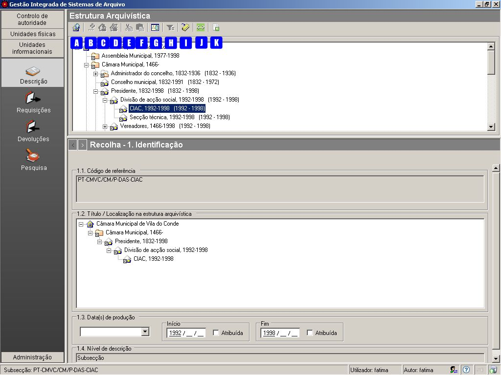
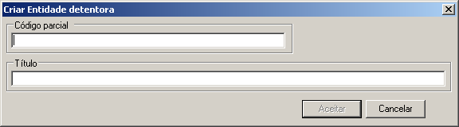
.. |image2| image:: _static/images/estruturaorganica.png
   :width: 500px
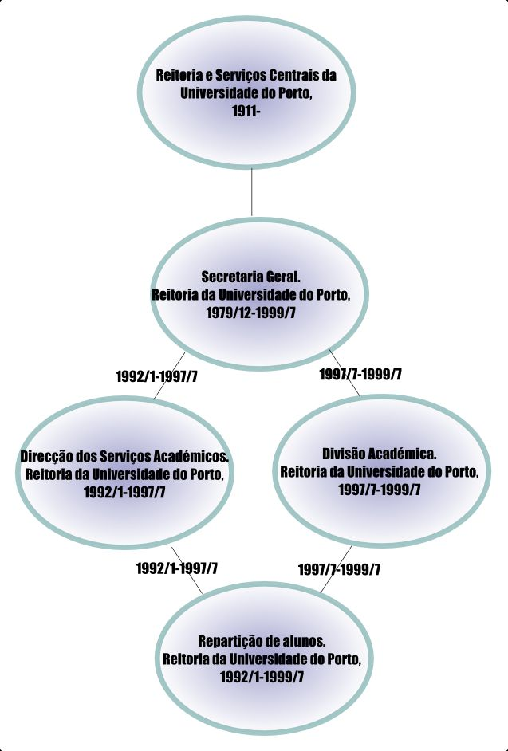
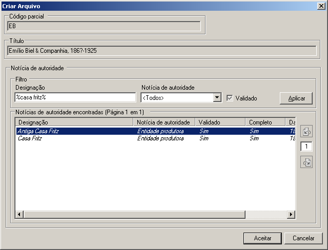
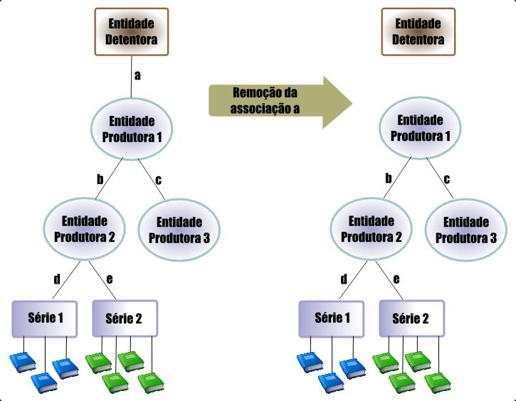
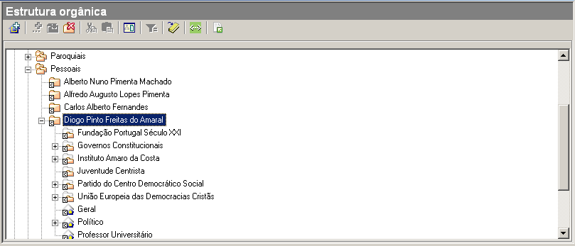
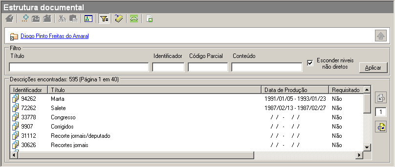

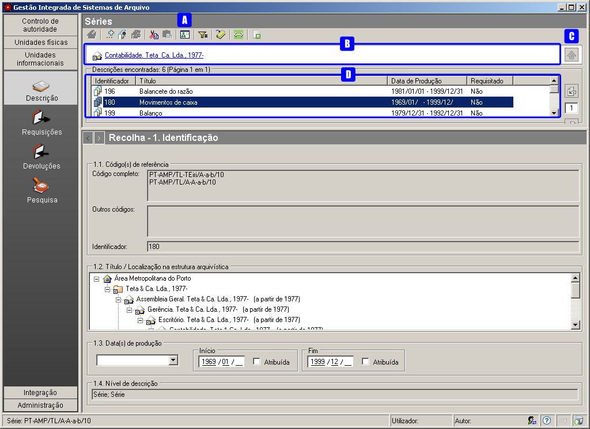
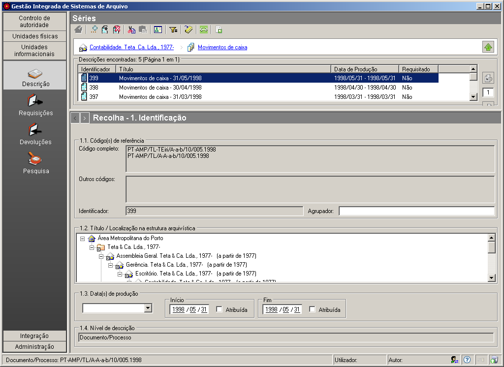
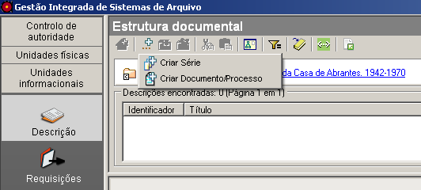
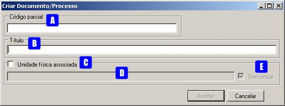
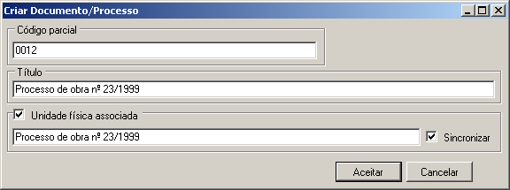
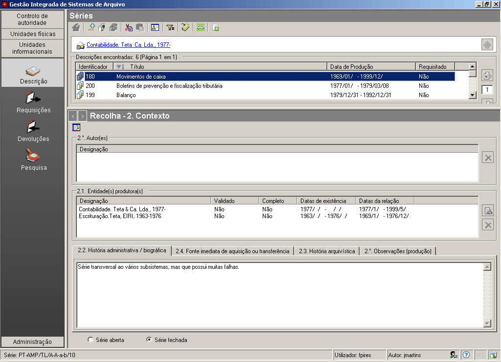

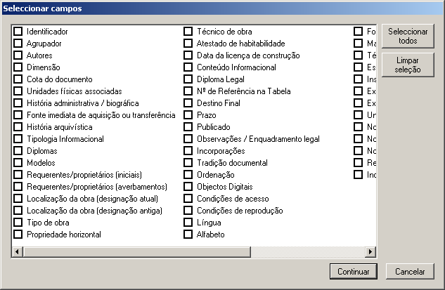
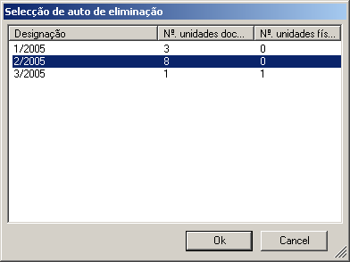
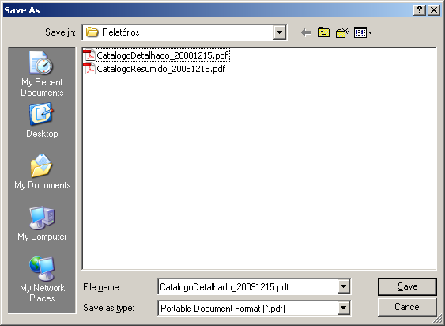
.. |image19| image:: _static/images/exportaread.png
   :width: 400px
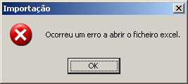
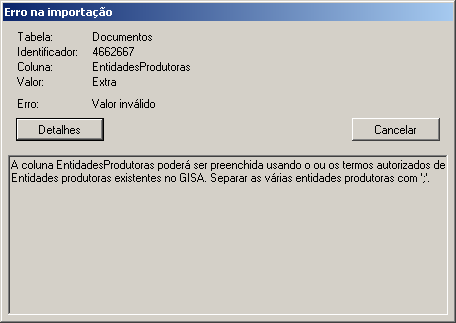
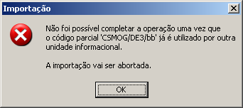
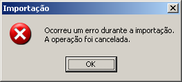
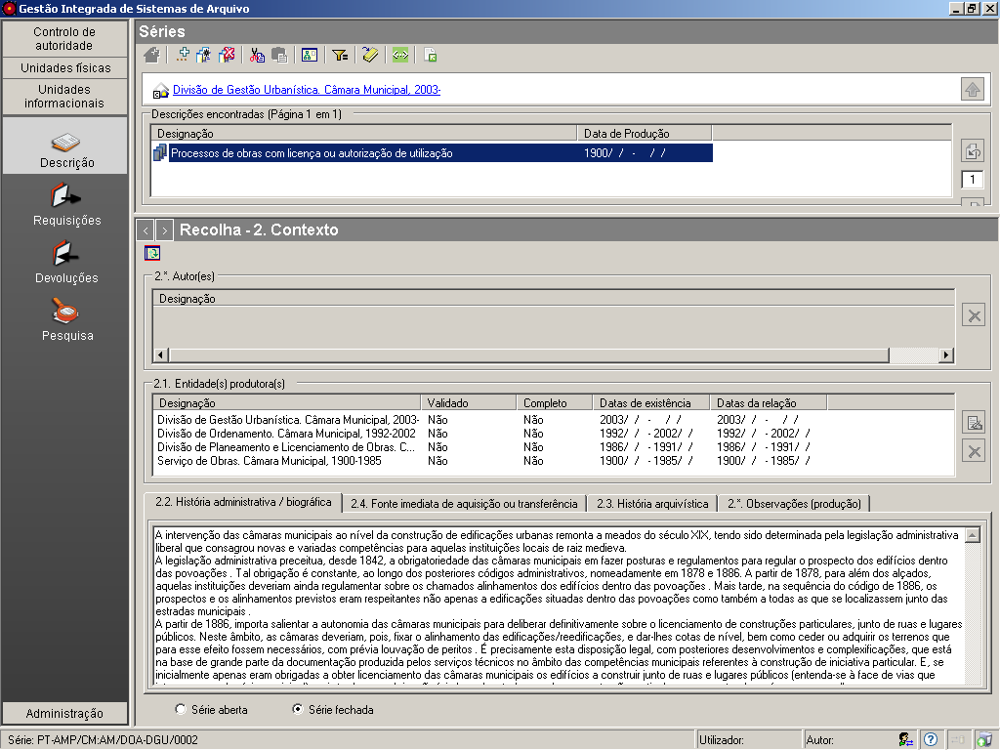
