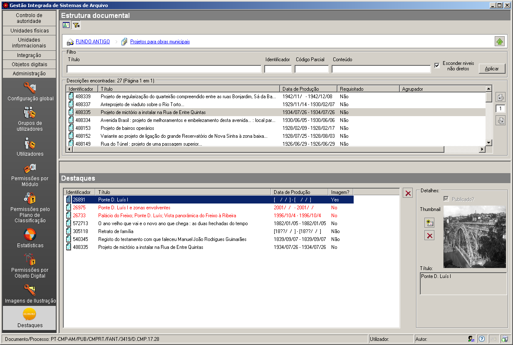

Destaques
=========

O módulo da aplicação desktop *Administração/Destaques* serve de
backoffice ao GISA Internet, possibilitando a gestão das unidades
documentais (séries ou documentos) a serem apresentadas *online* como
destaques.

|image0|

Na área de contexto é possível aceder às unidades documentais, via
unidades produtoras, quer sob a forma de estrutura hieráquica, ou de
pesquisa numa lista de produtores (para isso, clicar no botão *Filtro*),
tal como é feito na área de *Unidades Informacionais/Descrição*.

Ao selecionar a unidade documental pretendida, na área de contexto, esta
pode ser arrastada para a área de *Destaques*. Se esta unidade não
estiver publicada fica a vermelho, pois não vai ser apresentada na área
de destaques. Para poder ser destacada, terá de ser publicada primeiro
(`Publicação de um nível
documental <avaliacao.html#publicacao-de-um-nivel-de-descricao>`__).

A cada unidade documental destacada deve ser associada uma imagem que
permita ilustrar o destaque na web.

