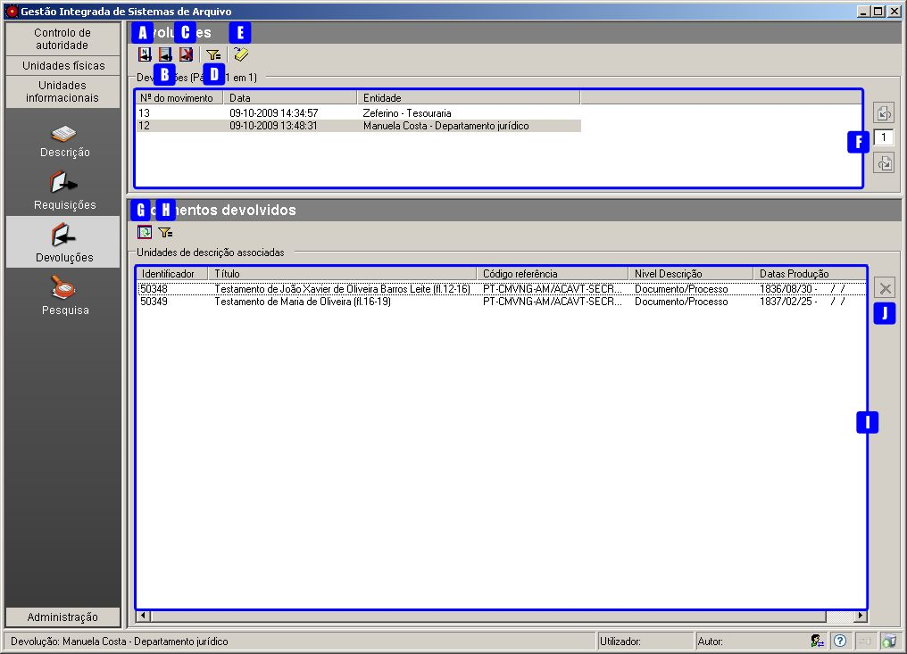
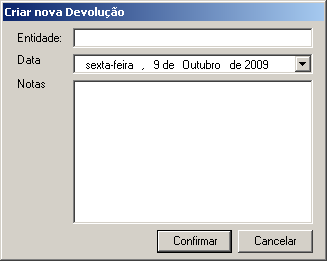
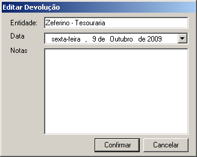
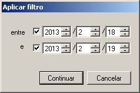
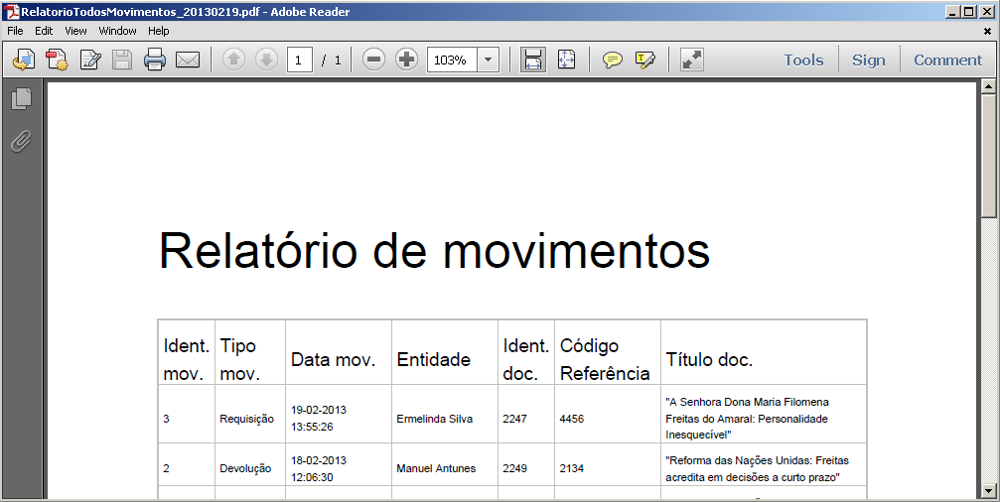
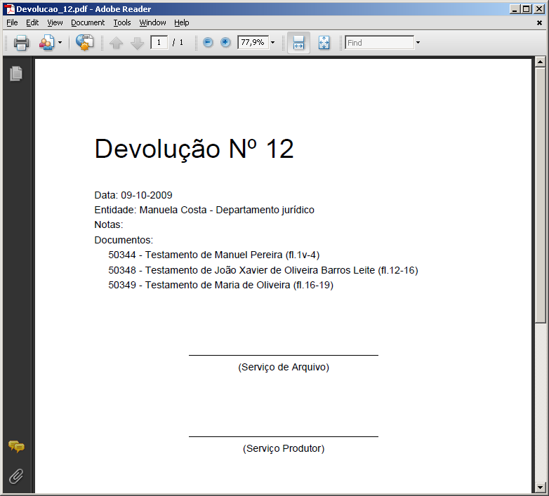

Devoluções de documentos
========================

Quando um documento que foi requisitado é devolvido, convém registar o
regresso do documento à guarda do arquivo e o responsável dessa
devolução.

O registo de qualquer devolução de documentos é efetuada no módulo
*Devoluções* da área *Unidades informacionais*. No sistema, fica
associado a cada documento qual o seu estado, se já se encontra em
arquivo ou se ainda está requisitado.

|image0|

A: ``Criar devolução`` - Botão que permite criar uma devolução.

B: ``Editar devolução`` - Botão que permite editar uma devolução.

C: ``Eliminar devolução`` - Botão que permite eliminar uma devolução.

D: ``Filtro`` - Botão que permite filtrar a lista de devoluções.

E: ``Imprimir`` - Botão que permite gerar o comprovativo da devolução
selecionada.

F: ``Devoluções`` - Lista de todas as devoluções criadas apresentando as
seguintes colunas: nº de movimento, data e entidade responsável.

G: ``Apresentar/esconder painel de apoio`` - Botão que apresenta a lista
de documentos requisitados e ainda não devolvidos.

H: ``Filtro`` - Botão que permite filtrar a lista dos documentos que
constam na devolução selecionada.

I: ``Documentos devolvidos`` - Lista com todos os documentos que constam
na devolução selecionada.

J: ``Apagar item`` - Botão que permite eliminar documentos que constam
na devolução selecionada.

Devolver documentos
-------------------

O registo da devolução de um documento, só é possível, depois de ter
sida registada no sistema uma `requisição <requisicoes.html>`__ do
mesmo.

Para registar uma devolução, clicar no botão ``Criar devolução``:

|image1|

Introduzir dados relativos à devolução:

-  ``Entidade`` - entidade que entrega o(s) documento(s) requisitado(s).
-  ``Data`` - data da devolução.
-  ``Notas`` - campo onde se coloca por exemplo os contactos ou qualquer
   outra anotação.

Por fim, clicar no botão ``Confirmar``, para confirmar, ou ``Cancelar``,
para desistir da criação da devolução.

Depois de criada a devolução, com um número de movimento gerado pelo
sistema, o qual identifica inequivocamente a devolução, devem ser
selecionados os documentos a ser devolvidos. Assim, clicar no botão
``Apresentar/esconder painel de apoio`` para ser apresentada uma lista
com todos os documentos requisitados e ainda não devolvidos, para se
poder selecionar o(s) documento(s), que está(ão) a ser devolvido(s), e
arrastar para a lista ``Documentos devolvidos``. A seleção dos
documentos pode ser múltipla, com a ajuda da tecla ``Shift`` ou
``Ctrl``.

Para apagar algum documento indevidamente associado à lista
``Documentos devolvidos``, é necessário selecioná-lo e clicar no botão
``Apagar item``.

A partir do momento em que um documento é devolvido, passa a estar
novamente disponível para voltar a ser requisitado se necessário.

Editar devolução
----------------

Para alterar a entidade, data ou notas de uma devolução, é necessário
primeiro selecionar a devolução na lista de devoluções e de seguida
clicar no botão ``Editar``.

|image2|

Eliminar devolução
------------------

Para eliminar uma devolução, basta selecionar a devolução na lista de
devoluções e clicar no botão ``Eliminar``.

Emitir relatórios
-----------------

Todos os movimentos
~~~~~~~~~~~~~~~~~~~

É possível gerar, em formato PDF ou RTF, um ficheiro contendo a lista de
todos os movimentos no Arquivo, efetuados dentro de um intervalo de
datas indicado pelo utilizador.

|image3|

São considerados dois tipos de movimento, as requisições e as
devoluções.

|image4|

Comprovativo da devolução
~~~~~~~~~~~~~~~~~~~~~~~~~

É possível gerar, em formato PDF ou RTF, um ficheiro contendo todos os
dados relativos à devolução que está selecionada.

|image5|

