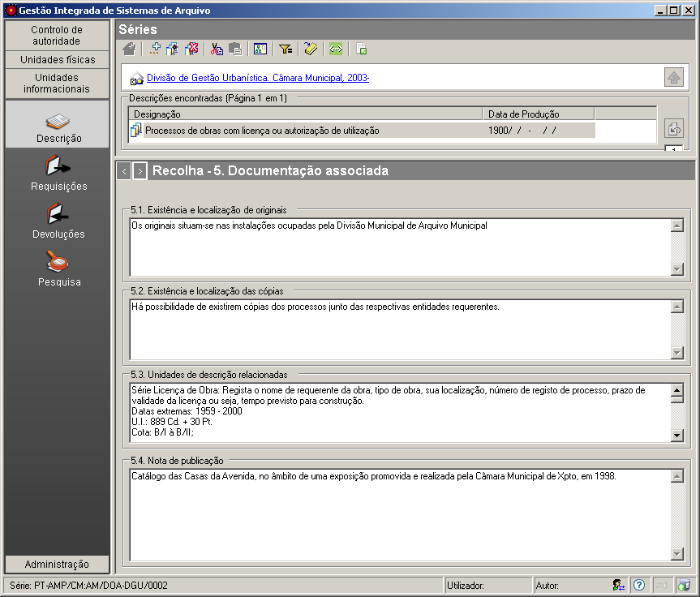

5. Documentação associada
=========================

Esta é uma das zonas da `descrição
multinível <descricao_ui.html#descricao-multinivel>`__ da ISAD(G).

|image0|

Existência e localização de originais
-------------------------------------

Se a unidade de descrição se refere a documentos que são cópias, este
campo permite indicar onde se encontram os originais (na mesma entidade
detentora ou noutro local) e se estão ou não disponíveis. Também se deve
indicar se os originais já não existem, ou se a sua localização é
desconhecida.

Existência e localização das cópias
-----------------------------------

Se houver cópias disponíveis dos documentos relativos à unidade de
descrição em causa, indicar neste campo a sua existência, localização e
disponibilidade.

Unidades de descrição relacionadas
----------------------------------

Neste campo regista-se a informação relativa a outras unidades de
descrição existentes na mesma entidade detentora, ou em qualquer outro
lugar, que estejam relacionadas com a unidade de descrição em causa,
pela proveniência ou por outro tipo de associação. Também se deve
introduzir informação relativa à natureza da relação.

Nota de publicação
------------------

Este campo serve para registar as publicações relativas aos documentos
referidos pela unidade de descrição selecionada. Devem constar neste
campo referências e/ou informações sobre essas publicações e também
referências a fac-símiles ou transcrições publicadas.

