Entidades produtoras
====================

Este módulo encontra-se na área do *Controlo de Autoridade*, permite a
gestão de todos os registos de autoridade do tipo ``Entidade produtora``
e possui a seguinte área de contexto:

|image0|

A: ``Novo termo de autoridade`` - Criar uma nova entidade produtora.

B: ``Editar controlo de autoridade`` - Alterar a forma autorizada da
entidade produtora selecionada na lista.

C: ``Apagar controlo de autoridade`` - Apagar a entidade produtora
selecionada na lista.

D: ``Filtrar dados`` - Ativar ou desativar a área de filtragem,
permitindo a restrição do número de registos a visualizar. As entidades
produtoras a visualizar podem ser filtradas por: ``Designação``,
``Notícia de autoridade`` e ``Validado``.

E: ``Gerar relatório`` - Gerar PDF ou RTF com a lista das entidades
produtoras apresentadas. Esta lista poderá ter todos os registos ou
parte, se filtrada.

F: ``Área de seleção do contexto`` - Lista todos os termos, autorizados
e não autorizados, de todas as entidades produtoras . Os termos que
estão em *itálico* são as formas não autorizadas.

Criação de uma entidade produtora
---------------------------------

Para criar uma entidade produtora usa-se o botão
``Novo termo de autoridade``.

|image1|

É necessário o preenchimento de um código único, que identifique a
entidade produtora, e de um termo, como forma autorizada do seu nome.

**Notícia de autoridade**

Este campo é preenchido automaticamente com ``Entidade produtora``.

**Código parcial**

Este campo é obrigatório e deve ser um código único, que identifique
inequivocamente a entidade produtora que está a ser criada. Este código
será a parte do código de referência relativa ao nível, que esta
entidade produtora ocupa na estrutura orgânica.

Para se preencher este campo, usam-se normalmente letras maiúsculas
(entre A e Z), de forma a identificar facilmente a entidade produtora
(tipo sigla). No entanto, também se podem usar letras minúsculas (entre
a e z), algarismos (0-9), “.” (ponto), “,” (vírgula), “;” (ponto e
vírgula) e “:” (dois pontos). Ter em conta que não são admitidos: Ç, ç,
“-” (hífen), “/” (barra) ou “ ” (espaço).

Como este campo é obrigatório, o botão ``Aceitar`` mantém-se inativo se
não estiver preenchido ou se estiver preenchido com caracteres não
válidos.

Caso seja introduzido um código parcial repetido, que já tenha sido
atribuído a outra entidade produtora, a operação é anulada e aparece a
seguinte mensagem de erro:

|image2|

**Forma autorizada**

Ao criar um registo de autoridade, pode introduzir-se um *termo novo* ou
escolher um *termo já existente* na lista de termos, como forma
autorizada. A lista de termos é uma lista com todos os termos usados
como formas autorizadas ou não autorizadas nas diferentes notícias de
autoridade. A partir do momento que deixem de ser usados, estes
desaparecem da lista.

|image3|

Ao selecionar ``Escolher um novo termo`` deve ser digitado um termo que
não conste na lista. Ao clicar no botão ``Aceitar`` o termo será
adicionado à lista. Se o botão ``Aceitar`` não estiver ativo é porque o
termo introduzido já consta na lista, sendo necessário selecionar
``Escolher um termo já existente``.

|image4|

Para escolher um termo já existente na lista de termos, seleciona-se a
opção ``Escolher um termo já existente``, que apresenta uma lista com
todos os termos existentes, exceto os que constituem forma autorizada de
outras entidades produtoras. Pode digitar-se o início do termo para este
ser localizado rapidamente na lista, sendo apresentado na barra de
rodapé (ver exemplo em cima), o que se for digitando. Depois de
selecionar o termo, clica-se no botão ``Aceitar`` e o novo registo de
autoridade é acrescentado à lista de entidades produtoras.

Para se criar um termo novo baseado num já existente, seleciona-se a
opção ``Escolher um termo já existente``, escolhe-se o termo desejado e
volta-se a clicar em ``Escolher um novo termo``, passando a ser possível
escrever um novo termo tendo como base o já existente. O botão
``Aceitar`` só fica ativo quando o termo digitado não existir na lista.

Edição de uma entidade produtora
--------------------------------

A edição através do botão ``Editar notícia de autoridade`` só é
permitida quando se seleciona da lista da
``Área de seleção do contexto`` um termo na sua forma autorizada (que
não esteja em itálico). Esta edição permite alterar a designação do
termo autorizado e o código parcial.

A janela de edição é a seguinte:

|image5|

O ``Código parcial`` pode ser alterado desde que cumpra as regras atrás
referidas.

Para alterar a forma autorizada, deve escolher-se um outro termo da
lista ou selecionar-se ``Escolher um novo termo`` para o poder alterar.
O procedimento é idêntico ao da criação de uma entidade produtora.

Remoção de uma entidade produtora
---------------------------------

Para remover uma entidade produtora, deve selecionar-se na
``Área de seleção do contexto`` a sua forma autorizada e clicar no botão
``Apagar controlo de autoridade`` ou pressionar a tecla ``DEL``. Tal
como na edição, o botão de remoção só fica ativo quando se seleciona uma
forma autorizada (ou seja, não deve estar em itálico).

Quando se apaga uma entidade produtora, serão também apagadas todas as
relações existentes com outras entidades produtoras. O GISA antes de a
apagar confirma com o utilizador se deseja prosseguir ou cancelar esta
operação.

|image6|

Por segurança, só é possível remover uma entidade produtora desde que
não tenha níveis documentais associados. Assim, se pretender remover uma
entidade produtora com níveis documentais associados, primeiro estes
terão de ser
`removidos <descricao_ui.html#remocao-de-um-nivel-documental>`__ ou
`movidos <descricao_ui.html#deslocacao-de-um-nivel-documental>`__ para
debaixo de outro nível de descrição.

|image7|

Como ao eliminar uma entidade produtora, serão eliminadas todas as
relações desta entidade com o resto da estrutura, deve-se ter em
especial atenção o caso de remoção de uma entidade produtora relacionada
com outras, que lhe são hierarquicamente inferiores. Em termos práticos,
na hierarquia apresentada na `área de contexto <descricao_ui.html>`__ do
módulo ``Unidades informacionais/Descrição``, deixam de se ver as
entidades produtoras subjacentes à entidade eliminada. Isto acontece uma
vez que deixou de existir relação destas entidades com o topo da
estrutura, embora na realidade continuem a existir, bem como todos os
seus documentos.

A seguir ilustra-se esta situação, partindo do princípio que
inicialmente existia a hierarquia do lado esquerdo da figura.

|image8|

A remoção da **Entidade produtora 1** da estrutura, do lado esquerdo da
figura, é possível visto não ter unidade documentais diretamente
associadas, mas implica também a remoção das relações **a**, **b** e
**c**, tal como se pode observar no lado direito da figura. Entretanto,
as subhierarquias **Entidade produtora 2** e **Entidade produtora 3**
mantêm-se, embora na *árvore* apresentada na aplicação deixem de estar
visíveis.

Estas subhierarquias “soltas” passarão a estar visíveis na árvore da
estrutura arquivística se a **Entidade produtora 2** e a **Entidade
produtora 3** forem hierarquicamente associadas, por exemplo, à
**Entidade Detentora**.

Filtragem de entidades produtoras
---------------------------------

A lista de entidades produtoras pode ser filtrada pelos seguintes
campos:

-  ``Designação`` - os termos que aparecem na lista, na sua forma
   autorizada ou não, devem obedecer à expressão introduzida neste
   campo.

\* ``Notícia de autoridade`` - Este campo não é usado pois a lista de
registos já está a ser filtrada por registos do tipo *Entidade
produtora*.

-  ``Validado``, permitindo visualizar *todos* os registos de autoridade
   quando a caixa de verificação tem fundo cinza e um visto, ou só
   visualizar os registos de autoridade *validados* quando a caixa de
   verificação tem fundo branco e um visto, ou então, visualizar os
   registos de autoridade *não validados*, em que a caixa de verificação
   tem fundo branco e não tem visto.

Para mais detalhe consultar
`Filtros <ambiente_trabalho.html#filtros>`__.

Geração de relatório de entidades produtoras
--------------------------------------------

Através do botão ``Gerar relatório`` da barra de ferramentas é possível
gerar um ficheiro do tipo PDF ou RTF com todas as entidades produtoras.

|image9|

Nesta janela é possível selecionar os campos de descrição a serem
apresentados no relatório. Para selecionar todos os campos, clicar no
botão ``Selecionar todos``. Para desmarcar os campos selecionados,
clicar no botão ``Limpar seleção``.

Para desistir da geração do relatório, clicar no botão ``Cancelar``,
senão clicar no botão ``Continuar``, fazendo aparecer a seguinte janela:

|image10|

Nesta janela selecionar a localização, o nome e o tipo de ficheiro a
gerar. Por fim, clica-se no botão ``Guardar`` para gerar o ficheiro ou
no botão ``Cancelar`` para desistir.

Descrição de produtores de informação
-------------------------------------

É nesta área que consta o formulário, baseado na norma
`ISAAR-CPF <http://www.ica.org/10203/standards/isaar-cpf-international-standard-archival-authority-record-for-corporate-bodies-persons-and-families-2nd-edition.html>`__,
necessário ao preenchimento de toda a meta-informação relativa à
entidade produtora selecionada na área de contexto. As zonas de
preenchimento são as seguintes:

`1. Identificação <entidade_produtora.html#identificacao>`__

`2. Descrição <entidade_produtora.html#descricao>`__

`3. Relações <entidade_produtora.html#relacoes>`__

`4. Controlo de
descrição <entidade_produtora.html#controlo-de-descricao>`__

Embora a seguir se descreva o possível conteúdo nas diferentes zonas de
preenchimento, o utilizador não deve dispensar a consulta da norma.

Identificação
~~~~~~~~~~~~~

A janela ilustra a zona de identificação da entidade produtora
selecionada na área de contexto.

|image11|

A: ``Adicionar item`` - Permite adicionar formas não autorizadas ao
termo de indexação. O botão encontra-se inibido, enquanto não estiver
selecionado nenhum tipo de forma ou tipo de termo.

B: ``Apagar item`` - Apaga qualquer termo selecionado que não esteja na
sua forma autorizada. Em vez deste botão também se pode utilizar a tecla
``DEL``.

**Código parcial**

Este campo aparece automaticamente preenchido, pois foi introduzido no
momento da criação da entidade produtora.

**Tipo de entidade**

O campo ``Tipo de entidade`` tem três hipóteses de preenchimento:
``Coletividade``, ``Família`` e ``Pessoa``.

**Termo de indexação**

A ``Forma autorizada`` deve identificar de forma unívoca a entidade
produtora e aparece automaticamente pois é estabelecida no momento da
sua criação.

Para cada entidade produtora, para além da forma autorizada, podem
existir mais termos com os seguintes tipos de forma:

-  ``Forma paralela``, que permite indicar diferentes formas nas quais a
   forma autorizada do nome ocorre noutras línguas.

\* ``Forma normalizada segundo outras regras``, permitindo formas
normalizadas construídas segundo outras normas que não as utilizadas
pelo serviço de arquivo que criou o registo de autoridade.

-  ``Outras formas``, abrangendo os restantes casos.

Tendo um destes tipos de forma selecionado, pode-se adicionar um termo
clicando no botão ``Adicionar item``, aparecendo a seguinte janela com a
lista de todos os termos existentes no sistema:

|image12|

Neste momento, deve escolher-se uma das seguintes hipóteses:

-  ``Escolher um novo termo`` - Neste caso, digitar o termo e clicar no
   botão ``Aceitar``. O botão ``Aceitar`` só fica ativo se o termo não
   existir.

\* ``Escolher um termo já existente`` - Para esta opção, pode ajudar
digitar o início do termo a escolher para o localizar rapidamente na
lista. Ao digitar o texto, este vai aparecendo em rodapé.

Ao clicar no botão ``Aceitar`` será adicionado o termo no tipo de forma
escolhida.

Em cada tipo de forma, podem ser criados um ou mais termos. Para remover
um termo, basta selecioná-lo e clicar de seguida no botão
``Apagar item``. Para alterar um termo, a única forma, é remover e
tornar a adicionar.

**Identificador único**

Campo preenchido por um número ou um código alfanumérico que permita
identificar a entidade produtora.

Descrição
~~~~~~~~~

A figura mostra a zona ``2. Descrição`` de uma entidade produtora. Cada
painel contém um campo a ser preenchido de acordo com a norma ISAAR-CPF.

|image13|

**Datas de existência**

Campo para registar as datas de existência da entidade a ser descrita,
seja ela coletividade, pessoa ou família. Reserva-se também um subcampo
de texto para qualquer comentário relativo à data de existência.

**História**

Neste campo regista-se a história concisa da coletividade, pessoa ou
família. O conteúdo deste campo irá aparecer no campo `2.2. História
administrativa/biográfica <contexto.html#historia-administrativabiografica>`__
da descrição da entidade produtora no módulo *Unidades
informacionais/Descrição*.

**Zona geográfica**

Registam-se aqui os locais ou jurisdições predominantes onde as
coletividades estiveram sediadas, as pessoas ou famílias viveram ou
tiveram ligações.

**Estatuto legal**

Serve para indicar o estatuto legal da coletividade (associação de
utilidade pública, por exemplo).

**Enquadramento legal**

Serve para indicar, por exemplo, legislação ou textos normativos, que
regulamentam poderes, funções, responsabilidades e a esfera de
atividades da coletividade, pessoa ou família.

**Funções, ocupações e atividades**

Neste campo registam-se as funções, ocupações e atividades desenvolvidas
pela coletividade, pessoa ou família.

**Estrutura interna**

Campo onde se descreve a estrutura administrativa interna da
coletividade, a genealogia da família, ou as fases de vida de uma pessoa
individual.

**Contexto geral**

Serve para registar a informação pertinente do contexto geral social,
cultural, económico, político e/ou histórico da coletividade, pessoa ou
família.

**Outra informação relevante**

Qualquer outra informação sobre a coletividade, pessoa ou família que
não se enquadre em mais nenhum campo, pode ser registada neste.

Relações
~~~~~~~~

Esta zona destina-se ao estabelecimento de relações entre a entidade
produtora selecionada na área de contexto e outras entidades produtoras.
Esta operação é de extrema importância pois permite construir a
estrutura orgânica, constituindo o plano de classificação do arquivo.

Segundo a ISAAR-CPF, entre as entidades produtoras podem existir as
seguintes categorias de relações:

-  ``Hierárquica`` - esta relação é unidirecional e verifica-se entre
   duas entidades produtoras em que uma delas é hierarquicamente
   superior à outra:

\* ``Temporal`` - esta relação é unidirecional e verifica-se entre duas
entidades produtoras em que uma delas é temporalmente posterior à outra:

-  ``Associativa`` - esta relação é bidirecional e associa de uma forma
   geral duas entidades produtoras;

\* ``Familiar`` - esta relação é bidirecional e associa duas entidades
produtoras com uma relação familiar.

|image14|

A: ``Entidade produtora de contexto`` - Entidade produtora selecionada
na área de contexto, considerada a origem.

B: ``Lista de relações`` - Lista de entidades produtoras e a forma como
estas estão relacionadas com a ``Entidade produtora de contexto``.
Assim, se a entidade produtora da lista tiver:

-  ``Hierárquica superior`` - quer dizer que é hierarquicamente superior
   à ``Entidade produtora de contexto``,
-  ``Hierárquica subordinada`` - quer dizer que é hierarquicamente
   inferior à ``Entidade produtora de contexto``,
-  ``Temporal predecessora`` - quer dizer que é temporalmente anterior à
   ``Entidade produtora de contexto``,
-  ``Temporal sucessora`` - quer dizer que é temporalmente posterior à
   ``Entidade produtora de contexto``,
-  ``Associativa`` - quer dizer que está associada de alguma forma com a
   ``Entidade produtora de contexto``,
-  ``Familiar`` - quer dizer que tem uma relação familiar com a
   ``Entidade produtora de contexto``.

C: ``Adicionar item`` - Permite adicionar uma relação entre a
``Entidade produtora de contexto``, considerada *origem*, e outra
qualquer entidade produtora, considerada *destino*. Para mais detalhe
consultar a secção a seguir *Criar uma relação entre entidades
produtoras*.

D: ``Editar item`` - Permite editar a relação selecionada na lista,
podendo alterar os seguintes campos que caracterizam a relação:
``Tipo de nível subordinado``, ``Data de início`` e ``Data de fim`` e
``Descrição``. Este botão só fica ativo quando houver alguma relação
selecionada.

E: ``Apagar item`` - Remove a relação selecionada na lista. Em vez deste
botão, também se pode utilizar a tecla ``DEL``. Este botão só fica ativo
quando houver alguma relação selecionada.

**Criar uma relação entre entidades produtoras**

Para se criar uma relação entre duas entidades produtoras, primeiro,
seleciona-se a entidade produtora *origem* da relação na área de
contexto. Se se tratar de uma relação hierárquica ou temporal, deve-se
ter em conta que a entidade produtora origem terá de ser a
hierarquicamente inferior ou a temporalmente posterior, respetivamente.
Esta regra baseia-se na assunção de que uma hierarquia é construída de
cima para baixo e uma linha temporal do mais antigo para o mais recente,
ou seja, a relação só pode ser estabelecida no momento de criação da
entidade produtora inferior ou posterior.

Depois de se selecionar a entidade produtora *origem*, clica-se no botão
``Adicionar item``, aparecendo a seguinte janela:

|image15|

A: ``Lista de entidades produtoras`` - Lista onde se seleciona a
entidade produtora *destino*. A lista pode ser filtrada pela designação
e pelo estado de validação.

B: ``Categoria`` - Deve ser escolhida uma entre as seguintes categorias
de relação: ``Hierárquica superior``, ``Temporal predecessora``,
``Associativa`` ou ``Familiar``. No estabelecimento das relações
``Hierárquica superior`` e ``Temporal predecessora`` é importante
escolher qual é a entidade produtora origem e a destino.

C: ``Tipo do nível subordinado`` - No caso de uma relação hierárquica,
também é preciso definir o tipo de nível que a entidade produtora
subordinada (origem) vai assumir na estrutura orgânica.

D: ``Datas da relação`` - É conveniente preencher as datas de início e
de fim da relação (com exceção da relação temporal). As datas poderão
ser incompletas (por e.x 1999-??-??) caso não se tenha toda a
informação. A hierarquia da estrutura orgânica vai ter estas datas,
entre parêntesis, associadas à respetiva relação como se pode ver em
`Navegação na estrutura
orgânica <descricao_ui.html#navegacao-na-estrutura-organica>`__.

E: ``Descrição`` - Pode usar-se este campo para descrever a relação com
um pequeno texto que permita esclarecer a sua existência.

Nesta janela de diálogo, escolher a entidade produtora *destino* da
``Lista de entidades produtoras`` e registar a caracterização da
relação.

No campo ``Categoria``, escolher a relação e, se esta for hierárquica,
no campo ``Tipo do nível subordinado`` escolher o tipo de nível da
entidade produtora destino.

A lista pendente, de valores propostos para preencher o campo
``Tipo do nível subordinado``, é gerada automaticamente pelo sistema, de
forma a ajudar o utilizador a escolher possibilidades válidas. Esta
lista baseia-se no tipo de nível que a entidade produtora
hierarquicamente superior (origem) já tem (ver tabela a seguir) e nas
datas da(s) relação(ões) que esta tem com outras entidades que lhe são,
por sua vez, hierarquicamente superiores. Assim, a regra que restringe
os *tipos de nível* é a seguinte:

+-------------------------------------+-----------------------------------------------------+
| Tipo da entidade produtora origem   | Tipos possíveis para a entidade produtora destino   |
+=====================================+=====================================================+
| *Nenhum atribuído*                  | ``Subarquivo``, ``Secção`` ou ``Subsecção``         |
+-------------------------------------+-----------------------------------------------------+
| ``Arquivo``                         | ``Subarquivo`` ou ``Secção``                        |
+-------------------------------------+-----------------------------------------------------+
| ``Subarquivo``                      | ``Subarquivo`` ou ``Secção``                        |
+-------------------------------------+-----------------------------------------------------+
| ``Secção``                          | ``Subsecção``                                       |
+-------------------------------------+-----------------------------------------------------+
| ``Subsecção``                       | ``Subsecção``                                       |
+-------------------------------------+-----------------------------------------------------+

A título de *exemplo*, considera-se que há uma entidade produtora
*Repartição de alunos, 1992-1999* que, entre *1992* e *1997*, foi
``Secção`` da entidade produtora *Direcção dos Serviços Académicos,
1992-1997* e, entre *1997* e *1999*, foi ``Secção`` da entidade
produtora *Divisão Académica, 1997-1999*. Para qualquer relação
estabelecida entre uma qualquer entidade produtora hierarquicamente
inferior a *Repartição de alunos, 1992-1999*, são apresentadas na lista
do *Tipo do nível subordinado* as seguintes hipóteses: *Subsecção (1992
/ / - 1997/ / )* ou *Subsecção (1997 / / - 1999/ / )*.

Também se deve definir o período da relação, preenchendo as
``Datas da relação``, de início e de fim. As ``Datas de existência``, na
realidade, podem ser diferentes destas, pois uma entidade produtora pode
estar relacionada com uma que lhe é hierarquicamente superior, durante
um determinado período, e, num período a seguir, passar a estar
relacionada com outra. Além disso, também é possível uma entidade
produtora ser subordinada de mais do que uma entidade produtora, num
mesmo período.

Não é possível estabelecer uma relação hierárquica entre duas entidades
produtoras durante um período quando essa relação já existiu num outro
período diferente. Nestes casos, deve criar-se uma única relação com um
período alargado de forma a abranger os dois períodos e no campo
``Descrição``, esclarecer-se o hiato de tempo em que a relação não
existiu. Por exemplo, quando entre *1980-1985*, uma entidade produtora
*EP1* é subordinada a uma entidade produtora *EP2* e mais tarde, entre
*1990-1995*, voltou a estar subjacente a essa *EP2*. Neste caso, cria-se
essa relação no período *1980-1995* e refere-se o hiato no campo
``Descrição``.

Por fim, preencher o campo ``Descrição``, se necessário, e clicar em
``Aceitar`` para concluir a criação da nova relação ou ``Cancelar`` para
desistir.

Controlo de descrição
~~~~~~~~~~~~~~~~~~~~~

A zona ``4. Controlo de descrição`` serve, como o próprio nome indica,
para controlar a descrição efetuada nas zonas anteriores.

|image16|

A: ``Adicionar item`` - Botão que permite preencher o campo
``Identidade das instituições``.

B: ``Apagar item`` - Botão que remove a instituição selecionada no campo
``Identidade das instituições``. Este botão encontra-se inibido enquanto
não estiver selecionada a instituição a remover.

C: ``Data da descrição`` - Botão que permite abrir o calendário para
escolher a data da criação ou revisão da descrição, a qual pode
coincidir ou não com a data de registo no sistema.

D: ``Autor da descrição`` - Botão que permite abrir a lista dos autores,
para escolher o autor da criação ou revisão da descrição, o qual pode
não coincidir com o operador do registo.

E: ``Registos anteriores`` - Lista de registos, onde aparece uma linha
nova sempre que se efetua um registo, guardando sempre os seguintes
dados: ``Data de registo``, ``Data de descrição``, ``Operador`` e
``Autor da descrição``.

**Identificador de registo**

Serve para identificar o registo de autoridade univocamente dentro do
contexto no qual ele será usado.

**Identidade das instituições**

Este campo deverá ser preenchido com o nome da instituição(ões)
responsável(eis) pela criação do registo de autoridade. Uma vez que em
Portugal ainda existe muita indefinição nesta matéria e supondo que quem
cria o registo será uma entidade produtora, optou-se por preencher este
campo de uma forma controlada, recorrendo a entidades que deverão
constar na lista de Entidades produtoras.

A barra de ferramentas permite adicionar ou remover elementos do campo
``Identidade das instituições``. Para adicionar clica-se no botão
``Adicionar item`` e aparece a seguinte janela:

|image17|

Escolhe-se da lista a entidade produtora responsável pela criação do
registo de autoridade, podendo recorrer-se ao filtro. Caso a entidade
não exista, deverá ser criada (ver detalhe em `Criação de uma Entidade
Produtora <entidade_produtora.html#criacao-de-uma-entidade-produtora>`__).
Depois de a entidade produtora selecionada, clica-se no botão
``Adicionar`` para adicionar ao campo ou no botão ``Cancelar`` para
desistir.

Para remover uma entidade produtora deste campo, seleciona-se essa
entidade e clica-se no botão ``Apagar`` item ou pressiona-se na tecla
``DEL``. Aparece uma janela para confirmar ou desistir da operação.

**Regras e/ou convenções**

Este campo serve para identificar as regras e/ou convenções aplicadas na
criação do registo de autoridade.

**Validado**

Esta caixa de verificação, quando assinalada, indica que a descrição do
registo de autoridade está finalizada e revista.

**Completo**

Esta caixa de verificação, quando assinalada, indica que o nível de
detalhe com que é feita a descrição do registo de autoridade é elevado.

**Data de criação e/ou revisão**

Sempre que for criado ou alterado um registo de autoridade deve
indicar-se a data em que foi feita a descrição e o autor dessa
descrição. Por omissão, a data e hora assumidas são as do computador e o
autor é o pré-definido no GISA, existente na barra de estado. Caso sejam
diferentes, deve introduzir-se outra data através de um calendário e
outro autor, escolhendo da lista de autores existentes (usando os botões
``Data da revisão atual`` e ``Autor da revisão atual``).

Sempre que fôr criado ou alterado um registo de autoridade, na lista
Registos anteriores aparece uma linha com as seguintes colunas:

-  ``Data de registo``, a data em que foi efetuada a criação ou
   alteração da entidade produtora.
-  ``Data de descrição``, data introduzida no campo anterior referente à
   data em que foi feita a descrição (pode ser anterior à
   ``Data de registo`` da entidade produtora).
-  ``Operador``, responsável pela introdução/alteração dos dados (no
   caso da versão monoposto não existe operador).
-  ``Autor da descrição``, responsável pela descrição registada, que
   pode ser diferente do operador que a registou.

**Língua e alfabeto**

Serve para indicar a língua e o alfabeto utilizados.

**Fontes/Observações**

Neste campo indica-se como foi criado o registo de autoridade, incluindo
as fontes consultadas para a sua criação e outras notas importantes à
manutenção do registo.

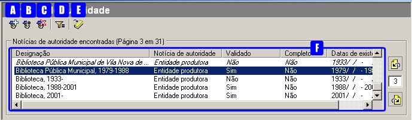
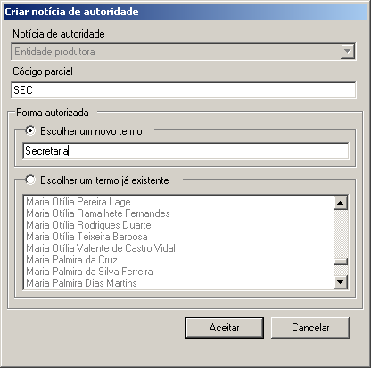
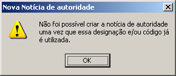

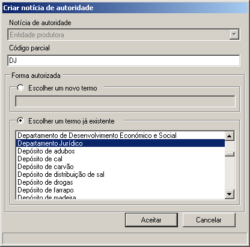
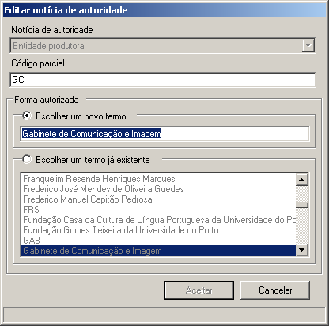
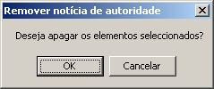
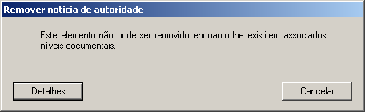
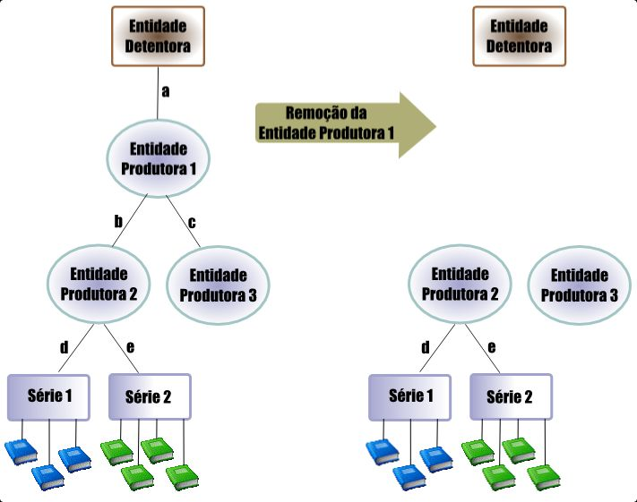
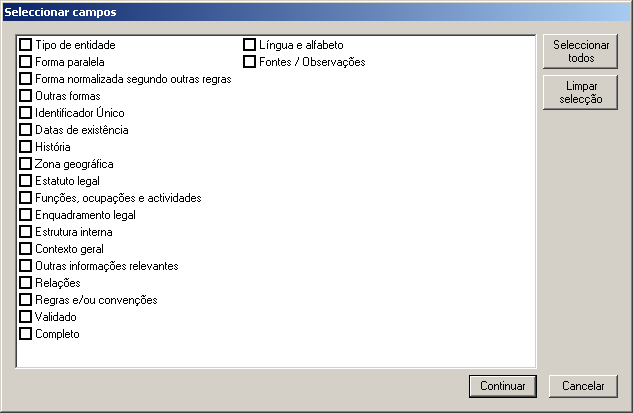
.. |image10| image:: _static/images/guardarrelatorio.png
   :width: 400px
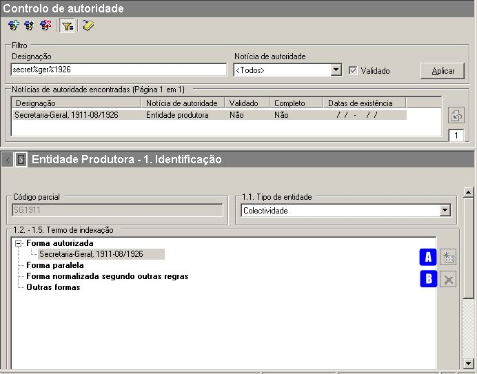
.. |image12| image:: _static/images/seleccaotermo.png
   :width: 400px
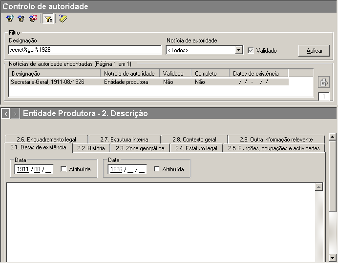
.. |image14| image:: _static/images/relacoesep.jpg
   :width: 500px
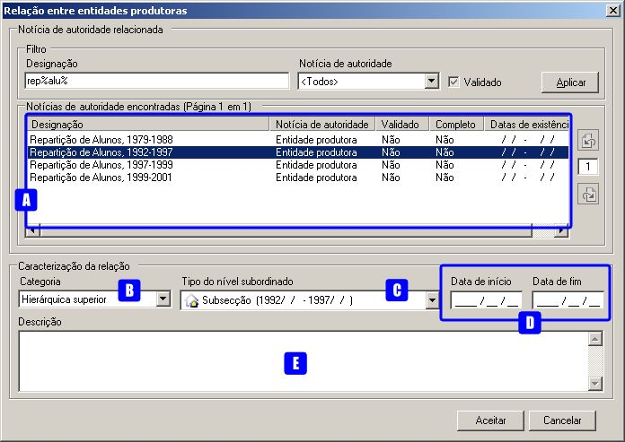
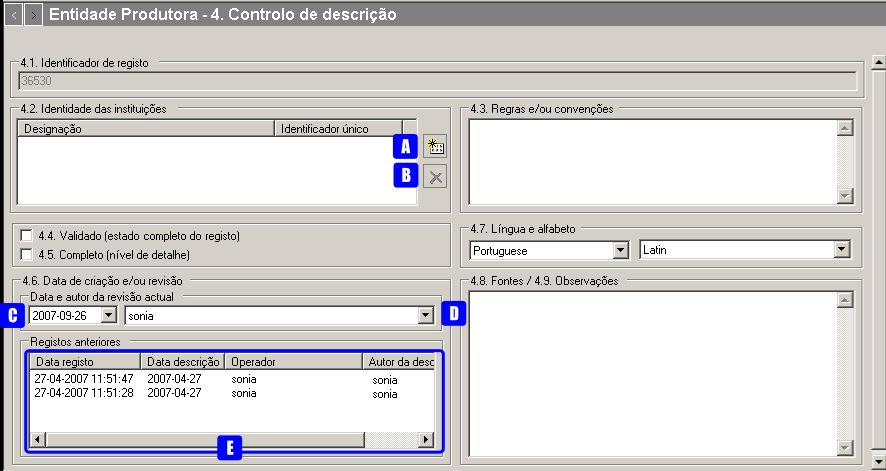
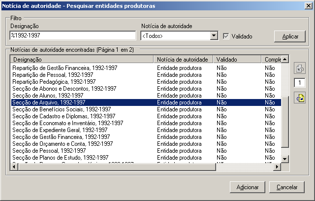
