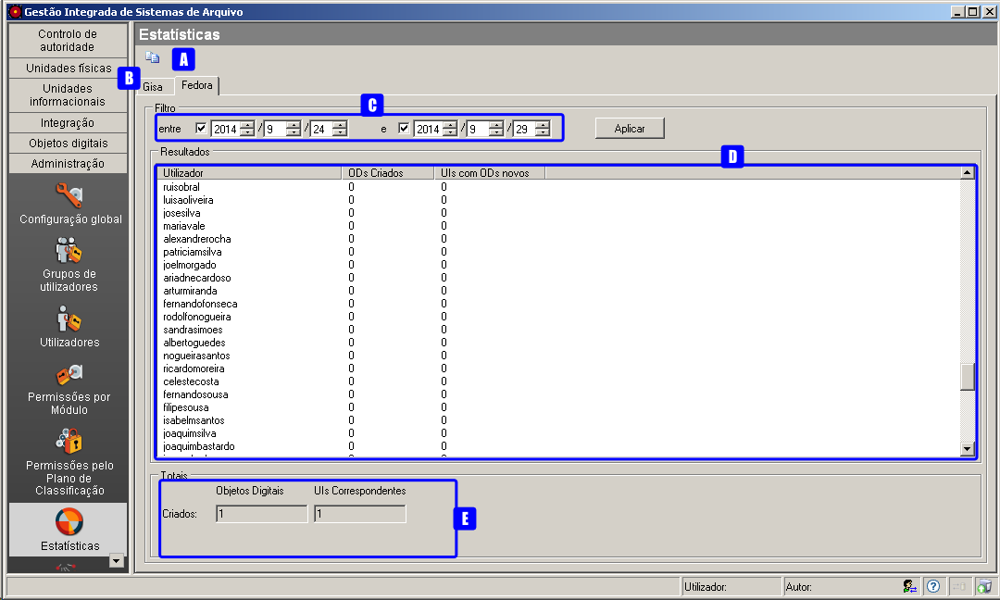
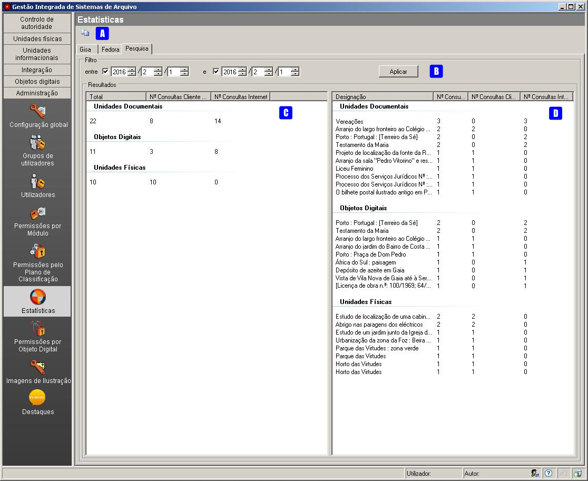
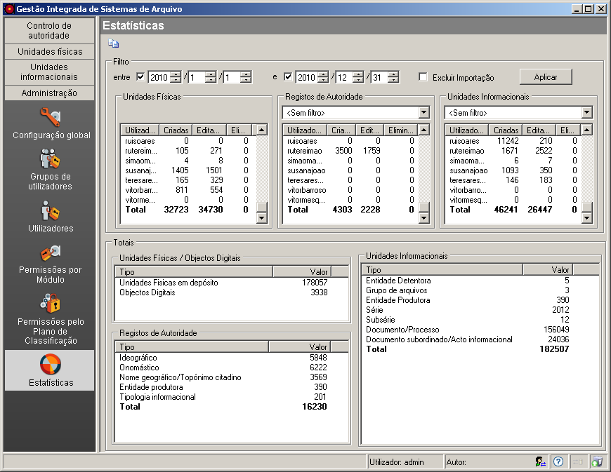

Estatísticas
============

Este módulo apresenta dados estatísticos sobre os registos efetuados no
GISA e no FEDORA, tanto em termos globais como por utilizador, tendo ou
não em conta um período de tempo.

Estatísticas GISA
-----------------

|image0|

A: ``Copiar estatísticas`` - Botão que copia para o ``clipboard`` os
dados estatísticos.

B: ``Fedora`` - Separador que mostra a área de estatísticas dos objetos
digitais.

C: ``Filtro por intervalo de datas`` - Área que permite apresentar as
listas de contagem dos registos efetuados por utilizador, nas unidades
físicas, nos registos de autoridade, nas unidades informacionais e nos
totais, tendo em conta um determinado período.

D: ``Filtro por modo de registo`` - Permite excluir a contagem de
registos, efetuados pelos utilizadores via importação.

E: ``Unidades físicas por utilizador`` - Tabela em que, para cada
utilizador, mostra o número de registos de unidades físicas criadas,
editadas e eliminadas.

F: ``Filtro por notícia de autoridade`` - Permite filtrar o número de
registos de autoridade criados, editados ou eliminados por utilizador,
apresentados na tabela ``Registos de autoridade por utilizador`` (F),
por: ``Ideográfico``, ``Onomástico``,
``Nome geográfico/Topónimo citadino``, ``Entidade produtora`` ou
``Tipologia informacional``.

G: ``Registos de autoridade por utilizador`` - Tabela em que para cada
utilizador mostra o número de registos de autoridade criados, editados e
eliminados.

H: ``Filtro por nível de descrição`` - Permite filtrar o número de
unidades informacionais criadas, editadas e eliminadas por cada
utilizador, apresentados na tabela
``Unidades informacionais por utilizador`` (H), por:
``Entidade detentora``, ``Entidade produtora``, ``Série``, ``Subsérie``,
``Documento/Processo`` e ``Documento subordinado/Ato informacional``.

I: ``Unidades informacionais por utilizador`` - Lista em que para cada
utilizador mostra o número de registos de unidades informacionais
criadas, editadas e eliminadas, para o período selecionado no filtro.

J: ``Totais de Unidades físicas/Objetos digitais`` - Mostra o total de
registos de unidades físicas, referências a objetos digitais simples
guardados no Fedora, referências a objetos digitais compostos guardados
no Fedora e referências a objetos digitais existentes no sistema de
ficheiros, para o período selecionado no filtro.

K: ``Totais de Registos de autoridade`` - Mostra o total de registos de
autoridade e a contagem por notícia de autoridade, para o período
selecionado no filtro.

L: ``Totais de Unidades informacionais`` - Mostra o total de registos de
unidades informacionais e a contagem por níveis de descrição, para o
período selecionado no filtro.

Estatísticas FEDORA
-------------------

|image1|

A: ``Copiar estatísticas`` - Botão que copia para o ``clipboard`` os
dados estatísticos.

B: ``GISA`` - Separador que mostra a área de estatísticas dos registos
no GISA.

C: ``Resultados`` - Área que permite apresentar para cada utilizador a
contagem dos ODs criados e UIs com ODs novos dentro de um período de
tempo.

D: ``Totais`` - Mostra o total de ODs criados e o total de UIs
correspondente dentro do período de tempo estabelecido no filtro.

Estatísticas Pesquisa
---------------------

Área que apresenta contagens dos acessos efetuados às Unidades físicas,
às Unidades documentais e aos Objetos digitais, tanto no GISA desktop
como no GISA Internet. Considera-se um acesso quando se entra no detalhe
de alguma das entidades. Durante um período, vários acessos à mesma
entidade conta como um único acesso.

As contagens podem ser apresentadas para um determinado período.

|image2|

A: ``Copiar estatísticas`` - Botão que copia para o ``clipboard`` os
dados estatísticos.

B: ``Filtro por intervalo de datas`` - permite apresentar acessos para
um determinado período.

C: ``Contagens``: nº de acessos totais, via cliente desktop ou GISA
Internet, efetuados a Unidades documentais, Objetos digitais e Unidades
físicas.

D: ``Top 10``: Top 10 das Unidades documentais, dos Objetos Digitais e
das Unidades físicas mais acedidos.

Contagem
--------

Logo após qualquer gravação no GISA, a aplicação verifica se houve
alguma criação, edição ou eliminação desde a última gravação e, caso
exista, é contabilizada nas *Estatísticas*. O GISA grava sempre que
acontece a confirmação de uma criação, eliminação ou edição de um
registo, ou então, quando acontece uma mudança de contexto. Quando um
utilizador altera um ou vários campos de formulário de um registo e de
seguida muda de contexto provocando uma gravação, o GISA contabiliza nas
*Estatísticas* uma edição desse registo.

A área de ``Totais`` das *Estatísticas* dá o nº total de registos
existentes, entrando em linha de conta com eliminações entretanto
efetuadas.

Apresenta-se a seguir a contagem efetuada em possíveis operações
realizadas por determinado utilizador, nas diferentes áreas da
aplicação.

Unidades físicas
~~~~~~~~~~~~~~~~

As operações da área das ``Unidades físicas`` que se refletem na
contagem das ``Estatísticas``:

+--------------------------------------------------+--------------------+--------------------+--------------------+
| Operação                                         | Criação            | Edição             | Eliminação         |
+==================================================+====================+====================+====================+
| Criação de registo via barra de ferramentas      | 1 Unidade física   |                    |                    |
+--------------------------------------------------+--------------------+--------------------+--------------------+
| Duplicação via barra de ferramentas              | 1 Unidade física   |                    |                    |
+--------------------------------------------------+--------------------+--------------------+--------------------+
| Edição via barra de ferramentas                  |                    | 1 Unidade física   |                    |
+--------------------------------------------------+--------------------+--------------------+--------------------+
| Edição de campos de formulário                   |                    | 1 Unidade física   |                    |
+--------------------------------------------------+--------------------+--------------------+--------------------+
| Eliminação de registo via barra de ferramentas   |                    |                    | 1 Unidade física   |
+--------------------------------------------------+--------------------+--------------------+--------------------+

Controlo de Autoridade
~~~~~~~~~~~~~~~~~~~~~~

As operações da área do ``Controlo de Autoridade`` que se refletem na
contagem das ``Estatísticas``, quer em termos de registos de autoridade
quer de unidades informacionais às quais estes estão associados:

+----------------------------------------------------------------------------------------------------------------+---------------------------+----------------------------------------------------+---------------------------+
| Operação                                                                                                       | Criação                   | Edição                                             | Eliminação                |
+================================================================================================================+===========================+====================================================+===========================+
| Criação de registo via barra de ferramentas                                                                    | 1 Registo de autoridade   |                                                    |                           |
+----------------------------------------------------------------------------------------------------------------+---------------------------+----------------------------------------------------+---------------------------+
| Edição da notícia de autoridade via barra de ferramentas                                                       | 1 Registo de autoridade   |                                                    | 1 Registo de autoridade   |
+----------------------------------------------------------------------------------------------------------------+---------------------------+----------------------------------------------------+---------------------------+
| Edição do termo via barra de ferramentas                                                                       |                           | 1 Registo de autoridade                            |                           |
+----------------------------------------------------------------------------------------------------------------+---------------------------+----------------------------------------------------+---------------------------+
| Edição do campo ``3. Relações`` de uma Entidade produtora, adicionando uma relação pela primeira vez           | 1 Unidade informacional   | 1 Registo de autoridade                            |                           |
+----------------------------------------------------------------------------------------------------------------+---------------------------+----------------------------------------------------+---------------------------+
| Edição do campo ``3. Relações`` de uma Entidade produtora, adicionando uma relação, não sendo a primeira vez   |                           | 1 Registo de autoridade; 1 Unidade informacional   |                           |
+----------------------------------------------------------------------------------------------------------------+---------------------------+----------------------------------------------------+---------------------------+
| Edição do campo ``3. Relações`` de uma Entidade produtora, editando uma relação                                |                           | 1 Unidade informacional                            |                           |
+----------------------------------------------------------------------------------------------------------------+---------------------------+----------------------------------------------------+---------------------------+
| Edição do campo ``3. Relações`` de uma Entidade produtora, eliminando uma relação                              |                           | 1 Registo de autoridade; 1 Unidade informacional   |                           |
+----------------------------------------------------------------------------------------------------------------+---------------------------+----------------------------------------------------+---------------------------+
| Eliminação de registo via barra de ferramentas                                                                 |                           |                                                    | 1 Registo de autoridade   |
+----------------------------------------------------------------------------------------------------------------+---------------------------+----------------------------------------------------+---------------------------+
| Edição do resto dos campos de formulário                                                                       |                           | 1 Registo de autoridade                            |                           |
+----------------------------------------------------------------------------------------------------------------+---------------------------+----------------------------------------------------+---------------------------+

Unidades Informacionais
~~~~~~~~~~~~~~~~~~~~~~~

As operações da área das ``Unidades Informacionais`` que se refletem na
contagem das ``Estatísticas``:

+--------------------------------------------------------------------------------------------------------------------------------------+---------------------------------------------+---------------------------+---------------------------+
| Operação                                                                                                                             | Criação                                     | Edição                    | Eliminação                |
+======================================================================================================================================+=============================================+===========================+===========================+
| Associação de um nível de arquivo à estrutura orgânica via barra de ferramentas pela 1ª vez                                          | 1 Unidade informacional                     |                           |                           |
+--------------------------------------------------------------------------------------------------------------------------------------+---------------------------------------------+---------------------------+---------------------------+
| Associação de um nível de arquivo à estrutura orgânica via barra de ferramentas sem ser pela 1ª vez                                  |                                             | 1 Unidade informacional   |                           |
+--------------------------------------------------------------------------------------------------------------------------------------+---------------------------------------------+---------------------------+---------------------------+
| Eliminação da associação de um nível de arquivo à estrutura orgânica via barra de ferramentas (não apaga o nível, só a associação)   |                                             |                           | 1 Unidade informacional   |
+--------------------------------------------------------------------------------------------------------------------------------------+---------------------------------------------+---------------------------+---------------------------+
| Criação de registo via barra de ferramentas                                                                                          | 1 Unidade informacional                     |                           |                           |
+--------------------------------------------------------------------------------------------------------------------------------------+---------------------------------------------+---------------------------+---------------------------+
| Criação de registo via barra de ferramentas com uma UF associada                                                                     | 1 Unidade informacional; 1 Unidade física   |                           |                           |
+--------------------------------------------------------------------------------------------------------------------------------------+---------------------------------------------+---------------------------+---------------------------+
| Edição via barra de ferramentas                                                                                                      |                                             | 1 Unidade informacional   |                           |
+--------------------------------------------------------------------------------------------------------------------------------------+---------------------------------------------+---------------------------+---------------------------+
| Eliminação de registo via barra de ferramentas                                                                                       |                                             |                           | 1 Unidade informacional   |
+--------------------------------------------------------------------------------------------------------------------------------------+---------------------------------------------+---------------------------+---------------------------+
| Corta e cola via barra de ferramentas                                                                                                |                                             | 1 Unidade informacional   |                           |
+--------------------------------------------------------------------------------------------------------------------------------------+---------------------------------------------+---------------------------+---------------------------+
| Edição de campos de formulário                                                                                                       |                                             | 1 Unidade informacional   |                           |
+--------------------------------------------------------------------------------------------------------------------------------------+---------------------------------------------+---------------------------+---------------------------+
| Importação de N linhas da tabela Documentos do Excel                                                                                 | N Unidades informacionais                   |                           |                           |
+--------------------------------------------------------------------------------------------------------------------------------------+---------------------------------------------+---------------------------+---------------------------+
| Importação de N linhas da tabela UnidadesFisicas do Excel                                                                            | N Unidades físicas                          |                           |                           |
+--------------------------------------------------------------------------------------------------------------------------------------+---------------------------------------------+---------------------------+---------------------------+

Filtrar dados
-------------

Os dados estatísticos relativos à contagem das operações efetuadas por
cada utilizador podem ser filtrados:

-  definindo uma data ou um período de tempo;
-  excluindo a contabilização dos registos que foram importados de Excel
   para o GISA.

Por exemplo, a seguinte janela mostra os registos efetuados por cada
utilizador durante o ano de 2010:

|image3|

Copiar dados para Excel
-----------------------

É possível copiar para o Excel todas as tabelas deste módulo. Quando as
tabelas estão filtradas, são passados os dados filtrados.

Para copiar basta clicar no botão ``Copiar estatísticas`` e numa folha
do Excel pressionar nas teclas ``Ctrl-V`` ou selecionar
``Editar/Colar``.

.. |image0| image:: _static/images/estatisticasgerais.png
   :width: 500px

