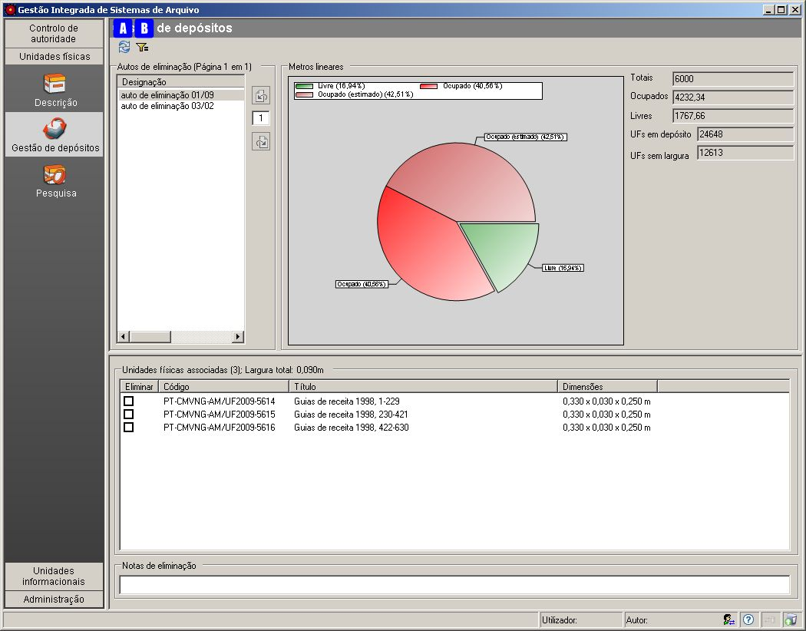

Gestão de depósitos
===================

Este módulo permite gerir o espaço de um depósito através da sua taxa de
ocupação, tendo para isso que ser feito o controlo das entradas e saídas
definitivas de documentos.

Partindo do princípio que é feito no sistema o recenseamento das unidade
físicas que dão entrada no depósito e o registo da avaliação documental
com emissão de autos de eliminação, será possível neste módulo registar
o abate das unidades físicas e ter sempre presente o espaço em
prateleira livre.

|image0|

A: ``Mostrar imagem`` - Botão que atualiza os valores na janela.

B: ``Filtrar dados`` - Botão que permite filtrar os autos de eliminação
pela sua designação.

Autos de eliminação
-------------------

Na área de contexto é apresentada a lista de todos os autos de
eliminação registados no sistema. Esta lista pode ser filtrada pela
designação do auto de eliminação, no qual consta um conjunto de unidades
físicas que poderão ser abatidas.

Unidades físicas associadas
---------------------------

Na área de detalhe é apresentada a lista das unidade físicas que constam
no auto de eliminação, selecionado na lista de autos de eliminação.

A caixa de verificação existente em cada linha permite *registar o
abate* (eliminação física) da unidade física, representada pelo código,
título e dimensões. Depois de se efetuar os registos de eliminações, a
área ``Metros lineares`` será atualizada se se clicar no botão
``Mostrar imagem`` (A).

|image1|

Pode observar-se que os valores e o gráfico da área ``Metros lineares``
mostram ganho de espaço livre após a eliminação de unidades físicas.

Todas as unidades físicas registadas como eliminadas não desaparecem do
sistema, ficam com a indicação de que foram eliminadas e desaparecem,
por omissão, das listas de contexto e de resultados de pesquisa. Para
ficarem visíveis, basta assinalar as opções de mostrar unidades físicas
eliminadas.

Notas de eliminação
-------------------

Anotar alguma informação útil relativa à eliminação física associada ao
auto de eliminação selecionado.

Metros lineares
---------------

Nesta área é apresentado um gráfico circular e valores que fornecem a
taxa de ocupação do depósito.

Para que a taxa de ocupação seja real, todas as unidades físicas deverão
ter o campo da largura preenchido. Caso contrário, é dada uma estimativa
baseada nos valores existentes.

Os valores apresentados são:

-  ``Totais`` - Valor que reflete o número de metros lineares totais de
   prateleira do depósito da entidade onde a aplicação está instalada.
   Este valor é introduzido no módulo de ``Configuração Geral`` na área
   da ``Administração`` (ver detalhadamemte em `Configuração
   global <configuracao_global.html>`__.

\* ``Ocupados`` - Total das larguras das unidades físicas existentes em
depósito. Este valor é estimado se existirem algumas unidades físicas
sem registo das respetivas larguras no sistema, pois para estes casos
considera-se terem uma largura média hipotética, calculada com base nas
larguras efetivamente registadas no sistema.

-  ``Livres`` - Este valor é a diferença entre os metros lineares totais
   e os metros lineares ocupados.

\* ``UFs em depósito`` - Número de unidades físicas existentes em
depósito.

-  ``UFs sem largura`` - Número de unidades físicas sem largura
   registada.

O gráfico mostra três diferentes fatias:

-  ``Livre`` - Percentagem de espaço livre. Este valor é estimado, se
   houver unidades físicas sem a largura registada, pois será o cálculo
   da diferença entre o valor total de metros lineares de prateleira e o
   valor estimado de metros lineares ocupados.

\* ``Ocupado`` - Valor exato dos metros lineares ocupados pelas unidades
físicas, cujas larguras foram registadas no sistema.

-  ``Ocupado estimado`` - Para o caso das unidades físicas, cuja largura
   não foi registada no sistema, parte-se do princípio que cada uma têm
   como largura, a média das larguras registadas até ao momento. Assim,
   é apresentado um valor estimado dos metros lineares ocupados pelas
   unidades físicas, cujas larguras não foram registadas no sistema.

