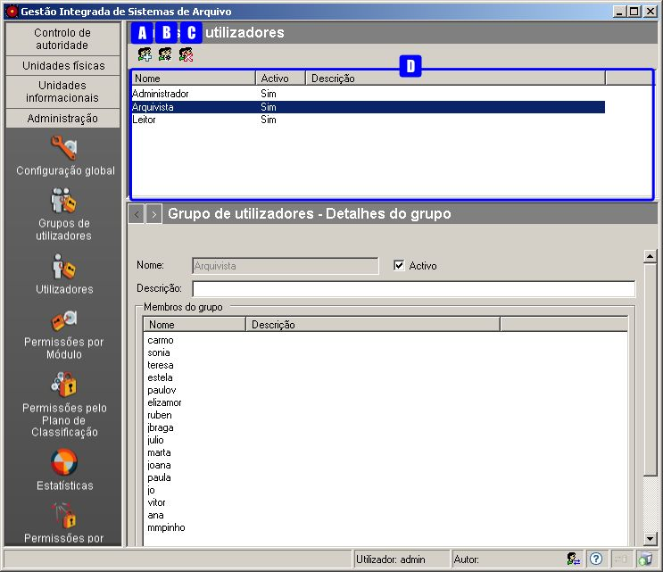
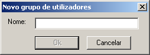
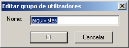
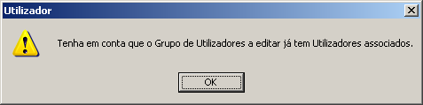
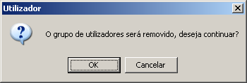
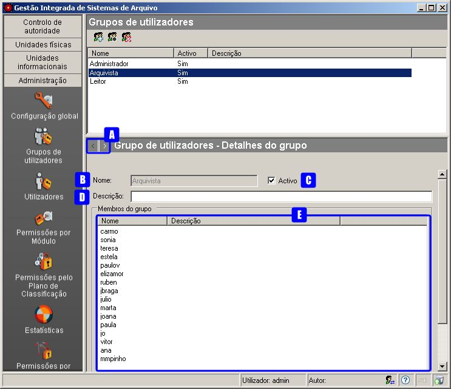
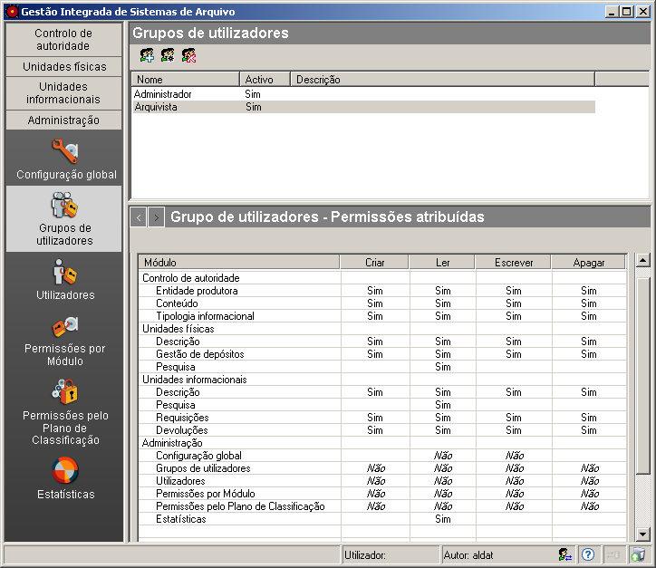

Grupos de utilizadores
======================

Neste módulo, faz-se a gestão dos grupos de utilizadores. Em termos
práticos, os grupos servem para atribuir ou retirar permissões a um
conjunto de utilizadores sem ter de o fazer um a um.

|image0|

Esta janela mostra, na área de contexto, a lista de
``Grupos de utilizadores`` existentes, permitindo criar, visualizar,
editar e apagar grupos através dos botões existentes na barra de
ferramentas:

A: ``Novo grupo de utilizadores`` - Botão para criar um grupo de
utilizadores novo.

B: ``Editar grupo de utilizadores`` - Botão para editar o nome do grupo
de utilizadores.

C: ``Apagar grupo de utilizadores`` - Botão que permite apagar um grupo
de utilizadores.

D: ``Lista de grupos de utilizadores`` - Grupos de utilizadores
existentes no sistema.

Criar grupo de utilizadores
---------------------------

Para criar um grupo de utilizadores, clica-se no botão
``Novo grupo de utilizadores``, aparecendo a seguinte janela:

|image1|

Introduz-se um nome sem espaços e clica-se no botão ``Ok``. Caso o botão
``Ok`` não fique ativo, é porque já existe algum grupo de utilizadores
ou utilizador com o mesmo nome.

Editar nome de grupo de utilizadores
------------------------------------

Para alterar o nome de um grupo de utilizadores, seleciona-se o grupo e
clica-se no botão ``Editar grupo de utilizadores``.

|image2|

Altera-se o nome e clica-se no botão ``Ok`` para assumir o novo ou
``Cancelar`` para desistir. Caso o botão ``Ok`` não fique ativo, é
porque já existe algum grupo de utilizadores ou utilizador com o mesmo
nome.

Tem de se ter em conta que, se já existirem utilizadores associados a
esse grupo, continuarão a estar associados ao mesmo grupo mas com o novo
nome. Quando existe esta situação, antes de se efetuar a alteração, a
aplicação avisa mostrando a seguinte janela:

|image3|

Remover grupo de utilizadores
-----------------------------

Para remover um grupo de utilizadores, seleciona-se o grupo, da
``Lista de grupos de utilizadores``, e clica-se no botão
``Apagar grupo de utilizadores``.

Tem de se ter em conta que se existirem utilizadores associados a esse
grupo, deixarão de o estar.

|image4|

Clica-se no botão ``Ok`` para apagar ou ``Cancelar`` para desistir.

Editar detalhes de um grupo de utilizadores
-------------------------------------------

Ao selecionar um grupo de utilizadores na lista de utilizadores
existentes, é possível editar os dados a eles associados na área de
detalhes.

|image5|

A: ``Botões de navegação`` - Botões que permitem navegar nos diferentes
painéis de detalhes dos grupos de utilizadores possibilitando a
visualização ou a edição dos dados.

B: ``Nome`` - Campo de visualização preenchido no momento de criação do
grupo de utilizadores. Para editar este nome, utiliza-se o botão
``Editar grupo de utilizadores`` da barra de ferramentas.

C: ``Ativo`` - Caixa de verificação que indica se o referido grupo está
ou não ativo.

D: ``Descrição`` - Neste campo introduz-se uma descrição que caracterize
o tipo de grupo selecionado.

E: ``Membros do grupo`` - Esta lista mostra todos os utilizadores
membros deste grupo.

Permissões por módulo de um grupo de utilizadores
-------------------------------------------------

Para editar permissões de um grupo de utilizadores, selecionar na área
de contexto o grupo desejado e escolher o painel de
``Grupo de utilizadores - Permissões atribuídas`` através dos botões de
navegação:

|image6|

Quando se cria um grupo novo, por omissão, aparecem todas as permissões
com o valor ***Não***, indicando que o grupo não tem permissão para
utilizar a aplicação. Em função do tipo de grupo e do `cálculo de
permissões <permissoes_calculo.html>`__ feito pelo sistema, pode
atribuir-se permissão explícita com **Sim**, retirar explicitamente com
**Não** ou repor o valor por
`omissão <permissoes_omissao.html#grupos-ou-utilizadores-novos>`__
***Não***.

Na área de detalhes desta janela, é possível atribuir permissões aos
grupos de utilizadores sobre as operações permitidas em cada módulo:
``Criar``, ``Ler``, ``Escrever`` e ``Apagar``.

Para se definir uma permissão, seleciona-se a linha do módulo e na
coluna correspondente à operação clica-se até se obter o valor
pretendido: **Sim**, **Não** ou ***Não***.

O módulo `Permissões por Módulo <permissoes_modulo.html>`__ também
permite definir as permissões dos utilizadores ou grupos sobre os
módulos, a partir de um determinado módulo.

