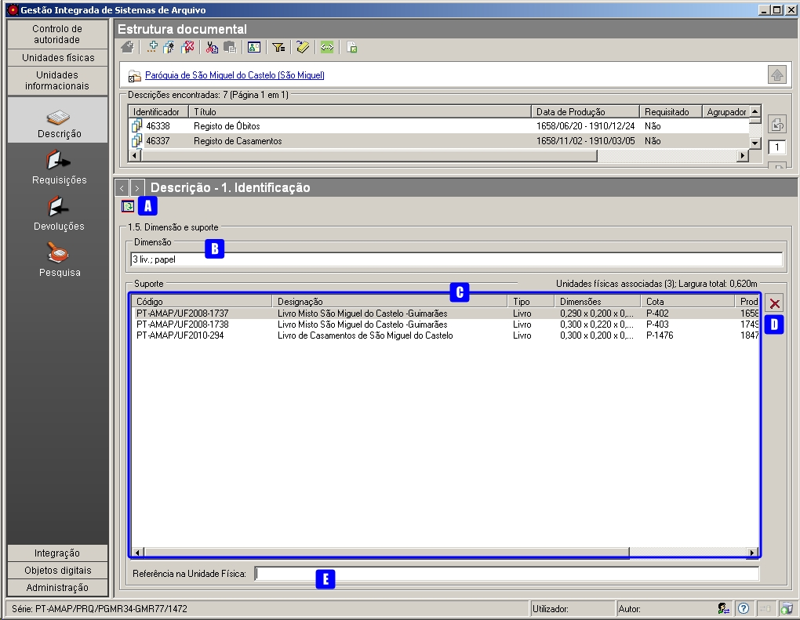
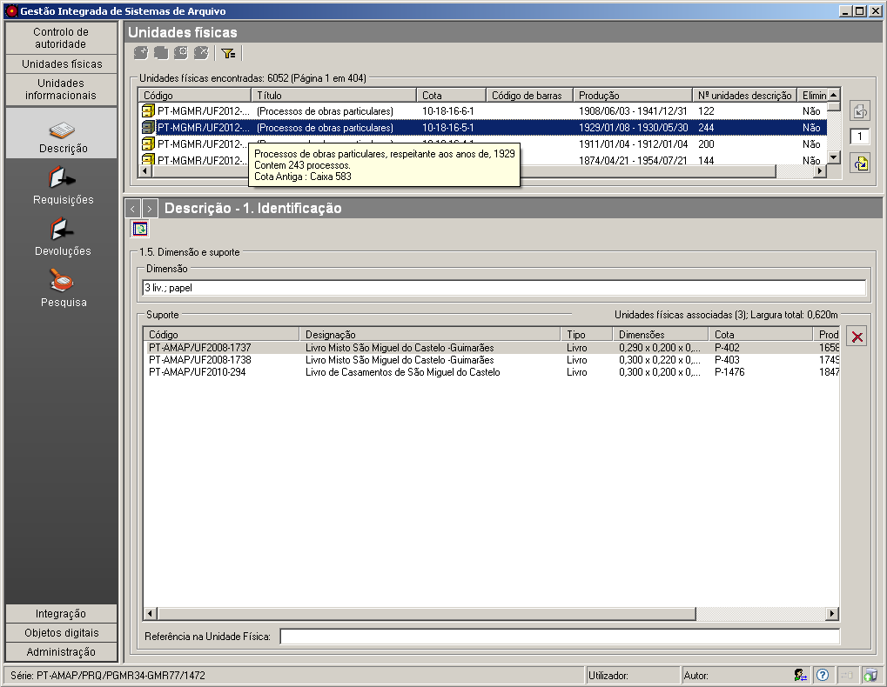
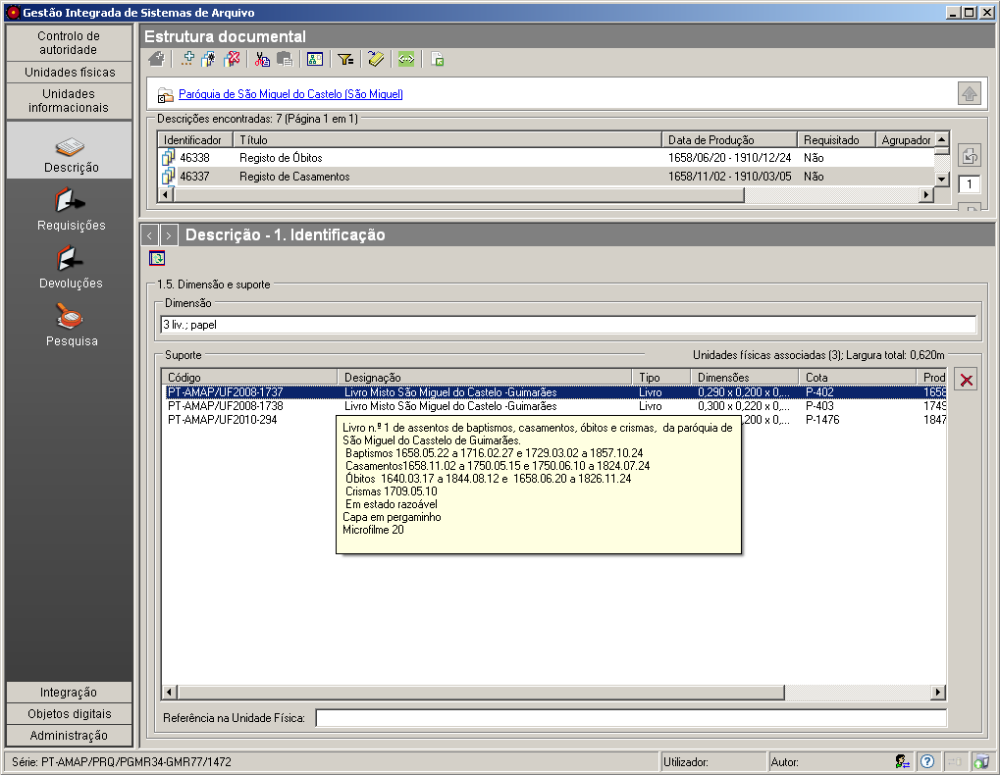

1.5 Dimensão e suporte
======================

*Identificação* é uma das zonas da `descrição
multinível <descricao_ui.html#descricao-multinivel>`__ da ISAD(G) onde
se integra este painel.

|image0|

A: ``Apresentar/esconder painel de apoio`` - Botão que apresenta ou
esconde a lista de todas as ``Unidades Físicas`` existentes.

B: ``Dimensão`` - Campo de texto onde se pode colocar a dimensão da
unidade informacional que se está a descrever.

C: ``Apagar item`` - Apaga a *Unidade Física* selecionada na lista
``Unidades físicas associadas``. Em vez deste botão também se pode
utilizar a tecla ``DEL``.

D: ``Lista de Unidades físicas`` - Lista de unidades físicas que servem
de suporte à unidade informacional selecionada. As unidades físicas
devem estar previamente recenseadas e descritas no módulo de *Unidades
físicas/Descrição*. Cada unidade física associada, apresenta os
seguintes dados: ``Código parcial``, ``Designação``, ``Tipo``,
``Dimensões``, ``Cota``, ``Datas de produção`` e indicação se ainda
existe em depósito ou se já foi abatida. A título informativo é dado no
cabeçalho da lista, o total das unidades físicas associadas e a largura
total em metros lineares.

E: ``Referência na Unidade Física`` - Referência dentro da unidade
física selecionada na ``Lista de Unidades físicas``.

**Associação de unidades físicas a uma unidade informacional**

Para se associar uma ou várias unidades físicas a este campo tem de se
clicar no botão ``Apresentar/esconder painel de apoio`` para, na área de
contexto, mostrar a lista de todas as unidades físicas existentes.

|image1|

Essa lista é paginada e pode ser filtrada para se visualizar
determinado(s) elemento(s). Se se parar o rato numa unidade física, é
mostrada uma “tooltip” com o seu ``Conteúdo informacional``, de forma a
poder ajudar na escolha.

Depois de se selecionarem um ou vários elementos da lista, com possível
ajuda das teclas de ``Shift`` e ``Ctrl`` para seleções múltiplas
(adjacentes ou não), arrastam-se os elementos para o campo
``Lista de Unidades físicas`` na área de detalhe.

**Remoção de uma associação de uma Unidade a uma Unidade informacional**

Para remover a associação de uma *Unidade física* a uma *Unidade
informacional*, primeiro, seleciona-se o item pretendido na lista de
unidades físicas associadas, existente na área de detalhes e depois
clica-se no botão ``Apagar item`` que se encontra no lado direito. O
botão de ``OK``, confirma a remoção, e o ``Cancelar``, cancela.

**Conteúdo da unidade física**

Na ``Lista de Unidades físicas``, se se parar o rato numa unidade
física, é mostrada uma “tooltip” com o seu ``Conteúdo informacional``.

|image2|

