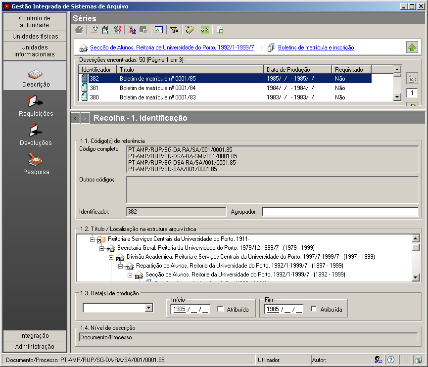

1.1 - 1.4 Referência e datas de produção
========================================

*Identificação* é uma das zonas da `descrição
multinível <descricao_ui.html#descricao-multinivel>`__ da ISAD(G) onde
se integra este painel.

|image0|

Código de referência
--------------------

O ``Código de referência`` permite identificar uma unidade de descrição.
O GISA admite vários tipos de código, os quais se descrevem a seguir:

-  ``Código completo`` - este código identifica uma unidade de descrição
   na estrutura do arquivo e fornece o contexto do(s) documento(s) ao(s)
   qual(is) se refere(m) no arquivo. O código completo de uma unidade de
   descrição é construído automaticamente pelo sistema, juntando os
   códigos parciais dos vários níveis (orgânico ou documental) da
   estrutura arquivística, introduzidos obrigatoriamente pelo
   utilizador, os quais fazem parte do percurso hierárquico entre o
   nível de topo, a ``Entidade detentora``, e a referida unidade de
   descrição. Os diferentes códigos parciais apresentam-se separados por
   hífen (“-”) ou barra (“/”), dependendo dos casos. O hífen separa
   níveis do tipo ``Arquivo`` de ``Subarquivo``, ``Secção`` de
   ``Subsecção``, ``Série`` de ``Subsérie`` e ``Documento/Processo`` de
   ``Documento subordinado/ato informacional`` e a barra separa todos os
   restantes casos. Dado que a estrutura arquivística reflete o contexto
   produtor da informação e como determinada informação pode ter sido
   produzida por diversos produtores, este código completo pode não ser
   um código único, pois pode existir mais que um percurso entre o nível
   de topo e o nível em causa. Para um utilizador experiente, que
   conheça alguns códigos de nível mais superior, conseguirá deduzir
   facilmente o contexto de um documento com o código
   ``PT-AMP/RUP/SG-DA-RA/SA/001/0001.85``.

\* ``Outros códigos`` - estes códigos são outros possíveis
identificadores usados previamente à utilização do GISA e que podem
continuar a ser referenciados por algum utilizador do sistema. Este
campo não é preenchido ou editado pelo utilizador, só pode ser
visualizado, mas somente via importação/conversão de dados existentes
noutros formatos. Como estes códigos são antigos e normalmente criados
de forma manual, não há garantias que sejam únicos. Ou seja, poderão ser
usados para pesquisas, mas não serão utilizados como identificadores.

-  ``Identificador`` - código automaticamente gerado pelo sistema para
   ser utilizado como identificação inequívoca de uma unidade de
   descrição, sendo também disponibilizado ao utilizador para possíveis
   pesquisas.

\* ``Agrupador`` - código a preencher opcionalmente pelo utilizador,
permitindo agrupar um conjunto de unidades de descrição, de alguma forma
relacionadas entre si, desde que estas tenham todas o mesmo código. Este
campo pode ser por exemplo utilizado em casos de processos, constituídos
por grupos distintos de documentos simples, em que se preenche este
campo com um código agrupador igual em todos os documentos simples do
mesmo grupo.

Título/Localização na estrutura arquivística
--------------------------------------------

Campo exclusivamente de visualização, que mostra, automaticamente, a
posição da unidade de descrição em causa na estrutura, explicitando
todos os níveis existentes entre ela e a entidade detentora. No caso de
a unidade que está a ser descrita ter sido produzida por mais do que uma
entidade produtora, isso é apresentado neste campo.

Datas de produção
-----------------

Neste campo regista-se o intervalo das datas de produção do documento ou
conjunto de documentos ao qual se refere a unidade de descrição. Para o
caso de uma data única, colocam-se as datas extremas iguais. As datas
extremas são inclusivas e podem ser abertas quando ainda não se conhece
a data de fim, deixando a data vazia.

Às datas de produção podem ser associados os seguintes modificadores:
``Antes de``, ``Depois de`` e ``Cerca de``. Quando se regista uma data
que não vem explícita no documento, deve assinalar-se na caixa de
verificação ``Data atribuída``.

Deve-se ter em conta que uma *data não preenchida* é diferente de uma
*data desconhecida*. O campo de data vazio quer dizer que ainda não foi
preenchido, mas que o poderá ser mais tarde. Quando a data é
desconhecida na sua totalidade, o campo data deverá ser preenchido com ?
(pontos de interrogação).

O GISA admite *datas incompletas*, as quais deverão ser preenchidas com
? (pontos de interrogação) nos dígitos desconhecidos.

Nas unidades de descrição, os campos de datas podem ser preenchidos da
seguinte forma:

+-----------------+---------------------------------------------------------------------+-----------------------------------+
| Data            | Preenchimento do campo                                              | Exemplo                           |
+=================+=====================================================================+===================================+
| Completa        | Campos ano, mês e dia preenchidos                                   | 1910/03/23                        |
+-----------------+---------------------------------------------------------------------+-----------------------------------+
| Indeterminada   | Campos ano, mês e dia preenchidos com data desconhecida             | ????/??/??                        |
+-----------------+---------------------------------------------------------------------+-----------------------------------+
| Incompleta      | Campos ano, mês e dia preenchidos com data parcialmente conhecida   | 19??/??/?? (séc XX)               |
|                 |                                                                     | 2000/12/?? (dezembro de 2000)     |
|                 |                                                                     | 196?/??/?? (anos 60 do séc. XX)   |
+-----------------+---------------------------------------------------------------------+-----------------------------------+
| Vazia           | Campos ano, mês e dia ainda por preencher                           | \_ \_ \_ \_ /\_ \_ /\_ \_         |
+-----------------+---------------------------------------------------------------------+-----------------------------------+

Nível de descrição
------------------

Campo exclusivamente de visualização, que mostra o tipo de nível da
unidade de descrição que está selecionada na área de contexto. Os tipos
de nível de descrição podem ser:

-  Arquivo
-  Subarquivo
-  Secção
-  Subsecção
-  Série
-  Subsérie
-  Documento/Processo
-  Documento subordinado/Ato informacional

Quando para um nível de descrição existem vários níveis hierárquicos
superiores, este campo mostra os diferentes tipos de nível em causa
separados por “;”.

