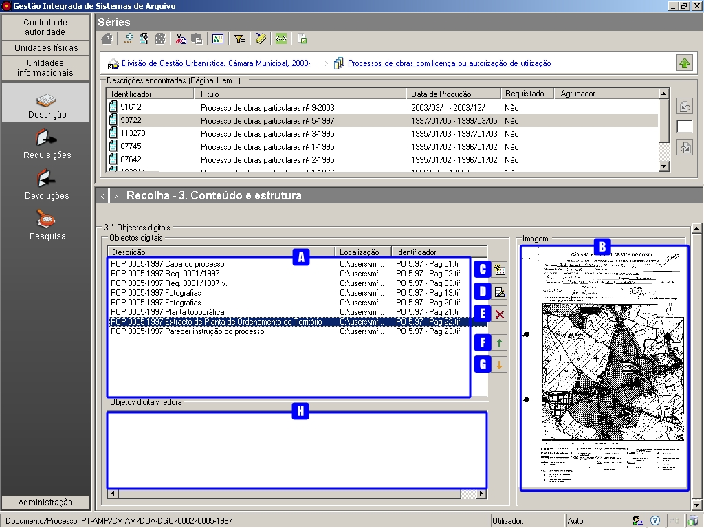
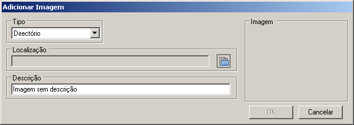
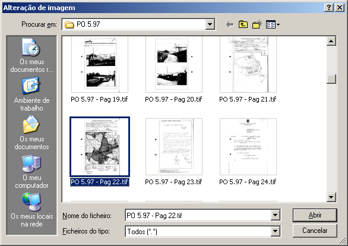
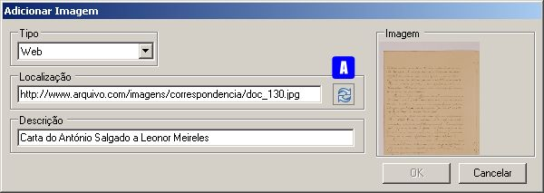

3.* Índice de imagens
=====================

A informação descrita no GISA pode estar em suporte papel ou digital.
Para se consultar um documento em suporte papel, descrito no GISA,
ter-se-á que o ir buscar às prateleiras do arquivo tradicional, a não
ser que haja uma associação da unidade de descrição à cópia digital do
mesmo. Se esse documento estiver em suporte digital será também
imediatamente visualizado, desde que associado à sua unidade de
descrição no GISA.

Esta zona não consta na na *ISAD-G*, mas é uma das principais áreas da
`descrição multinível <descricao_ui.html#descricao-multinivel>`__ no
GISA, pois permite o acesso rápido à informação e ao mesmo tempo
contribui para a conservação dos documentos originais, quando se
encontram em suporte papel.

|image0|

A: ``Lista de objetos digitais associados`` - Mostra todos os objetos
digitais, que se encontram em sistema de ficheiros, correspondentes à
unidade de descrição selecionada.

B: ``Imagem`` - Pré-visualização da imagem, quando o objeto digital
referenciado é um ficheiro do tipo imagem. Caso o ficheiro seja de outro
tipo, é mostrado o seu ícone.

C: ``Novo item`` - Associa um a referência a um objeto digital à unidade
de descrição em causa.

D: ``Editar item`` - Permite alterar a descrição ou a referência ao
objeto digital que está selecionado.

E: ``Apagar item`` - Remove a referência ao objeto digital selecionada.
Em vez deste botão também se pode utilizar a tecla ``DEL``.

F: ``Mover para cima`` - Permite mover para cima a referência
selecionada.

G: ``Mover para baixo`` - Permite mover para baixo a referência
selecionada.

H: ``Objetos digitais`` - Apresenta todos os objetos digitais, que se
encontram no Arquivo digital, correspondentes à unidade de descrição
selecionada.

Neste painel, são apresentados todos os suportes digitais associados ao
nível de descrição selecionado, relativo a um ou mais documentos. Estes
suportes poderão residir num sistema de ficheiros ou, de preferência,
num `Repositório Digital <introducao.html#repositorio-digital>`__.

Neste painel, podem associar-se a determinada unidade de descrição, os
correspondentes ficheiros, residentes num sistema de ficheiros. Caso os
objetos digitais que encontrem num Arquivo Digital, esta associação é
feita no módulo opcional `Objetos
digitais/Fedora <objetos_digitais.html>`__, bem como toda a sua gestão.

Associar referências a objetos digitais
---------------------------------------

Para, num nível de descrição arquivística, se associar uma referência a
um objeto digital, residente no sistema de ficheiros, clicar no botão
``Novo item``, abrindo-se a seguinte janela:

|image1|

Primeiro, selecionar o tipo de referência a associar:

-  ``Diretório``, quando a referência é um caminho para o sistema de
   ficheiros onde se encontram os objetos digitais.

\* ``Web``, quando a referência é um URL para um objeto digital que se
encontra num servidor de ficheiros. Neste caso, quando as imagens são
apresentadas dentro de uma página web, também deve ser indicado o
endereço desta página no módulo *Configuração Global* da área de
*Administração* (ver página `Configuração
global <configuracao_global.html>`__).

Referência do tipo Diretório
~~~~~~~~~~~~~~~~~~~~~~~~~~~~

Ao selecionar uma referência do tipo ``Diretório``:

|image2|

A: ``Localizar ficheiro`` - Permite localizar objeto digital localizado
num sistema de ficheiros.

A escolha do ficheiro a associar, faz-se via botão
``Localizar ficheiro``, abrindo-se a seguinte janela :

|image3|

Escolhe-se o ficheiro na rede e clica-se no botão ``Abrir``.

Quando existe mais que uma máquina cliente GISA, o caminho deverá ser de
rede (tal como na janela anterior), de forma a que as imagens estejam
acessíveis em todas as máquinas.

Referência do tipo Web
~~~~~~~~~~~~~~~~~~~~~~

|image4|

A: ``Atualizar`` - Permite localizar objeto digital localizado num
endereço Web.

Para adicionar uma referência do tipo ``Web``, indicar o endereço no
campo de texto ``Localização`` e clicar no botão ``Atualizar``. Se o
endereço for válido e de uma imagem, esta será visualizada na área
``Imagem``.

Visualizar objetos digitais
---------------------------

Fazendo duplo clique em cima da área ``Imagem``, onde se pode visualizar
a imagem ou do ícone do ficheiro associado, será aberto o documento
através da aplicação, que está associada no Windows àquele tipo de
ficheiro.

.. |image2| image:: _static/images/associarrefdirimagem.jpg
   :width: 400px

