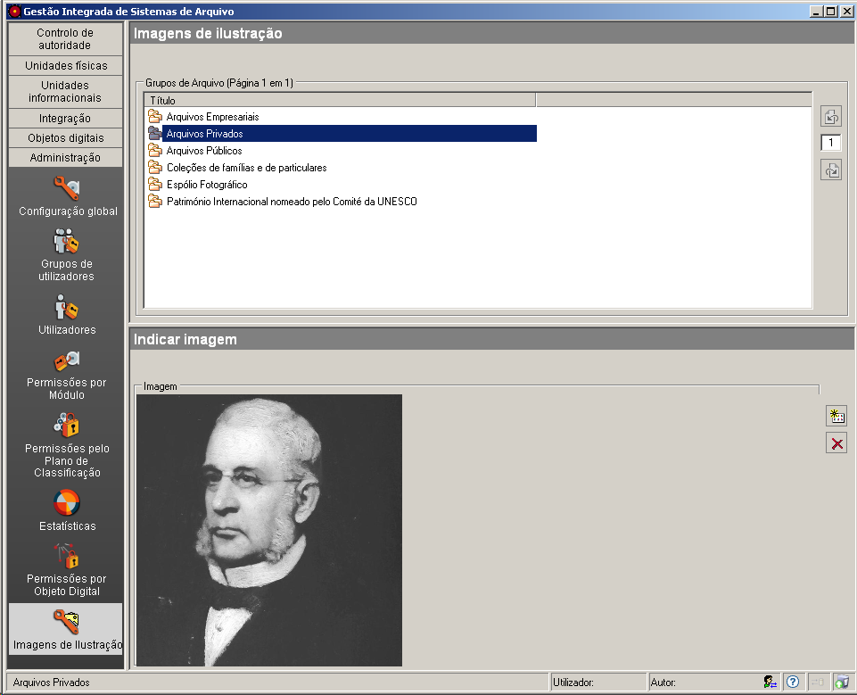

Imagens de Ilustração
=====================

Esta área serve de backoffice ao GISA Internet, sendo possível associar
imagens a cada grupo de arquivo para serem apresentadas na página de
arranque.

|image0|

Na área de contexto são listados todos os grupos de arquivos existentes
e para cada grupo selecionado, com o botão *Adicionar item* da área de
detalhes, pode associar-se uma imagem e com o botão *Apagar item* da
área de detalhes pode remover-se a imagem associada.

