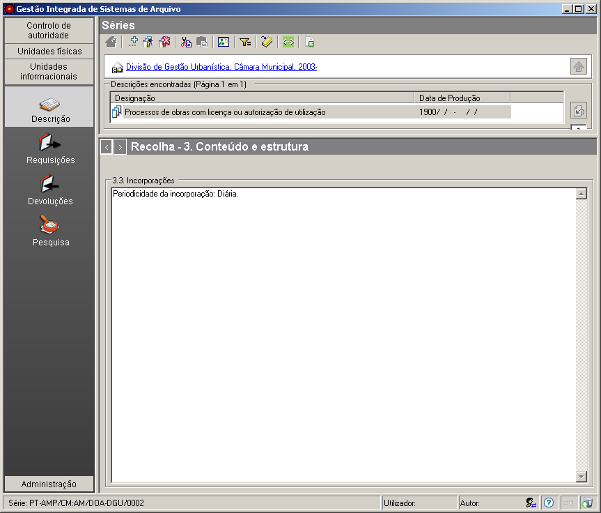

3.3 Incorporações
=================

*Conteúdo e estrutura* é uma das zonas da `descrição
multinível <descricao_ui.html#descricao-multinivel>`__ da ISAD(G) à qual
este painel de preenchimento pertence.

|image0|

Este campo de texto permite informar o utilizador sobre as incorporações
ou acréscimos de documentos previstos, em termos de frequência e
quantidade, relativos à unidade de descrição selecionada.

