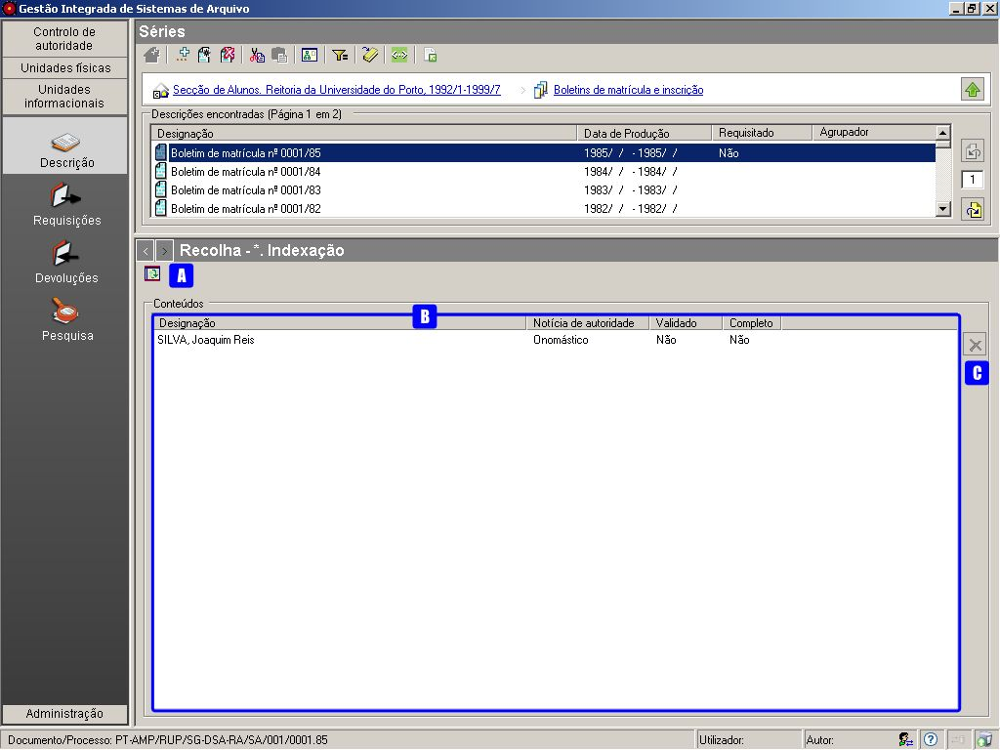

* Indexação
===========

Esta zona não pertence à descrição ISAD-G, mas é considerada como
essencial na `descrição
multinível <descricao_ui.html#descricao-multinivel>`__ do GISA.

A indexação de uma unidade de descrição consiste em destacar no seu
conteúdo informacional, os termos mais significativos, de modo a
facultar pesquisas mais eficientes e rápidas.

|image0|

A: ``Apresentar/esconder painel de apoio`` - Botão que serve para
apresentar ou esconder na área de contexto, a lista dos termos de
autoridade do tipo ``Conteúdos``.

B: ``Conteúdos`` - Lista de registos de autoridade do tipo ``Conteúdos``
que indexam a descrição arquivística em causa.

C: ``Apagar item`` - Remove o elemento selecionado na lista do campo
``Conteúdos``.

Associação de índices
---------------------

Para se estabelecer a associação de índices à unidade de descrição
selecionada, basta:

1. Clicar no botão ``Apresentar/esconder painel de apoio`` para aparecer
na área de contexto a lista dos termos relativos aos registos de
autoridade do tipo ``Conteúdo``.

2. Selecionar o termo que se pretende associar à unidade de descrição em
causa. A lista é paginada e pode ser filtrada. Se o termo não existir na
lista, deverá ser criado e para isso consultar a página
`Conteúdos <conteudo.html>`__.

3. Arrastar o elemento selecionado para o campo ``Conteúdos``.

Remoção de índices
------------------

Para remover um registo de autoridade do campo ``Conteúdos`` e este
deixar de estar a indexar o nível de descrição em questão, seleciona-se
o registo pretendido, clica-se no botão ``Apagar item`` ou pressiona-se
a tecla ``DEL`` e confirma-se clicando em ``Ok``.

