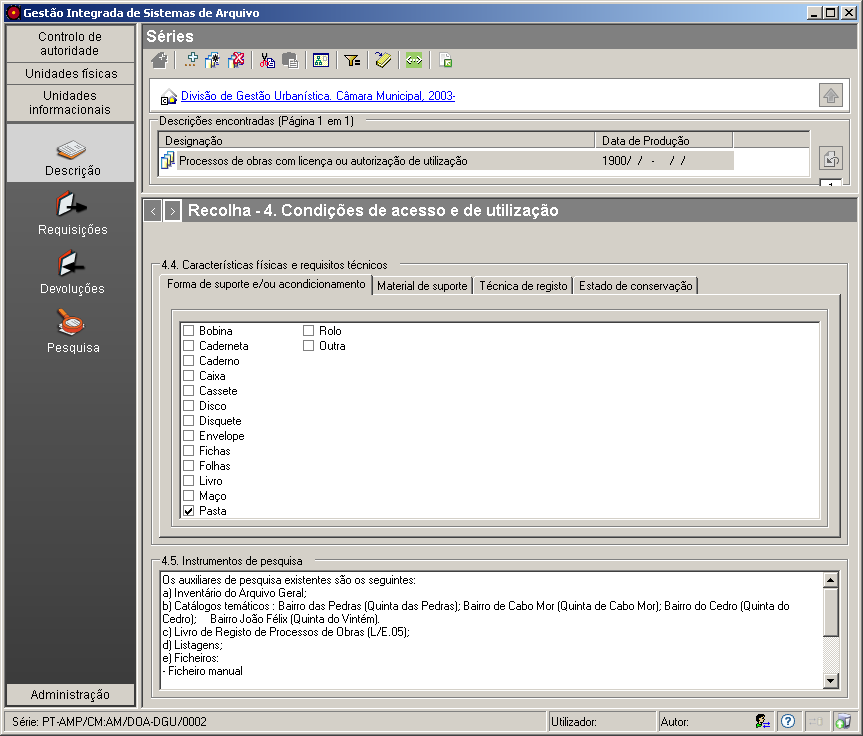

4.4-4.5 Descrição do material
=============================

No seguinte painel, existem os campos de preenchimento:
``Características físicas e requisitos técnicos`` e
``Instrumentos de pesquisa``, pertencendo à zona *Condições de acesso e
de utilização* da `descrição
multinível <descricao_ui.html#descricao-multinivel>`__ da ISAD(G).

|image0|

Características físicas e requisitos técnicos
---------------------------------------------

Faculta informação sobre qualquer característica física ou requisito
técnico relevante que afetem a utilização do(s) documento(s) referido(s)
pela unidade de descrição. Tal como se pode ver na figura, pode
registar-se a ``Forma de suporte e/ou acondicionamento``,
``Material de suporte``, ``Técnica de registo`` e o
``Estado de conservação``.

Instrumentos de pesquisa
------------------------

Identifica os instrumentos de pesquisa para localizar documento(s)
descrito(s) na à unidade de descrição selecionada e, se adequado,
informa sobre a forma de se obter uma cópia.

