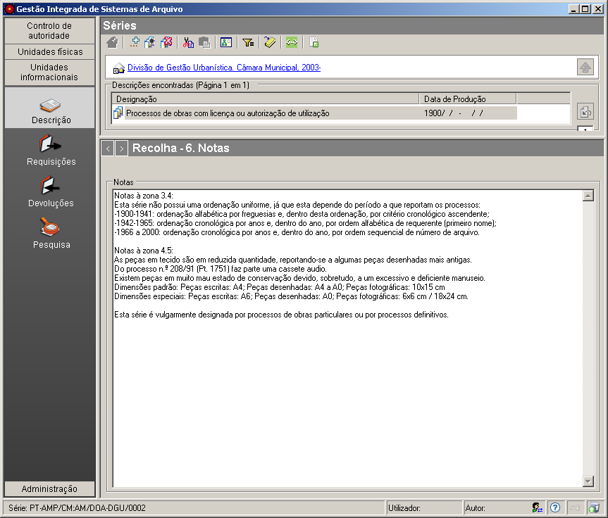

6. Notas
========

Esta é uma das zonas da `descrição
multinível <descricao_ui.html#descricao-multinivel>`__ da ISAD(G).

|image0|

É neste campo que se introduz toda a informação que não pode ser
registada em mais nenhuma zona da descrição de unidades informacionais.

