Objetos digitais
================

Para se trabalhar com objetos digitais (ODs) guardados no repositório
digital Fedora, seleciona-se no menu lateral do GISA o módulo de
*Objetos Digitais/Fedora*.

Para se criar determinado objeto digital pressupõe-se que todas as suas
imagens se encontram disponibilizadas num servidor de imagens,
encontrando-se acessíveis através de um *browser* via URLs.

|image0|

O ambiente de trabalho do módulo de *Objetos digitais* apresenta, tal
como outros módulos:

A: ``Área de contexto`` - onde se seleciona a unidade informacional à
qual se pretende associar um novo objeto digital ou editar algum já
associado.

B: ``Área de detalhe`` – onde se faz a gestão os objetos digitais e as
imagens neles incluídas, de cada unidade informacional selecionada.

Seleção da unidade informacional
--------------------------------

A associação de ODs a uma unidade informacional selecionada, depende do
seu tipo de nível. Se o tipo de nível for:

-  `Documento subordinado/Ato
   informacional <objetos_digitais.html#gerir-od-de-um-documento-subordinadoato-informacional>`__
   - só é possível associar um único objeto digital simples, o qual
   deverá ter correspondência direta com o documento simples.

-  `Série, Subsérie ou
   Documento/Processo <objetos_digitais.html#gerir-ods-de-uma-serie-subserie-ou-documentoprocesso>`__
   - é possível associar um ou vários objetos digitais simples, os quais
   podem ou não constituir um objeto digital composto. Neste caso, cada
   objeto digital simples pode não corresponder a um único documento
   simples, mas sim a um grupo de vários documentos simples, organizados
   segundo alguma lógica.

   Para se selecionar a unidade informacional à qual se vão associar os
   objetos digitais:

#. Navegar pela estrutura orgânica até ao produtor pretendido;
#. Clicar no botão ``Ver níveis documentais`` da barra de ferramentas
#. Navegar pela estrutura de níveis documentais até selecionar a unidade
   informacional à qual se pretende associar objetos digitais.

|image1|

Na barra de ferramentas conseguem-se fazer as seguintes operações:

A: ``Criar Subnível`` - Botão que permite criar uma unidade de
descrição, tal como na área de *Descrição* do módulo de *Unidades
Informacionais*. Os tipos de nível possíveis criar neste módulo são,
``Documento/Processo`` ou ``Documento subordinado/Ato informacional``,
dependendo do contexto selecionado. Este botão só fica ativo na vista
documental.

B: ``Editar nível`` – Botão que permite alterar ``Código parcial``,
``Título`` e ``Tipologia informacional`` da unidade de descrição
selecionada. Este botão só fica ativo quando algum nível da vista
documental estiver selecionado.

C: ``Eliminar nível`` – Permite eliminar nível de descrição selecionado
e respetivos ODs, se existentes. Este botão só fica ativo depois de
selecionar algum nível na vista documental.

D: ``Ver níveis estruturais/Ver níveis documentais`` – Permite mudar de
vista entre a estrutura orgânica e a estrutura documental.

E: ``Filtrar dados`` – Botão em posição *off* que permite filtrar a
lista de níveis documentais.

**Criar um nível documental**

O procedimento para criar um nível documental, ``Documento/Processo`` ou
``Documento subordinado/Ato informacional``, será o seguinte:

#. Selecionar o nível orgânico ou documental, subjacente ao qual se
   pretende criar o nível documental.
#. Clicar no botão ``Criar subnível`` da barra de ferramentas.
#. Escolher do menu o tipo de nível a criar. O menu já só apresenta a
   opção possível de associar debaixo do tipo do nível selecionado. Ou
   seja, se estiver selecionado um nível do tipo ``Documento/Processo``,
   a opção é ``Documento subordinado/Ato informacional``, caso contrário
   é ``Documento/Processo``.
#. Abre-se uma janela, na qual de deve preencher obrigatoriamente alguns
   campos.

|image2|

Campos de preenchimento:

-  ``Código parcial`` - Campo de preenchimento obrigatório, aceitando um
   alfanumérico, o qual deve ser único no conjunto de códigos parciais
   das unidades informacionais, também subjacentes ao nível selecionado
   na área de contexto. O sistema acusa quando se está a introduzir um
   elemento repetido. Apesar do campo ``Código parcial`` admitir
   qualquer tipo de caracter, aconselha-se a não introduzir a barra
   (“/”) nem o hífen (“-”) para não se confundir com os separadores de
   níveis do código de referência.

\* ``Título`` – Campo de texto para designar o documento, o qual é de
preenchimento obrigatório.

-  ``Tipologia`` – Tipologia informacional existente no controlo de
   autoridade. Para escolher a tipologia da lista de registos de
   autoridade, clicar no botão A.

|image3|

Nesta janela, pode selecionar-se, da lista de tipologias informacionais
existentes, a pretendida e clicar no botão ``Adicionar`` (só fica ativo
depois de um item selecionado). Caso a tipologia informacional
pretendida ainda não exista, deverá ser pedida a sua criação a algum
utilizador com permissões para o fazer. Para selecionar um elemento de
uma lista extensa, pode usar-se o filtro, usando os seguintes critérios:

-  ``Designação`` - Permite filtrar tipologias informacionais, cujos
   termos autorizados, paralelos e outros obedeçam à expressão de
   pesquisa indicada.

\* ``Notícia de autoridade`` - Neste caso, só existe um tipo possível,
``Tipologia informacional``.

-  ``Validado`` - Caixa de verificação que tem três estados: a) *sem
   visto*, só seleciona registos do controlo de autoridade não
   validados; b) *com visto a preto*, só visualiza registos do controlo
   de autoridade validados e c) *com visto e fundo a cinzento* (caso por
   omissão), visualiza quer os validados como os não validados. Para
   mais detalhes na construção de expressões de pesquisa nos filtros,
   consultar secção `Filtros <ambiente_trabalho.html#filtros>`__.

Por fim, clicar no botão ``Aceitar``, o qual só aparece ativo depois de
preenchidos os campos obrigatórios.

**Editar um nível documental**

É sempre possível editar o ``Código parcial``, ``Título`` ou
``Tipologia`` do nível selecionado com o botão ``Editar nível`` da barra
de ferramentas, aparecendo uma janela idêntica à de criação de um nível.

**Remover um nível documental**

A remoção de um nível documental do tipo ``Documento/Processo`` ou
``Documento subordinado/Ato informacional`` selecionado na lista
paginada é feita através do botão ``Eliminar nível``.

Caso o nível documental, que se pretende remover, tenha níveis
subjacentes, ter-se-á de os remover primeiro, antes de se poder remover
o nível em causa.

Para remover cada associação de um nível documental às várias unidades
orgânicas, não é necessário visualizar a estrutura documental de cada
unidade orgânica, basta ir ao campo de descrição `2.1 Entidade(s)
produtora(s) <contexto.html#entidade-s-produtora-s>`__ do módulo
*Unidades informacionais/Descrição* e apagar todas as associações com
unidades orgânicas, exceto a que consta na barra de navegação (ver
procedimento em `Contexto <contexto.html>`__). Por fim, restando uma
única associação do nível documental com a unidade orgânica apresentada
na barra de navegação, este já pode ser eliminado através do botão
``Eliminar nível``.

**Ver níveis estruturais/Ver níveis documentais**

Quando se seleciona uma unidade orgânica na estrutura orgânica, é
possível mostrar a estrutura documental subjacente, clicando no botão
``Ver níveis documentais``. Para voltar à vista da estrutura orgânica,
basta clicar no botão ``Ver níveis estruturais``, que se encontra na
mesma posição do botão anterior.

**Filtrar**

Para se filtrar elementos de uma lista pode-se clicar no botão
``Filtrar dados`` da barra de ferramentas, este fica em posição *on* e é
apresentada a *Área de filtragem*, onde se colocam critérios de
pesquisa. Para um maior detalhe, consultar
`Filtros <ambiente_trabalho.html#filtros>`__.

|image4|

A: ``Filtrar dados`` - Botão de filtragem de dados em posição *on*. Ao
clicar, volta à posição *off*.

B: ``Área de filtragem`` – Esta área é mostrada quando o botão Filtrar
dados estiver on. Os campos de filtragem, variam de acordo com o tipo de
lista onde vão atuar. Depois de se colocar os critérios de filtragem
pretendidos, clicar no botão ``Aplicar`` (ou pressionar a tecla
``Enter``) para limitar o número de elementos da lista. Para se voltar a
mostrar todos os elementos da lista, apagar os critérios introduzidos e
clicar no botão ``Aplicar``.

Para esconder esta área de filtragem basta clicar novamente no botão
``Filtrar dados``. Deve ter-se em conta que, ao esconder a área de
filtragem, o critério de filtragem estabelecido permanece enquanto não
se mudar para outra área de contexto.

Embora os campos de filtragem possam variar em função do tipo de lista,
o princípio de uso do filtro é exatamente o mesmo. O filtro apresentado
anteriormente filtra listas de unidades informacionais através dos
seguintes campos:

-  ``Título`` – permite selecionar unidades informacionais com títulos
   que estejam de acordo com o critério.

\* ``Identificador`` – permite selecionar unidades informacionais com
identificadores que estejam de acordo com o critério.

-  ``Código parcial`` - permite selecionar unidades informacionais com
   códigos parciais que estejam de acordo com o critério.

\* ``Conteúdo`` - permite selecionar unidades informacionais cujo
conteúdo esteja de acordo com o critério de pesquisa.

Gestão de OD associado a um Documento subordinado/Ato informacional
-------------------------------------------------------------------

Se na área de contexto do módulo de *Objetos Digitais/Fedora* se tem
selecionado um nível do tipo
``Documento subordinado/Ato informacional``, a área de detalhe permite a
construção/associação de um único ``Objeto Digital Simples``,
apresentando os seguintes campos de preenchimento:

|image5|

A: ``Título`` - título do OD simples, o qual, por omissão, é o título do
documento selecionado ou então qualquer outro, se alterado pelo
utilizador.

B: ``Publicar``: quando o OD simples pode ser disponibilizado no GISA
Internet, define-se como público assinalando esta caixa de verificação.

C: ``Ficheiros``: lista de URLs correspondentes aos ficheiros que
compõem o OD simples.

D: ``Adicionar item`` – permite adicionar um ficheiro ao OD simples, que
se está a criar, indicando o seu URL.

E: ``Apagar item`` - permite remover do OD simples, o ficheiro
selecionado na lista de ficheiros.

F: ``Mover para o início`` – permite alterar a ordem da lista de
ficheiros, movendo o ficheiro selecionado para o topo da lista.

G: ``Mover para cima`` - permite alterar a ordem da lista de ficheiros,
movendo o ficheiro selecionado para cima do anterior.

H: ``Mover para baixo`` - permite alterar a ordem da lista de ficheiros,
movendo o ficheiro selecionado para baixo do seguinte.

I: ``Mover para o fim`` – permite alterar a ordem da lista de ficheiros,
movendo o ficheiro selecionado para o fim da lista.

J: ``Mostrar no ecrã todo`` – apresenta as imagens, que constam da lista
de ficheiros, num visualizador a ocupar o écrã por completo.

K: ``Histórico`` – Barra de registo das diferentes versões do objeto
digital simples ao longo do tempo. Para cada versão é possível saber a
data, o utilizador e as operações efetuadas.

L: ``Visualizador``: permite visualizar a imagem correspondente ao
ficheiro selecionado .

M: ``Qualidade`` - campo inibido nesta área.

Criar/associar um OD simples
~~~~~~~~~~~~~~~~~~~~~~~~~~~~

Para criar um objeto digital, associado à uma unidade informacional do
tipo ``Documento subordinado/Ato informacional``, é obrigatório
preencher o título e adicionar pelo menos uma imagem na área de detalhe.

|image6|

Para se visualizar as imagens a associar a uma unidade informacional,
usa-se um *browser* e o URL para o servidor de imagens:

|image7|

Tendo a lista das imagens (ver figura) no *browser*, é possível fazer
uma seleção múltipla, arrastando-as em bloco para a área ``Ficheiros``
(C) de forma ficarem associadas ao objeto digital em contrução .

Em alternativa, clica-se no botão ``Adicionar item``, para se digitar o
URL do ficheiro de uma imagem.

|image8|

Por fim, caso seja necessário, é possível ordenar os ficheiros de
imagens do objeto digital na área de ``Ficheiros`` e, também, decidir se
este é público ou não.

A gravação é feita depois do documento deixar de estar selecionado e
neste momento é marcada uma primeira versão indicando a criação do
objeto.

Editar um OD simples
~~~~~~~~~~~~~~~~~~~~

É sempre possível alterar o título ou a tipologia, adicionar ou remover
imagens, mudar a ordem das imagens. Qualquer alteração efetuada fica
registada no ``Histórico`` do objeto digital com o respetivo número de
versão.

Para editar a tipologia associada deve clicar-se no botão ``Editar`` da
barra de ferramentas da área de *Contexto* e alterar o campo
``Tipologia``.

A alteração do objeto digital só é efetuada depois de se gravar,
acontecendo quando se desseleciona o documento simples ao qual está
associado.

Remover um OD simples
~~~~~~~~~~~~~~~~~~~~~

Para remover o OD associado a um nível do tipo
``Documento subordinado/Ato informacional``, ter-se-á que selecionar
esse nível, remover todas as imagens da lista ``Ficheiros``, bem como o
título e gravar.

Por outro lado, se se remover o documento simples com um objeto digital
associado, este último também é removido do Repositório.

Visualizar um OD associado a um Documento subordinado/Ato informacional
~~~~~~~~~~~~~~~~~~~~~~~~~~~~~~~~~~~~~~~~~~~~~~~~~~~~~~~~~~~~~~~~~~~~~~~

Se na área de contexto estiver selecionado um documento do tipo
``Documento subordinado/Ato informacional``, a visualização do respetivo
objeto digital é feita no ``Visualizador``, mostrando a imagem
correspondente a cada URL, selecionado na lista ``Ficheiros``.

É possível visualizar a versão do objeto digital pretendida, caso
contrário, é mostrada a última.

Gestão de ODs associados a uma Série, Subsérie ou Documento/Processo
--------------------------------------------------------------------

Se na área de contexto do módulo de *Objetos Digitais/Fedora* se tem
selecionado um nível do tipo ``Série``, ``Subsérie`` ou
``Documento/Processo``, a área de detalhe apresentada é, por exemplo, a
seguinte:

|image9|

A: ``Objeto Digital Composto`` - Caixa de verificação que indica se os
objetos digitais simples constituem ou não um objeto digital composto.
Este controlo só fica ativo se na lista de objetos digitais simples
constarem 2 ou mais objetos digitais.

B: ``Título`` - título do objeto digital composto cujo valor será, por
omissão, o do título da unidade informacional. Este campo fica ativo,
passível de se alterado, se for assinalada a caixa de verificação
``Objeto Digital Composto``.

C: ``Publicar`` – indica se o objeto digital composto é público
(disponível no GISA Internet) ou não. Este valor é calculado
automaticamente, sendo público se pelo menos um dos documentos simples o
for também.

D: ``Objetos Digitais Simples`` – lista de objetos digitais simples
associados à unidade informacional, selecionada na área de contexto.

E: ``Identificador`` - identificador do objeto digital simples.

F: ``Título`` - título do objeto digital simples.

G: ``Publicado`` – apresenta ``Sim`` ou ``Não``, caso seja ou não
público, isto é, disponibilizando-o ou não no GISA Internet.

H: ``Documento subordinado`` – título do documento do tipo
``Documento subordinado/Ato informacional``. Este campo só aparece
preenchido quando a unidade informacional selecionada é do tipo
``Documento/Processo`` e o objeto digital simples tem correspondência
direta com alguma unidade informacional a ele subjacente.

I: ``Adicionar item`` – permite criar e associar um objeto digital
simples ao nível selecionado.

J: ``Editar item`` – permite acrescentar ou apagar metadados ou imagens
do objeto digital simples selecionado na lista. Qualquer alteração
efetuada e gravada, fica registado em histórico o objeto digital na sua
versão anterior.

K: ``Apagar item`` - permite remover do Repositório o objeto digital
simples selecionado, deixando obviamente de estar associado ao nível de
descrição selecionado.

L: ``Mover para o início`` – permite alterar a ordem da lista de objetos
digitais simples, movendo o objeto digital simples selecionado para o
topo da lista.

M: ``Mover para cima`` - permite alterar a ordem da lista de objetos
digitais simples, movendo o objeto digital simples selecionado para cima
do anterior.

N: ``Mover para baixo`` - permite alterar a ordem da lista de objetos
digitais simples, movendo o obeto simples selecionado para baixo do
seguinte.

O: ``Mover para o fim`` – permite alterar a ordem da lista de objetos
digitais simples, movendo o objeto digital simples selecionado para o
fim da lista.

P: ``Mostrar no ecrã todo`` – apresenta as imagens dos objetos digitais
da lista num visualizador a ocupar o écrã por completo.

Q: ``Visualizador:`` permite visualizar o PDF correspondente ao objeto
digital selecionado.

R: ``Qualidade`` - definição da qualidade de imagem, com a qual se
pretende visualizar o objeto digital. Pode ser ``Mínima``, ``Baixa``,
``Média``, ``Alta``. Por omissão, é a definida na área de `Configuração
global <configuracao_global.html>`__.

Criar/associar um OD simples
~~~~~~~~~~~~~~~~~~~~~~~~~~~~

Para se criar e associar um objeto digital simples ao nível do tipo
``Série, Subsérie ou Documento/Processo``, clica-se no botão
``Adicionar item``, abrindo-se a seguinte janela:

|image10|

A: ``Título`` - título do objeto digital simples, o qual pode ser
digitado ou escolhido de uma lista de títulos predefinidos.

B: ``Adicionar título predefinido`` – permitir selecionar um título
predefinido de uma lista, sendo ao mesmo tempo acrescentar, alterar ou
apagar títulos à lista.

C: ``Publicar`` - quando o objeto digital simples pode ser
disponibilizado no GISA Internet define-se como *Público*.

D: ``Ficheiros`` - lista de URLs correspondentes aos ficheiros que
compõem o objeto digital simples.

E: ``Adicionar item`` – permite adicionar um ficheiro, indicando o seu
URL, ao objeto digital simples que se está a criar.

F: ``Apagar item`` - permite remover do objeto digital simples, o
ficheiro selecionado na lista de ficheiros.

G: ``Mover para o início`` – permite alterar a ordem da lista de
ficheiros, movendo o ficheiro selecionado para o topo da lista.

H: ``Mover para cima`` - permite alterar a ordem da lista de ficheiros,
movendo o ficheiro selecionado para cima do anterior.

I: ``Mover para baixo`` - permite alterar a ordem da lista de ficheiros,
movendo o ficheiro selecionado para baixo do seguinte.

J: ``Mover para o fim`` – permite alterar a ordem da lista de ficheiros,
movendo o ficheiro selecionado para o fim da lista.

K: ``Mostrar no ecrã todo`` – apresenta as imagens, que constam da lista
de ficheiros, num visualizador a ocupar o écrã por completo.

L: ``Versão`` – Barra de registo das diferentes versões do OD simples ao
longo do tempo. Para cada versão é possível saber a data, o utilizador e
as operações efetuadas.

M: ``Visualizador`` - permite visualizar a imagem correspondente ao
ficheiro selecionado .

N: ``Qualidade`` - campo inibido nesta área.

Neste formulário, de criação de um objeto digital, é obrigatório
preencher o título e adicionar pelo menos uma imagem. O título é um
campo de texto que pode ser digitado, mas que deve, sempre que possível,
ser preenchido com a ajuda da lista de títulos predefinidos, através do
botão ``Adicionar título predefinido``. A janela ``Escolher título``,
com a lista de títulos predefinidos, permite selecionar um dos títulos,
sendo também possível acrescentar ou alterar a lista sempre que
necessário.

|image11|

A: ``Criar título`` - permite criar um título predefinido.

B: ``Editar título`` - permite alterar um título selecionado na
``Lista de títulos predefinidos``.

C: ``Apagar título`` - permite apagar um título selecionado na
``Lista de títulos predefinidos``.

D: ``Filtro`` - permite filtrar a lista de títulos. Por exemplo Ma%,
iria mostrar Mapa.

E: ``Lista de títulos predefinidos`` - lista de titulos predefinidos.

O botão ``Aceitar`` permite preencher o título do objeto digital com o
título selecionado.

Através de um *browser* e de um URL adequado, podem selecionar-se as
imagens e arrastar para a área *Ficheiros*, para estas poderem constar
num objeto digital a ser submetido ao repositório.

|image12|

Em alternativa, clica-se em ``Adicionar item``, para se digitar o URL do
ficheiro da imagem pretendida.

|image13|

Depois de preencher a janela de criação do objeto digital simples,
clica-se no botão de *OK* para confirmar.

Para terminar a criação do objeto digital clica-se no botão de
``Aceitar`` da janela de criação/edição, embora a ingestão no
Repositório só seja efetuada quando se muda de contexto.

Lista de ODs simples
~~~~~~~~~~~~~~~~~~~~

Quando se está no contexto de um nível do tipo ``Documento/Processo``,
esta lista de ``Objetos Digitais Simples``, pode ter:

-  objetos digitais diretamente associados a este nível ou

\* objetos digitais associados aos seus documentos subordinados.

A primeira abordagem é adotada quando o esforço necessário para a
descrição de documentos simples é demasiado grande, sendo mais fácil
incluir as imagens de vários documentos simples num único objeto
digital, seguindo algum critério de seleção.

O exemplo a seguir apresenta objetos digitais criados e associados
diretamente no nível selecionado, os quais, normalmente, são compostos
pelas imagens de um grupo de documentos simples. Nestes casos, a coluna
``Documento subordinado`` encontra-se vazia.

|image14|

Quanto o elemento desta lista se encontra em itálico e sem a coluna
``Identificador`` preenchida, quer dizer que o objeto digital digital
foi criado mas ainda não foi submetido ao repositório. Para efetuar a
submissão, será necessário mudar de contexto.

No exemplo a seguir, a lista ``Objetos Digitais Simples`` apresenta
objetos digitais associados à unidade de descrição dos documentos,
subordinados ao nível de contexto. Nestes casos, a coluna
``Documento subordinado`` encontra-se preenchida com o título desses
documentos. O último elemento da lista é um documento subordinado ainda
sem objeto digital.

|image15|

Visualizar ODs
~~~~~~~~~~~~~~

Quando se entra neste contexto, para cada objeto digital selecionado na
lista de ``Objetos digitais Simples`` é apresentado o respetivo PDF no
visualizador de PDFs na qualidade que estiver definida por omissão na
área de `Configuração
global <configuracao_global.html#configuracoes-de-acesso-fedora>`__.

Após a criação/edição de um objeto digital ou a mudança de qualidade do
PDF, deve-se esperar alguns minutos pois o PDF pedido não se encontra em
*cache*, ou seja, terá de ser gerado e colocado em *cache*, substituindo
a versão anterior caso exista.

Caso o PDF a visualizar já exista em *cache* a sua apresentação será
automática.

O PDF de um objeto digital composto só é disponibilizado no GISA
Internet.

Definir um OD composto
~~~~~~~~~~~~~~~~~~~~~~

Um objeto digital composto não referencia diretamente ficheiros de
imagens, mas sim os objetos digitais simples, que por sua vez é que
referenciam as imagens. Cada objeto digital composto deve ter no mínimo
dois simples.

A decisão dos vários objetos digitais simples, associados a um nível de
descrição, constituírem ou não um objeto digital composto, depende da
forma como se pretende apresentar o documento final ao utilizador.

Assim, se se pretende visualizar um único PDF, deve definir-se que todos
os objetos digitais simples da unidade informacional selecionada,
constituem um *objeto digital composto*. Esse PDF, conterá todas as
imagens de todos os seus objetos digitais simples e incluirá marcadores
que correspondem aos títulos de cada objeto digital simples, localizando
a primeira imagem de cada um deles. Se não se definir um objeto digital
composto, visualizar-se-ão os vários PDFs, em que cada um corresponderá
a um objeto digital simples.

O título de um objeto digital composto é, por omissão, o título da
unidade informacional selecionada e o sinal de publicado aparece
automaticamente, quando pelo menos um dos objetos digitais simples, que
o constitui, tenha sido definido como público.

Exemplos de unidades informacionais com ODs
-------------------------------------------

A abordagem a adotar na associação de uniaddes informacionais a objetos
digitais, deverá ser escolhida tendo em conta o resultado pretendido, o
benefício recolhido e o esforço necessário.

+------------------------------------+------------------------------------------------------------+-------------------------------------------------------------------------------------------------------------------------------------------------------------------+---------------------------------------------------------------------------------------------------------------------------------------------------------------------------------------------------------------------------------+
| Exemplo 1                          | UI selecionada                                             | OD(s) associado(s)                                                                                                                                                | Benefício vs Esforço                                                                                                                                                                                                            |
+====================================+============================================================+===================================================================================================================================================================+=================================================================================================================================================================================================================================+
| Livros de registos de batismos     | Série de registos de batismo                               | Cada série tem vários ODs associados e cada OD corresponde a um livro.                                                                                            | Não exige muito esforço na descrição e associação de ODs, mas a pesquisa só vai devolver a série, na qual se pode localizar o livro pretendido. Cada livro é um PDF, em que a visualização dos registos se mantém sequencial.   |
+------------------------------------+------------------------------------------------------------+-------------------------------------------------------------------------------------------------------------------------------------------------------------------+---------------------------------------------------------------------------------------------------------------------------------------------------------------------------------------------------------------------------------+
| Livros de registos de batismos     | Documento simples correspondente a um registo de batismo   | Cada documento simples tem um OD associado.                                                                                                                       | Exige mais esforço na descrição e na criação/associação de cada OD, mas a pesquisa recupera diretamente o PDF do registo pretendido.                                                                                            |
+------------------------------------+------------------------------------------------------------+-------------------------------------------------------------------------------------------------------------------------------------------------------------------+---------------------------------------------------------------------------------------------------------------------------------------------------------------------------------------------------------------------------------+
| Exemplo 2                          | UI selecionada                                             | OD(s) associado(s)                                                                                                                                                | Benefício vs Esforço                                                                                                                                                                                                            |
+------------------------------------+------------------------------------------------------------+-------------------------------------------------------------------------------------------------------------------------------------------------------------------+---------------------------------------------------------------------------------------------------------------------------------------------------------------------------------------------------------------------------------+
| Processos individuais de pessoal   | Processo                                                   | Cada processo corresponde a vários ODs simples, em que cada um corresponde a um conjunto de documentos simples do mesmo ano civil.                                | Não exige muito esforço, mas a pesquisa só devolve processos, nos quais se pode localizar o PDF do ano pretendido. Dentro de cada ano, a visualização dos documentos simples é sequencial.                                      |
+------------------------------------+------------------------------------------------------------+-------------------------------------------------------------------------------------------------------------------------------------------------------------------+---------------------------------------------------------------------------------------------------------------------------------------------------------------------------------------------------------------------------------+
| Processos individuais de pessoal   | Processo                                                   | Cada processo corresponde a um OD composto, constituído por vários ODs simples, em que cada um corresponde a um conjunto de documentos simples de um ano civil.   | O esforço é idêntico, o resultado da pesquisa é um processo associado a um único PDF, o qual tem um marcador por cada ano civil. Dentro de cada ano civil, a visualização dos documentos simples mantém-se sequencial.          |
+------------------------------------+------------------------------------------------------------+-------------------------------------------------------------------------------------------------------------------------------------------------------------------+---------------------------------------------------------------------------------------------------------------------------------------------------------------------------------------------------------------------------------+
| Processos individuais de pessoal   | Documento simples                                          | Cada documento simples é associado a um OD simples, fazendo com que cada processo corresponda a vários ODs simples.                                               | Exige mais esforço na descrição de documentos e associação de ODs, mas a pesquisa de um documento simples é direta, devolvendo o respetivo PDF. A pesquisa de um processo dá como resultado um conjunto de PDFs.                |
+------------------------------------+------------------------------------------------------------+-------------------------------------------------------------------------------------------------------------------------------------------------------------------+---------------------------------------------------------------------------------------------------------------------------------------------------------------------------------------------------------------------------------+
| Processos individuais de pessoal   | Documento simples                                          | Cada documento simples corresponde a um OD simples. O processo é um OD composto constituído pelos vários ODs simples.                                             | Exige pouco mais esforço que o caso anterior. Em termos de resultado de pesquisa é que cada processo dá como resultado um único PDF, com marcadores a apontarem para o início de cada documento simples.                        |
+------------------------------------+------------------------------------------------------------+-------------------------------------------------------------------------------------------------------------------------------------------------------------------+---------------------------------------------------------------------------------------------------------------------------------------------------------------------------------------------------------------------------------+

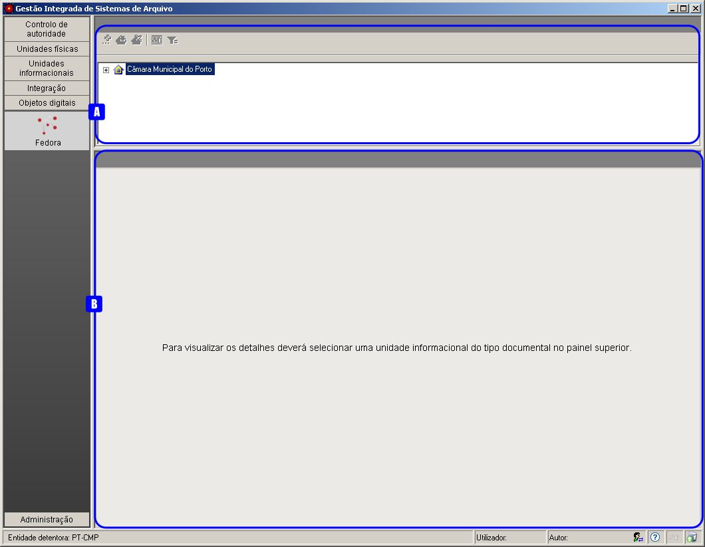
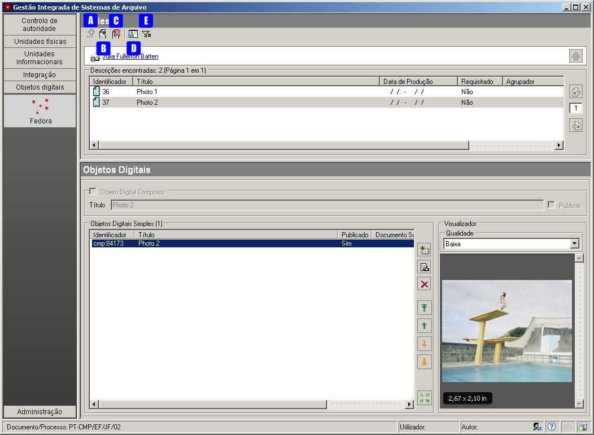
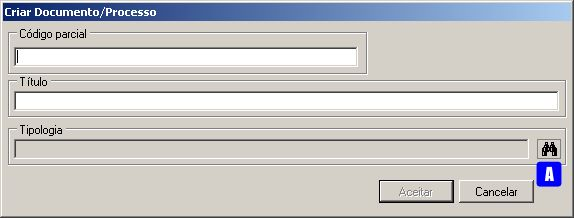
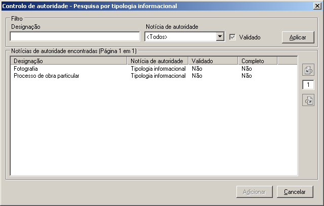
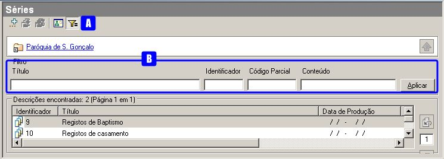
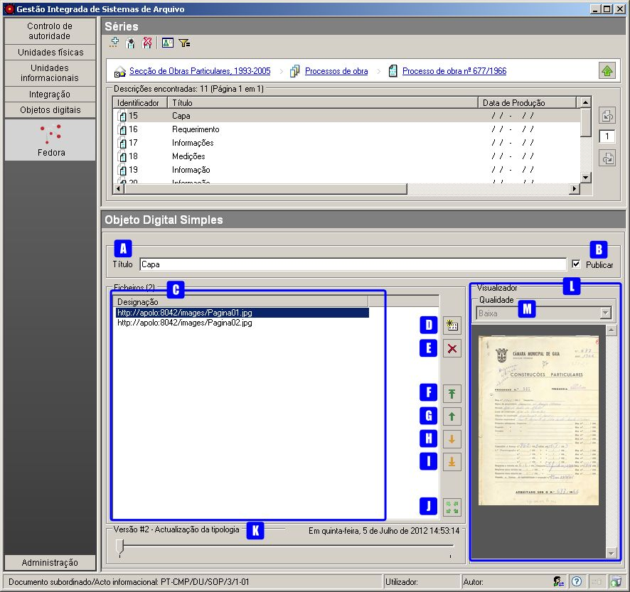
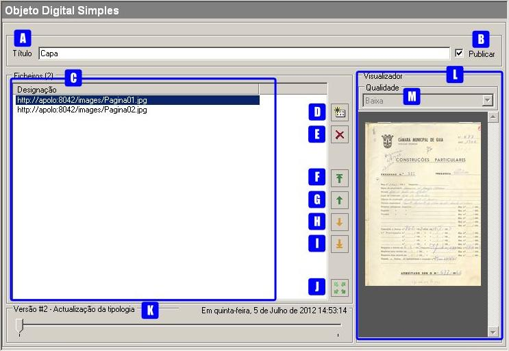
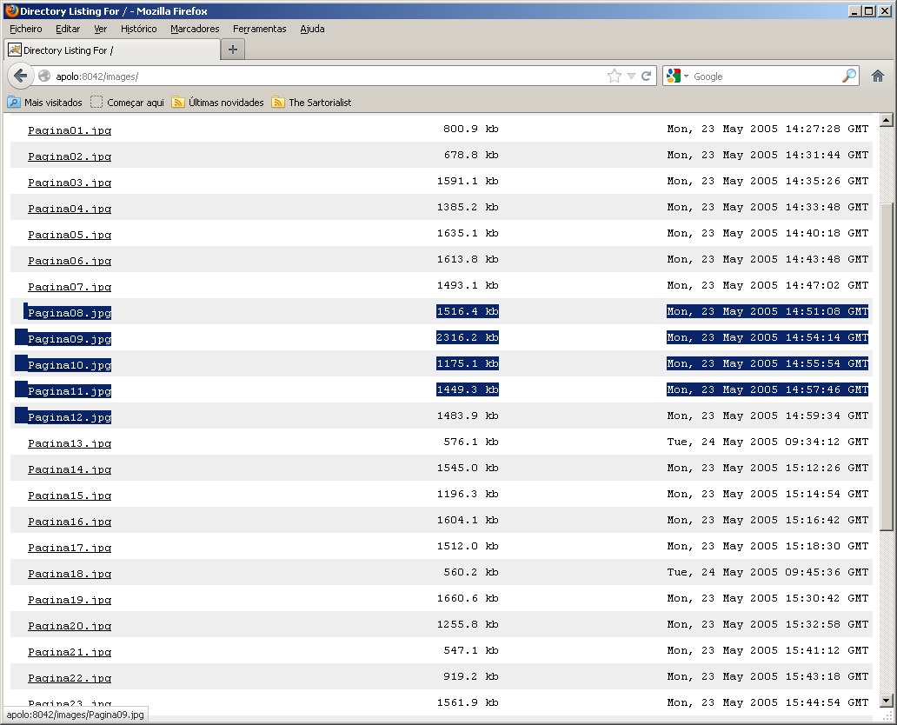
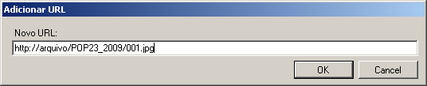
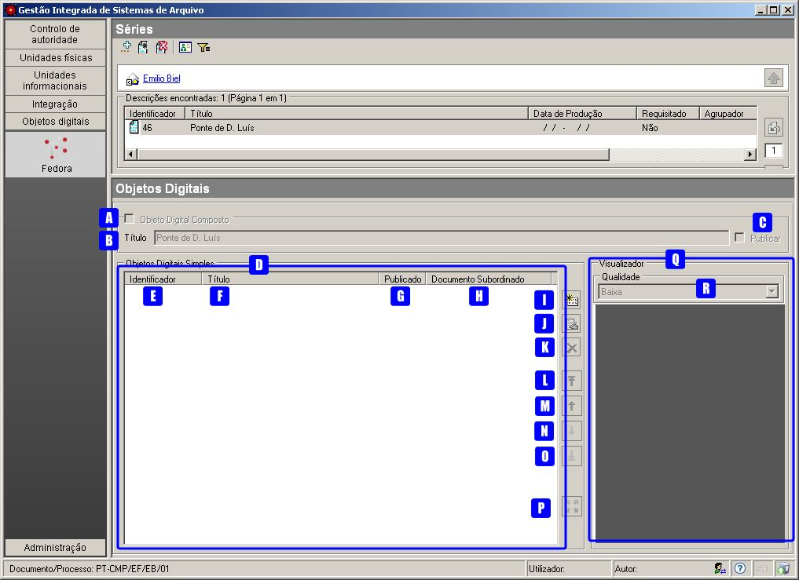
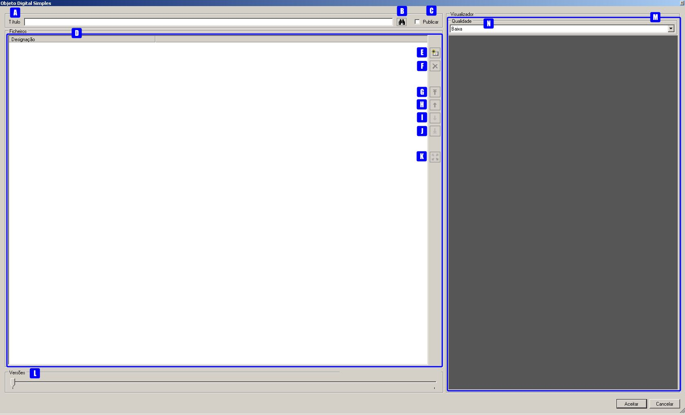
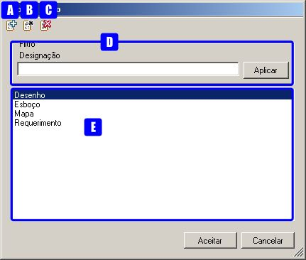

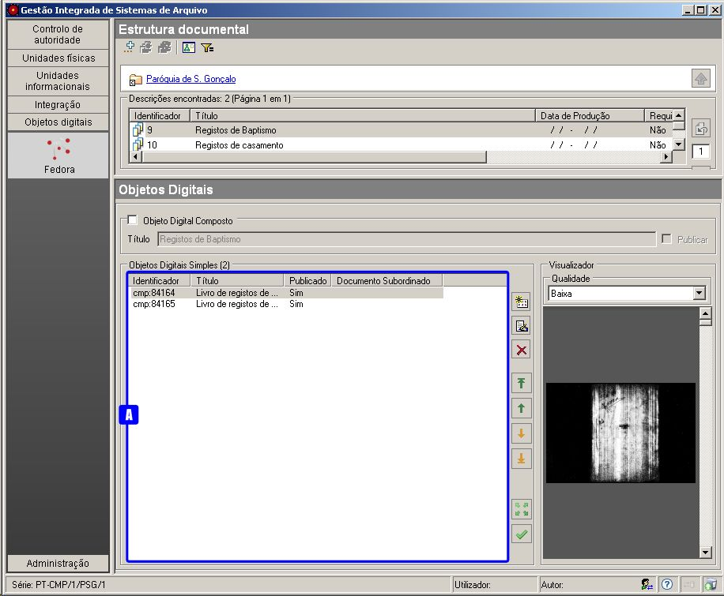
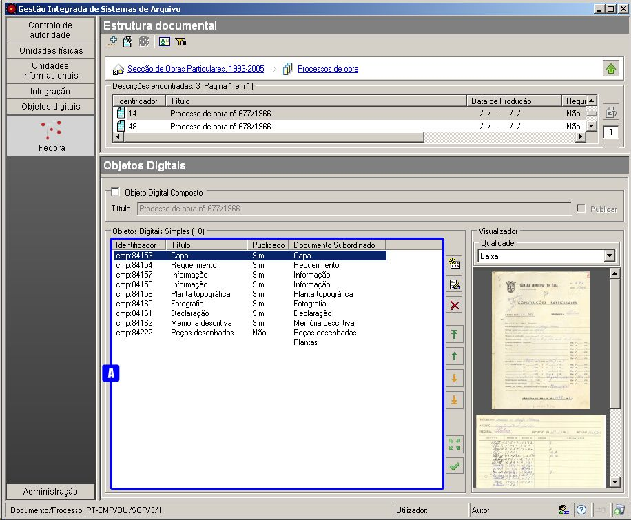
