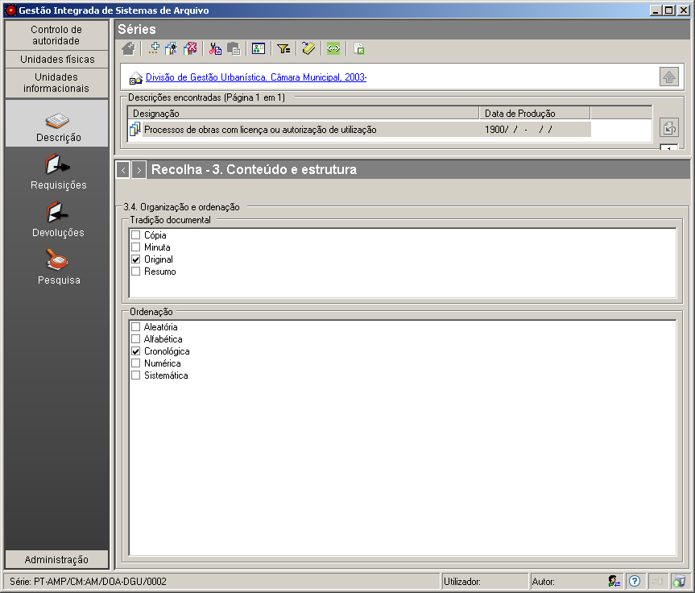

3.4 Organização e ordenação
===========================

*Conteúdo e estrutura* é uma das zonas da `descrição
multinível <descricao_ui.html#descricao-multinivel>`__ da ISAD(G) à qual
este painel de preenchimento pertence. Este painel faculta informação
sobre a estrutura interna, ordenação e/ou sistema de classificação da
unidade de descrição.

Para a ``Tradição documental``, os valores possíveis são:

-  ``Cópia``

\* ``Minuta``

-  ``Original``

\* ``Resumo``

Para a ``Ordenação``, os valores possíveis são:

-  ``Aleatória``

\* ``Alfabética``

-  ``Cronológica``

\* ``Numérica``

-  ``Sistemática``

Para se assinalar um item, primeiro, selecionar o item e, de seguida,
fazer novo clique. Cada unidade de descrição pode ter mais que um item
assinalado em cada um dos campos ``Tradição documental`` e
``Ordenação``.

|image0|

