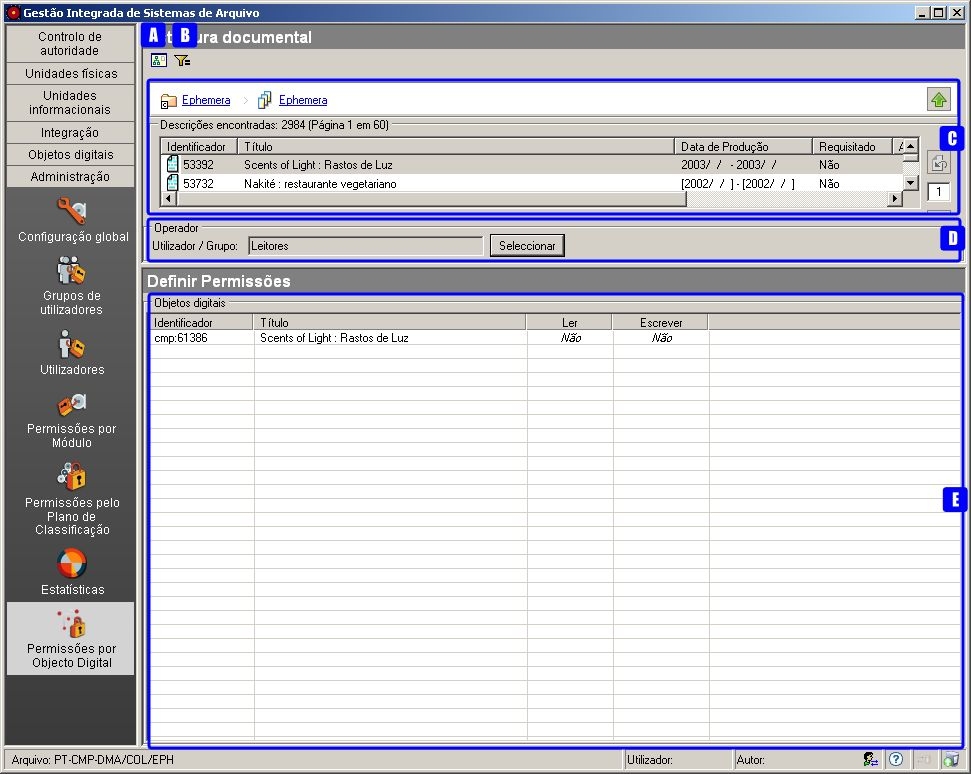
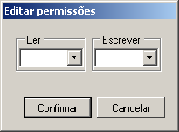

Permissões por Objeto Digital
=============================

A atribuição de permissões de acesso a um objeto digital é independente
da atribuição de permissões ao nível de descrição ao qual está
associado.

Se um utilizador não tiver nenhumas permissões de acesso a um nível de
descrição, não consegue aceder aos seus objetos digitais. Caso tenha
permissões de acesso a um nível de descrição, pode ou não ter permissões
de leitura ou escrita sobre os seus objetos digitais, dependendo do que
foi definido.

A opção *Permissões por Objeto Digital* permite definir o tipo de acesso
dos utilizadores ou grupos de utilizadores aos objetos digitais de uma
unidade informacional.

|image0|

A: ``Ver níveis documentais`` - Botão que permite mudar da vista
estrutural para a documental e vice-versa, para se poder selecionar o
nível de descrição pretendido.

B: ``Filtrar dados`` - Botão que permite filtrar na vista documental, os
níveis documentais pelo ``Título``, ``Identificador``,
``Código parcial`` ou ``Conteúdo``.

C: ``Área de seleção de um nível`` - Permite a navegação na estrutura
arquivística de forma a selecionar o nível de descrição que mostra os
objetos digitais sobre os quais se pretende listar/alterar as
permissões. De forma a facilitar a atribuição de permissões, cada nível
de descrição selecionado mostra também todos os objetos digitais
associados aos níveis subjacentes.

D: ``Operador`` - Permite selecionar o utilizador ou grupo de
utilizadores aos quais afetar as permissões.

E: ``Definição de permissões`` - Painel que permite visualizar e
atribuir as permissões sobre todas as operações a efetuar sobre os
objetos digitais.

Atribuição de permissões a objetos digitais
-------------------------------------------

Para alterar o tipo de permissão atribuída a uma operação, seleciona-se
a linha do objeto digital e na coluna correspondente à operação clica-se
até se obter o valor pretendido.

Se as permissões a atribuir são iguais para um conjunto de objetos
digitais, estas poderão ser atribuídas ao mesmo tempo, desde que na
mesma página. Faz-se a seleção múltipla dos objetos digitais pretendidos
e clica-se no botão direito do rato para se poder atribuir as
permissões:

|image1|

Escolhe-se para cada operação o valor pretendido e de seguida clica-se
no botão ``Confirmar`` para se atribuirem as permissões definidas nos
objetos selecionados. É possível escolher os seguintes valores: **Sim**,
**Não** ou *vazio*. Quando se escolhe o valor *vazio*, a permissão deve
voltar à permissão implícita que o objeto possuía, estabelecida por
`omissão <permissoes_omissao.html#objetos-digitais-novos>`__ ou como
resultado de um `cálculo <permissoes_calculo.html>`__.

