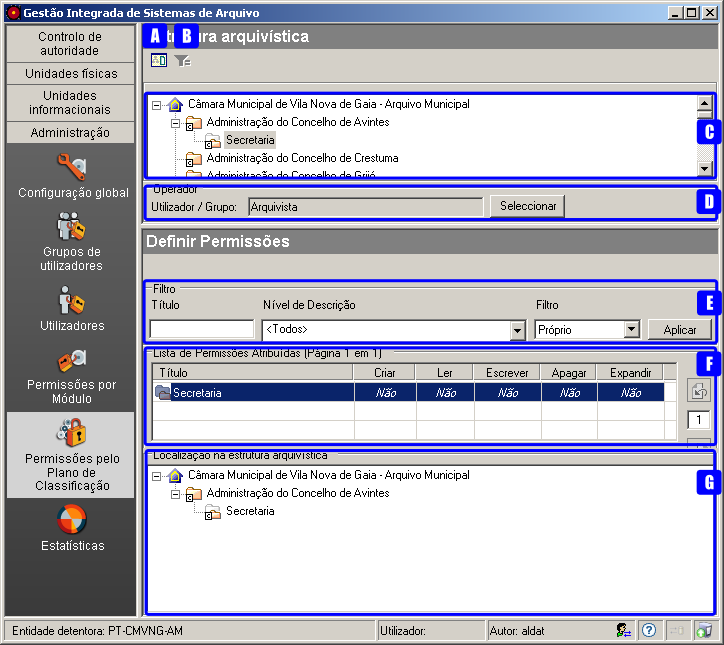
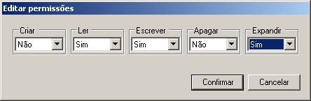

Permissões pelo Plano de Classificação
======================================

O módulo *Permissões pelo Plano de Classificação* na área de
*Administração* permite definir o tipo de acesso dos utilizadores aos
níveis de descrição da estrutura hierárquica. Esta definição pode ser
feita diretamente para cada utilizador ou para um grupo de utilizadores,
afetando as permissões dos utilizadores que lhe estão associados. A
definição de permissões dos utilizadores sobre os níveis deve ter em
conta não só os níveis existentes, como também os níveis que poderão a
vir ser criados.

|image0|

A: ``Ver níveis documentais`` - Botão que permite mudar da vista
estrutural para a documental e vice-versa, para se poder selecionar o
nível pretendido.

B: ``Filtrar dados`` - Botão que permite filtrar na vista documental, os
níveis documentais pelo Título, Identificador, Código parcial ou
Conteúdo.

C:\ `` Área de seleção de um nível`` - Permite a navegação na estrutura
arquivística de forma a selecionar o nível pretendido.

D: ``Operador`` - Permite selecionar o utilizador ou grupo de
utilizadores aos quais afetar as permissões.

E: ``Filtro`` - Permite listar os níveis sobre os quais se pretende
atribuir as permissões.

F: ``Lista de Permissões Atribuídas`` - Painel que permite visualizar e
atribuir as permissões sobre todas as operações a efetuar sobre os
níveis selecionados.

G: ``Localização na estrutura arquivística`` - Permite listar os
caminhos do nível selecionado até ao topo.

Na área de contexto deve ser selecionado o nível da estrutura
arquivística e também o utilizador ou grupo de utilizadores sobre os
quais se pretendem definir as permissões.

Atribuição de permissões a níveis
---------------------------------

Com um nível de descrição selecionado na área de contexto, a definição
das permissões sobre níveis pode ser feita na
``Lista de Permissões Atribuídas``, escolhendo a opção de filtragem
pretendida:

-  ``Próprio`` - quando só se pretende definir permissões no *nível
   selecionado* na área de contexto.

\* ``Todos documentais`` - quando se pretende definir permissões em
*níveis documentais de topo da estrutura documental*. Ou seja, quando na
área de contexto está um nível orgânico selecionado, este filtro permite
apresentar todos os níveis documentais diretamente relacionados com esse
nível ou com outro qualquer orgânico que seja subordinado, direta ou
indiretamente, ao selecionado.

-  ``Todos`` - quando se pretende definir permissões no nível
   selecionado e em *todos os níveis* (orgânicos e documentais)
   hierarquicamente (direta ou indiretamente) subjacentes a esse.

Dado que a ``Lista de permissões atribuídas`` pode ser extensa, pode
utilizar-se o título ou o nível de descrição para se poder limitar o
universo de níveis sobre os quais se pretende definir as permissões.

Para alterar o tipo de permissão atribuída a uma operação, seleciona-se
a linha do nível e na coluna correspondente à operação clica-se até se
obter o valor pretendido.

Se as permissões a atribuir são iguais para um conjunto de níveis de
descrição, estas poderão ser atribuídas ao mesmo tempo, desde que na
mesma página. Quando esse conjunto de níveis é grande (distribuindo-se
por mais que uma página), é conveniente aumentar o número de elementos
mostrados por página (ver `Configuração
global <configuracao_global.html>`__) de forma a reduzir o número de
páginas, tornando o processo de atribuição mais rápido. Uma vez feita a
seleção múltipla dos níveis pretendidos, clicar no botão direito do rato
para se poder atribuir as permissões:

|image1|

Escolher para cada operação o valor pretendido e de seguida clicar no
botão ``Confirmar`` para estabelecer as permissões definidas nos níveis
selecionados. É possível escolher os seguintes valores: **Sim**, **Não**
ou *vazio*. Quando se escolhe o valor *vazio*, a permissão deve voltar à
permissão implícita que o nível possuía, estabelecida por
`omissão <permissoes_omissao.html#niveis-novos>`__ ou como resultado de
um `cálculo <permissoes_calculo.html>`__.

Quando se pretende definir permissões em bloco, deve-se ter em conta as
regras de `Cálculo de permissões <permissoes_calculo.html>`__. Ou seja,
quando se definem:

-  *permissões em grupos de utilizadores*, as permissões dos
   utilizadores pertencentes a esses grupos podem ser afetadas com novos
   valores desde que não tenham valores explícitos.
-  *permissões de acesso a um nível documental* (série, subsérie e
   documento), todos os níveis hierarquicamente inferiores assumem as
   permissões do nível acima, desde que não tenham nenhuma permissão
   explícita.

