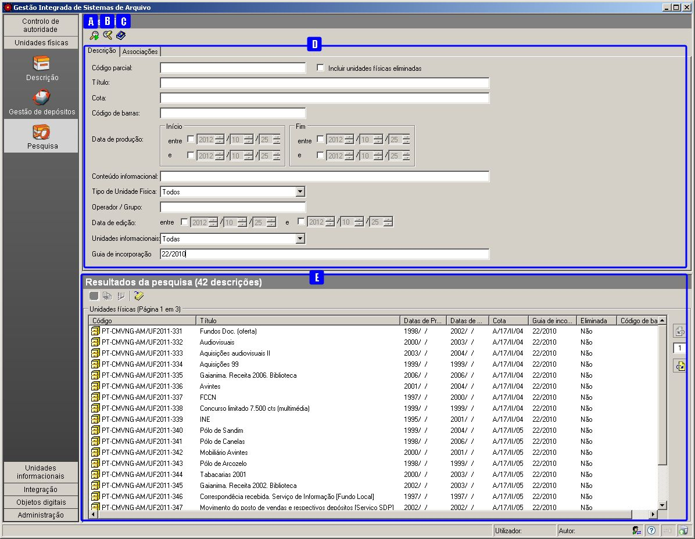
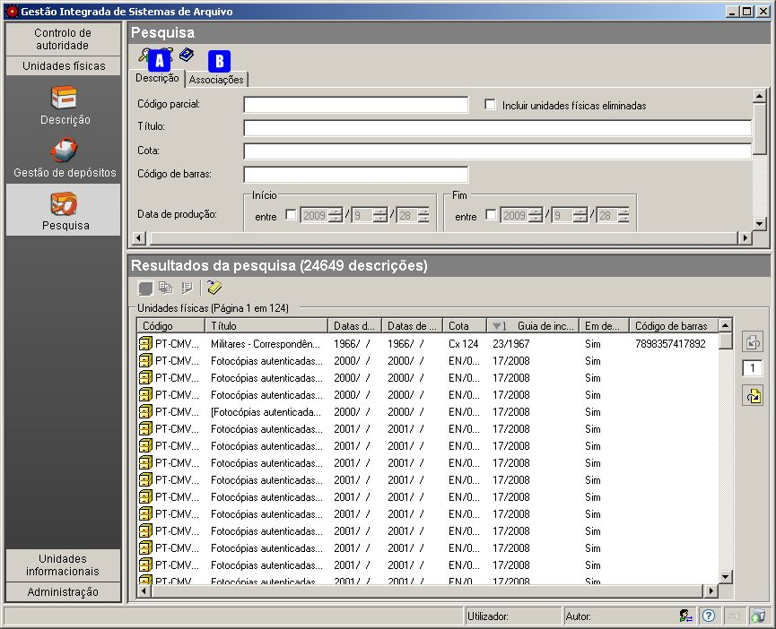
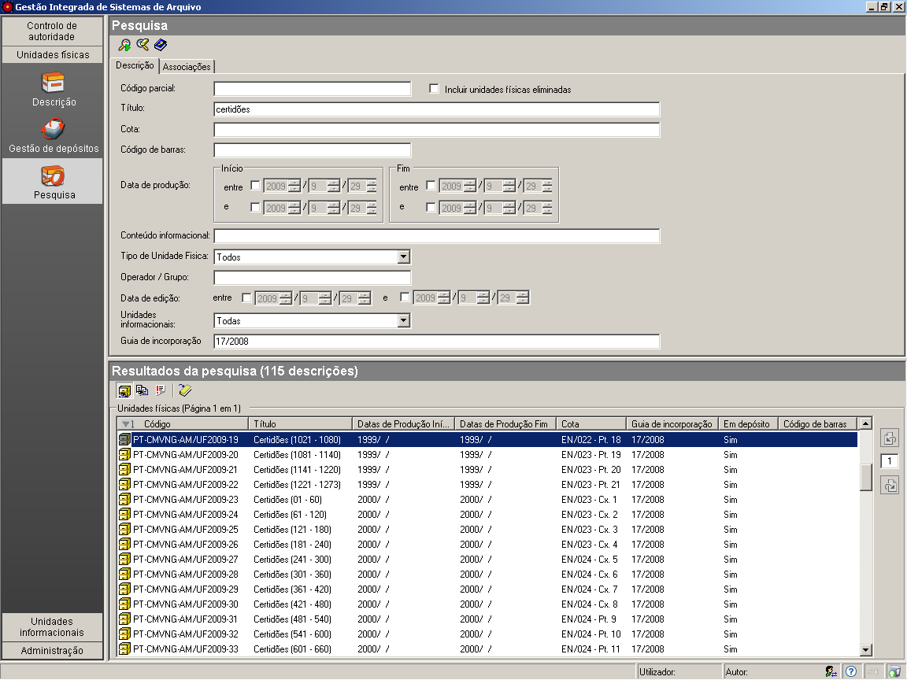
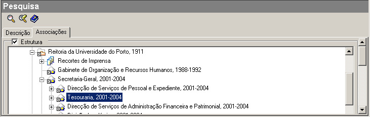
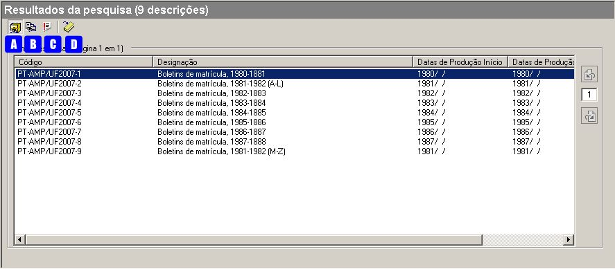
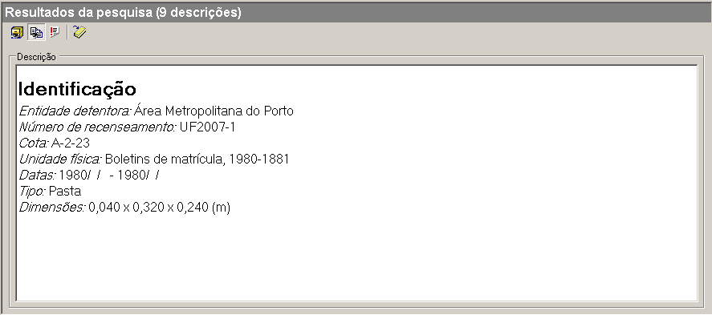
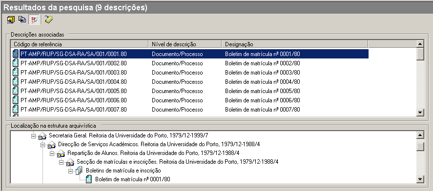
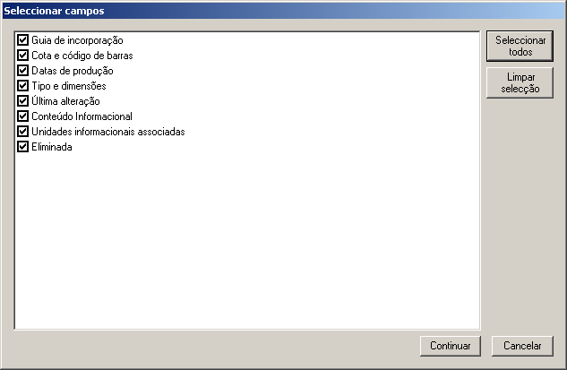

Pesquisa de Unidades físicas via aplicação
==========================================

A pesquisa de unidades físicas é feita no módulo de ``Pesquisa`` da área
de ``Unidades físicas``.

|image0|

A: ``Pesquisar`` - Botão que pesquisa a informação tendo em conta os
critérios de pesquisa.

B: ``Limpar critérios de pesquisa`` - Botão que apaga todos os critérios
de pesquisa definidos.

C: ``Ajuda Rápida`` - Botão que mostra texto de ajuda na construção de
expressões de pesquisa.

D: ``Critérios de pesquisa`` - Área de definição dos critérios de
pesquisa.

E: ``Resultados de pesquisa`` - Área de apresentação dos resultados da
pesquisa.

Para efetuar qualquer tipo de pesquisa, primeiro, especificar o critério
de pesquisa pretendido e a seguir, clicar no botão da barra de
ferramentas ``Pesquisar`` ou pressionar a tecla ``Enter``, sendo a lista
de resultados apresentada no painel em baixo. Ao selecionar-se um
resultado dessa lista, é possível visualizar todos os detalhes de
descrição dessa unidade, usando os vários botões apresentados na barra
de ferramentas do painel de resultados.

Critérios de pesquisa
---------------------

|image1|

A: ``Descrição`` - Painel para efetuar pesquisas nos campos das unidades
de descrição.

B: ``Associações`` - Painel para efetuar pesquisas em determinado ramo
da estrutura arquivística.

Para se efetuar uma pesquisa, primeiro deve especificar-se o critério de
pesquisa pretendido e a seguir clicar no botão *Pesquisar*, para a lista
de resultados ser apresentada. O critério de pesquisa é estabelecido,
usando os painéis acima referidos com expressões de pesquisa válidas.
Para um melhor conhecimento sobre a construção de expressões de
pesquisa, consultar a página `Expressões de pesquisa <pesquisa.html>`__.

Pesquisa na Descrição
~~~~~~~~~~~~~~~~~~~~~

É possível pesquisar por alguns campos (os mais usuais) da unidade de
descrição selecionando o painel ``Descrição``. Para um maior detalhe em
como construir expressões de pesquisa bem formadas, consultar a página
`Expressões de pesquisa <pesquisa.html>`__.

|image2|

**Código parcial**

Qualquer expressão introduzida neste campo de pesquisa deve recuperar
unidades físicas cujo ``Código parcial`` obedeça ao critério.

Se neste campo se colocar, por exemplo, UF2009-19, deverá recuperar
determinada unidade física com esse código parcial. Se, por exemplo, se
colocar UF2010\*, recuperará todas as unidades físicas de 2010.

**Incluir Unidades físicas eliminadas**

Por omissão, nos resultados de pesquisa só aparecem as unidades físicas
que existem em depósito, excluindo as que já foram abatidas. Assinalando
este critério, os resultados passam a ter em conta todas as unidades
físicas registadas no sistema, incluindo as que entretanto já não
existem em depósito.

**Título**

Qualquer expressão introduzida neste campo de pesquisa, deve recuperar
unidades físicas cujo campo ``Título`` esteja de acordo com ela.

**Cota**

Qualquer expressão introduzida no campo de pesquisa ``Cota`` deve
recuperar unidades físicas cuja cota obedeça a esse critério. Por
exemplo, ao colocar neste campo 6-66-5-1, é devolvida a unidade física
com essa cota.

**Código de barras**

Qualquer expressão introduzida neste campo de pesquisa deve recuperar
unidades físicas cujo campo ``Código de barras`` obedeça ao critério
estabelecido.

**Data de produção inicial e data final**

Estes campos permitem recuperar todas as unidades físicas, cujas datas
extremas (data de início e/ou data de fim) obedeçam aos intervalos
temporais, definidos como critério.

Quando se procura uma data exata, as datas limite do intervalo temporal,
usado como critério de pesquisa, devem ser iguais. Também se podem fazer
pesquisas a *partir de* uma determinada data, definindo somente o limite
inferior do intervalo, ou então, *antes de* uma determinada data,
definindo somente o limite superior.

Nas unidades de descrição do GISA, os campos de datas podem ser
preenchidos como se indica nas `Datas de
produção <descricao_uf?&.html#identificacao>`__. No entanto, a data como
critério de pesquisa, terá de ser completa, obrigando ao preenchimento
do ano, do mês e do dia. Quando se pesquisa por datas, descrições com
datas indeterminadas ou não preenchidas, não são recuperadas, mas
descrições com datas incompletas, desde que obedeçam ao critério, são.
Numa data incompleta, o ? pode ser um valor qualquer.

**Conteúdo informacional**

O resultado da pesquisa será qualquer unidades física, cujo campo
``Conteúdo informacional`` obedeça ao critério estabelecido.

**Tipo de unidade física**

O resultado da pesquisa será qualquer unidade física, cujo campo
``Tipo`` (tipo de suporte) obedeça ao critério estabelecido.

**Operador/Grupo**

Recupera todas as unidades físicas que foram criadas ou alteradas, pelo
operador ou grupo especificado na pesquisa.

**Data de edição**

Recupera todas as unidades físicas que foram criadas ou alteradas dentro
do período especificado no critério de pesquisa.

**Unidades informacionais**

Este campo de pesquisa pode ter três valores, definindo universos de
pesquisa diferentes:

-  ``Todos`` - os resultados de pesquisa abrangem todas as unidades
   físicas.
-  ``Com unidades arquivísticas`` - os resultados de pesquisa só mostram
   unidades físicas que estejam associadas a unidades informacionais.
-  ``Sem unidades arquivísticas`` - os resultados de pesquisa só mostram
   unidades físicas que não estejam associadas a unidades
   informacionais.

**Guia de incorporação**

Recupera todas as unidades físicas que foram associadas a uma guia de
incorporação, que deve obedecer à expressão especificada no critério de
pesquisa.

Por exemplo, se a expressão for \*2008, refere-se a todas as guias de
2008 (1/2008, 2/2008,…) e consequentemente mostra todas as unidades
físicas nelas contidas.

Pesquisa via Associações a unidades de descrição
~~~~~~~~~~~~~~~~~~~~~~~~~~~~~~~~~~~~~~~~~~~~~~~~

O painel ``Associações`` permite limitar a pesquisa ao universo das
unidades físicas que servem de suporte às unidades informacionais
subjacentes ao nível selecionado na estrutura arquivística.

|image3|

Para ativar este tipo de critério, tem que se selecionar previamente a
caixa de verificação ``Estrutura`` e, de seguida, selecionar o nível
pretendido, expandindo a árvore.

Resultados da pesquisa
----------------------

Os resultados da pesquisa podem ter três vistas distintas:
``Resultados``, ``Detalhes``, e ``Níveis associados``. Depois de
executar uma pesquisa, visualiza-se a vista de ``Resultados``, sendo
possível alternar entre vistas, através dos botões que se mostram a
seguir.

|image4|

A: ``Resultados`` - Mostra a lista de todas as unidades físicas que
obedecem ao critério de pesquisa.

B: ``Detalhes`` - Mostra os detalhes da descrição da unidade física
selecionada na lista de resultados.

C: ``Níveis associados`` - Mostra todas as unidades informacionais
associadas à unidade física selecionada na lista de resultados.

D: ``Relatórios`` - Gera ficheiros PDF com dados referentes aos
resultados.

Resultados
~~~~~~~~~~

O painel de ``Resultados`` (ver em cima), mostra a lista de descrições
de unidades físicas recuperadas na pesquisa efetuada. Para ordenar esta
lista pelas diferentes colunas, consultar `Ordenação de
listas <ambiente_trabalho.html#ordenacao-de-listas>`__.

Detalhes
~~~~~~~~

Selecionando uma unidade física na lista de resultados, pode ver-se um
resumo dos detalhes da descrição clicando no botão ``Detalhes``.

|image5|

Para imprimir ou guardar o texto do campo ``Descrição`` mostrado como
resultado da pesquisa, este terá de ser copiado para um documento de
texto (Word, Notepad, etc), utilizando o ``Copiar``/``Colar`` (ou as
teclas ``Ctrl+C``/``Ctrl+V``) do Windows.

Níveis associados
~~~~~~~~~~~~~~~~~

|image6|

Este painel mostra as unidades informacionais associadas à unidade
física selecionada nos resultados de pesquisa. Para cada unidade
informacional selecionada, é mostrada a sua localização na estrutura
arquivística.

Relatórios
~~~~~~~~~~

Este botão apresenta um menu com as seguintes opções de relatórios:
``Unidades físicas resumidas`` e ``Unidades físicas detalhadas``.

As ``Unidades físicas resumidas`` apresentam os dados em formato de
tabela, em que as linhas são as unidades físicas resultado da pesquisa e
as colunas os seguintes campos:

-  Código
-  Título
-  Datas de Produção
-  Cota
-  Guia de Incorporação
-  Código de Barras

Na seguinte janela define-se o nome do ficheiro, a localização e o tipo
de formato a gerar, sendo possível escolher em RTF, PDF ou XLSX. De
seguida, o relatório será guardado, com os dados provenientes dos
resultados de pesquisa.

|image7|

Nas ``Unidades físicas detalhadas``, os dados são apresentados registo a
registo e é facultado ao utilizador a possibilidade de escolher os
campos de descrição a constar em cada registo. Os campos podem ser
selecionados na seguinte janela:

|image8|

A seleção pode ser feita individualmente por campo, ou clicando no botão
``Selecionar todos`` para escolher todos os campos ao mesmo tempo. O
botão ``Limpar seleção`` retira todas as seleções efetuadas.

O ``Código`` e o ``Título`` constam sempre num relatório detalhado, não
sendo necessário selecioná-los.

Ao clicar no botão ``Continuar``, abre-se:

|image9|

Define-se o nome do ficheiro, a localização e o tipo de formato a gerar
(RTF ou PDF) e de seguida, ao guardar, será gerado o respetivo relatório
com os dados existentes na lista de resultados.

.. |image7| image:: _static/images/guardarrelatoriopesquisa.png
   :width: 300px

.. |image9| image:: _static/images/guardarrelatoriopesquisa.png
   :width: 300px
