Pesquisa de Unidades Informacionais via aplicação
=================================================

A pesquisa de unidades informacionais, pertencentes à estrutura
documental, é feita no módulo de *Pesquisa* da área de *Unidades
informacionais*.

|image0|

A: ``Pesquisar`` - Botão que pesquisa a informação tendo em conta os
critérios de pesquisa.

B: ``Limpar critérios de pesquisa`` - Botão que apaga todos os critérios
de pesquisa definidos.

C: ``Modo pesquisa simples`` - Botão que mostra o painel que permite
efetuar pesquisas simples. Nesse painel aparece na mesma posição o botão
``Modo pesquisa avançada`` que permite voltar a este quando se pretende
efetuar pesquisas mais avançadas.

D: ``Ajuda Rápida`` - Botão que mostra texto de ajuda na construção de
expressões de pesquisa.

E: ``Critérios de pesquisa`` - Área de definição dos critérios de
pesquisa.

F: ``Resultados de pesquisa`` - Área de apresentação dos resultados da
pesquisa.

Para efetuar qualquer tipo de pesquisa, primeiro, especificar o critério
de pesquisa pretendido, e a seguir, clicar no botão ``Pesquisar`` da
barra de ferramentas ou pressionar a tecla ``Enter``, que a lista de
resultados é apresentada no painel em baixo. A lista de resultados é
constituída por unidades informacionais, pertencentes à estrutura
documental, as quais podem ser do tipo ``Série``, ``Subsérie``,
``Documento/Processo`` ou ``documento subordinado/Ato informacional``.

Com os vários botões apresentados na barra de ferramentas, deste painel
de resultados, é possível gerar relatórios, visualizar os detalhes de
descrição ou até mesmo aceder ao documento digital (original ou cópia)
da unidade informacional selecionada na lista de resultados.

Modos de pesquisa simples e avançada
------------------------------------

O modo de pesquisa simples é o apresentado quando se entra na área de
pesquisa de unidades informacionais. Existem dois modos de pesquisa de
informação com diferente grau de complexidade e de precisão nos
resultados:

-  *pesquisa simples*, em que a procura da expressão de pesquisa é feita
   em todos os campos de descrição, dando resultados mais abrangentes
   (com mais ruído).

|image1|

-  *pesquisa avançada*, em que a procura da expressão de pesquisa é
   feita em campos específicos de descrição, podendo devolver resultados
   mais precisos.

|image2|

É possível alternar entre os dois modos de pesquisa através dos botões
``Modo pesquisa avançada`` e ``Modo de pesquisa simples``.

Critérios de pesquisa avançada
------------------------------

Na pesquisa avançada, existem dois tipos de critérios: ``Descrição`` e
``Estrutura``.

|image3|

A: ``Descrição`` - Neste painel define-se o critério de pesquisa,
colocando-se expressões de pesquisa nos diferentes campos de pesquisa,
de forma a recuperar unidades informacionais, cujos campos de descrição
estejam de acordo com o critério.

B: ``Estrutura`` - Painel para efetuar pesquisas via estrutura
arquivística, em que os resultados serão limitados às unidades
informacionais subjacentes ao nível da estrutura arquivística
selecionado.

Estes dois tipos de critério podem ser usados em simultâneo.

Pesquisa na Descrição
~~~~~~~~~~~~~~~~~~~~~

É possível pesquisar por alguns campos (os mais usuais) da unidade de
descrição selecionando o painel ``Descrição``. Os campos de pesquisa
avançada não estão totalmente visíveis, sendo possível redimensionar a
área dos ``Critérios de pesquisa`` para se poder definir algum critério
que não esteja visível.

Para um maior detalhe em como construir expressões de pesquisa bem
formadas, consultar a página `Expressões de pesquisa <pesquisa.html>`__.

|image4|

**Módulo**

Permite selecionar qual o universo sobre o qual se está a fazer a
pesquisa:

-  ``Pesquisa total`` - nos resultados pode constar qualquer uma das
   unidades documentais registadas no sistema.
-  ``Pesquisa de descrições publicadas`` - nos resultados só constam as
   unidades documentais definidas no sistema como públicas.

**Código Parcial**

Qualquer termo colocado no campo de pesquisa ``Código Parcial`` obriga a
que o código parcial (parte do código de referência relativa a um nível)
das unidades documentais resultado dessa pesquisa obedeçam a esse
critério.

Se neste campo se colocar, por exemplo, 0023, deverá recuperar
determinada unidade informacional com esse código parcial.

**Identificador**

O termo colocado no campo de pesquisa ``Identificador`` deve ser
numérico e obriga a que o identificador de cada unidade documental
resultado dessa pesquisa obedeça ao critério especificado.

**Título**

Qualquer pesquisa efetuada no campo ``Título``, devolve todas as
unidades de descrição do nível documental cujo título obedeça ao
critério de pesquisa.

**Autor**

Introduzida uma expressão de pesquisa no campo ``Autor``, os resultados
são todas as séries e documentos, cujo autor obedece à expressão. Como o
autor é um registo de autoridade, a expressão tanto pode estar de acordo
com a forma autorizada como com qualquer outra forma do nome. O termo
colocado na expressão de pesquisa, pode ser recolhido de uma lista,
clicando no botão lateral.

**Entidade produtora**

Introduzida uma expressão de pesquisa no campo ``Entidade produtora``,
os resultados são séries e documentos, diretamente produzidos por esse
produtor. A entidade produtora é um registo de autoridade, logo, a
pesquisa pode ser feita não só pelo termo autorizado como também por
qualquer forma paralela. O termo pode ser recolhido de uma lista,
clicando no botão lateral.

**Nível de descrição**

Por omissão, os resultados de pesquisa são todos os tipos de nível
documental: ``Série``, ``Subsérie``, ``Documento/Processo`` e
``Documento subordinado/Ato informacional``. Neste campo de pesquisa,
``Nível de descrição``, é possível filtrar-se os tipos de níveis
apresentados. Para a seleção múltipla dos diferentes tipos de nível,
usar a tecla de ``Ctrl``.

**Data de produção inicial e data final**

Estes campos permitem recuperar todas as unidades informacionais, cujas
datas extremas (data de início e/ou data de fim) obedeçam aos intervalos
temporais, definidos como critério.

Quando se procura uma data exata, as datas limite do intervalo temporal,
usado como critério de pesquisa, devem ser iguais. Também se podem fazer
pesquisas a *partir de* uma determinada data, definindo somente o limite
inferior do intervalo, ou então, *antes de* uma determinada data,
definindo somente o limite superior.

Nas unidades de descrição do GISA, os campos de datas podem ser
preenchidos como se indica nas `Datas de
produção <ident_ref.html#datas-de-producao>`__. No entanto, a data como
critério de pesquisa, terá de ser completa, obrigando ao preenchimento
do ano, do mês e do dia. Quando se pesquisa por datas, descrições com
datas indeterminadas ou não preenchidas, não são recuperadas, mas
descrições com datas incompletas, desde que obedeçam ao critério, são.
Numa data incompleta, o ? pode ser um valor qualquer.

**Tipologia informacional**

Ao escrever uma expressão de pesquisa no campo
``Tipologia informacional``, os resultados são unidades informacionais
cuja tipologia tem de estar de acordo. Como a Tipologia informacional é
um registo de autoridade, a pesquisa pode ser feita não só pela forma
autorizada como também por qualquer outra forma. O termo pode ser
escolhido de uma lista, clicando no botão lateral.

**Termos de indexação**

Quando se escreve uma expressão de pesquisa no campo
``Termos de indexação``, esta terá de obedecer a pelo menos um dos
registos de autoridade do tipo ``Ideográfico``, ``Onomástico`` ou
``Nome geográfico/Topónimo citadino`` que conste na lista da zona
``*.Indexação`` das unidades de descrição. A pesquisa pode ser feita não
só pelo forma autorizada do registo de autoridade, como também por
qualquer outra forma. O termo pode ser escolhido de uma lista, clicando
no botão lateral.

**Conteúdo informacional**

O resultado da pesquisa será qualquer unidades informacional, cujo campo
``Conteúdo informacional`` obedeça ao critério estabelecido.

**Notas**

A pesquisa com este critério vai incidir sobre o campo ``Notas`` das
unidades de descrição.

**Cota da unidade física**

A cota é um elemento característico de uma unidade física, definindo a
sua localização física no depósito.

Quando se pesquisam unidades informacionais a partir do campo ``Cota``,
os resultados serão unidades informacionais contidas em unidades
físicas, cujas cotas obedecem a expressão de pesquisa especificada.

**Agrupador**

Qualquer pesquisa através deste campo, deverá devolver unidades
informacionais, cujo campo ``Agrupador`` obedece à expressão colocada
como critério.

**Incluir apenas resultados objetos digitais**

Ao selecionar este critério, os resultados deverão ser unicamente
unidades informacionais com objetos digitais associados.

**Incluir apenas resultados com prazo de conservação ultrapassado**

Ao selecionar este critério, os resultados serão unicamente documentos
por avaliar, cuja série tem como destino final ``Eliminação`` e o prazo
de eliminação somado à data final de produção do documento dê uma data
anterior à data atual (definida no computador). Convém ter em conta que
este critério só funciona, quando as datas finais de produção dos
documentos estão preenchidas. **Suporte e acondicionamento**

É possível pesquisar pelo tipo de ``Suporte e acondicionamento``:
bobina, caderneta, caixa, etc.. Para a escolha múltipla dever-se-á
selecionar os itens da lista com a tecla de ``Ctrl`` pressionada.

**Material de suporte**

É possível pesquisar pelo tipo de ``Material de suporte``: papel, vidro,
metal, etc.. Para a escolha múltipla dever-se-á selecionar os itens da
lista com a tecla de ``Ctrl`` pressionada.

**Técnica de registo**

É possível pesquisar pela ``Técnica de registo``: áudio, filme,
impresso, etc..Para a escolha múltipla dever-se-á selecionar os itens da
lista com a tecla de ``Ctrl`` pressionada.

**Estado de conservação**

É possível pesquisar pelo ``Estado de conservação``: bom, razoável ou
mau.

Pesquisa na Estrutura
~~~~~~~~~~~~~~~~~~~~~

O painel ``Estrutura`` permite selecionar um nível da estrutura
arquivística, limitando o universo de pesquisa às unidades de informação
subjacentes ao nível selecionado.

|image5|

Para ativar este tipo de critério, tem que selecionar previamente a
caixa de verificação ``Estrutura`` e, de seguida, selecionar o nível
pretendido, expandindo a árvore. A estrutura na pesquisa só apresenta
níveis até ao tipo de nível ``Série``.

Resultados da pesquisa
----------------------

Os resultados da pesquisa podem ter cinco vistas distintas:
``Resultados``, ``Detalhes``, ``Informação da entidade produtora``,
``Imagens`` e ``Unidades físicas``. Primeiramente, visualiza-se a vista
de ``Resultados``, podendo-se alternar entre vistas clicando nos
seguintes ícones.

|image6|

A: ``Resultados`` - Mostra a lista de todas as unidades de descrição que
obedecem ao critério de pesquisa.

B: ``Detalhes`` - Mostra os detalhes da descrição da unidade de
descrição selecionada na lista de resultados.

C: ``Informação da entidade produtora`` - Mostra a localização da
descrição na estrutura arquivística selecionada na lista dos resultados.

D: ``Imagens`` - Mostra todas as imagens/objetos digitais associados à
unidade de descrição selecionada na lista de resultados.

E: ``Unidades físicas`` - Mostra todas as unidades físicas associadas à
unidade de descrição selecionada na lista de resultados.

F: ``Relatórios`` - Gera ficheiros PDF com dados referentes aos
resultados.

A seguir, apresentam-se exemplos das diferentes vistas para o resultado
de uma pesquisa.

Resultados
~~~~~~~~~~

Os resultados das pesquisas constituem sempre uma lista de unidades de
descrição de nível documental, tais como, séries, subséries, documentos,
etc..

A lista dos resultados pode ser ordenada pelas diferentes colunas, cujo
procedimento se encontra detalhado na secção ``Ordenação de listas`` do
capítulo ``Ambiente de trabalho``.

Detalhes
~~~~~~~~

Selecionando uma unidade de informação na lista de resultados, para se
ver os detalhes da sua descrição, clica-se no botão ``Detalhes``.

|image7|

Para imprimir ou guardar o texto do campo ``Descrição`` mostrado como
resultado da pesquisa, este terá de ser copiado para um documento de
texto (Word, Notepad, etc), utilizando o ``Copiar``/``Colar`` (ou as
teclas ``Ctrl+C``/``Ctrl+V``) do Windows.

Informação da entidade produtora
~~~~~~~~~~~~~~~~~~~~~~~~~~~~~~~~

Painel que informa qual o contexto produtor da descrição arquivística
selecionada na lista dos resultados.

|image8|

Imagens
~~~~~~~

|image9|

Este painel permite a visualização de ficheiros (de imagem, texto, som,
etc.) ou objetos digitais Fedora, associados à unidade de descrição
selecionada na lista de resultados da pesquisa.

Do lado esquerdo, na primeira lista, constam os ficheiros associados e
na segunda lista, os objetos Fedora.

Selecionando um ficheiro na primeira lista, do lado direito, aparece a
pré-visualização de uma imagem ou de um ícone, dependendo do tipo de
ficheiro. Fazendo um duplo clique sobre a pré-visualização, abre-se a
aplicação que no Windows está associada ao tipo de ficheiro em causa.

|image10|

Selecionando na segunda lista um objeto digital Fedora, do lado direito
é apresentado um visualizador da Acrobat embebido no GISA, com o PDF
correspondente. Também é possível maximizar a visualização do PDF.

Unidades físicas
~~~~~~~~~~~~~~~~

|image11|

Este painel mostra as unidades físicas associadas à unidade
informacional selecionada nos resultados de pesquisa.

Relatórios
~~~~~~~~~~

Este botão apresenta um menu com as seguintes opções de relatórios:
``Relatórios de pesquisa resumidos`` e
``Relatórios de pesquisa detalhados``.

Os ``Relatórios de pesquisa resumidos`` apresentam os dados em formato
de tabela, em que as linhas são as unidades informacionais resultado da
pesquisa e as colunas os seguintes campos:

-  Identificador
-  Código de referência
-  Nível de Descrição
-  Designação
-  Datas de Produção

Na seguinte janela define-se o nome do ficheiro, a localização e o tipo
de formato a gerar, sendo possível escolher em RTF, PDF ou XLSX. De
seguida, o relatório será guardado, com os dados provenientes dos
resultados de pesquisa.

|image12|

Nos ``Relatórios de pesquisa detalhados``, os dados são apresentados
registo a registo e é facultado ao utilizador a possibilidade de
escolher os campos de descrição a constar em cada registo,
selecionando-os na seguinte janela:

|image13|

A seleção pode ser feita individualmente por campo, ou clicando no botão
``Selecionar todos`` para escolher todos os campos ao mesmo tempo. O
botão ``Limpar seleção`` retira alguma seleção efetuada.

Os campos ``Código de referência``, ``Nível de Descrição``,
``Designação`` e ``Datas de Produção`` constam sempre num relatório
detalhado não sendo necessário selecioná-los.

Escolhendo qualquer uma das opções, ``Relatórios de pesquisa resumidos``
ou ``Relatórios de pesquisa detalhados``, será gerado o respetivo
relatório com os dados existentes na lista de resultados e pela mesma
ordem, sendo possível definir o nome do ficheiro, a localização e o tipo
de formato a gerar (RTF ou PDF) na seguinte janela.

|image14|

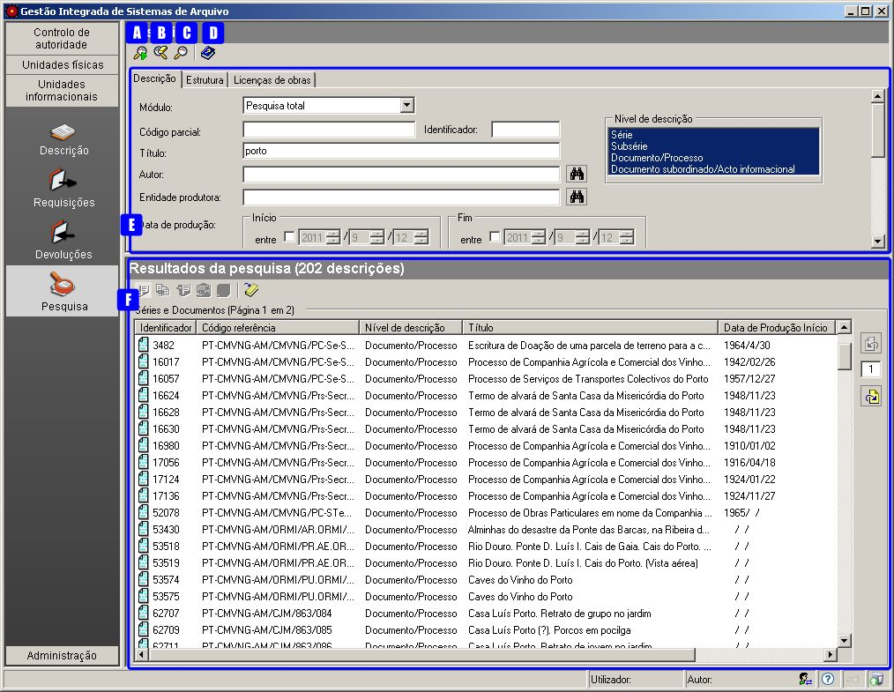
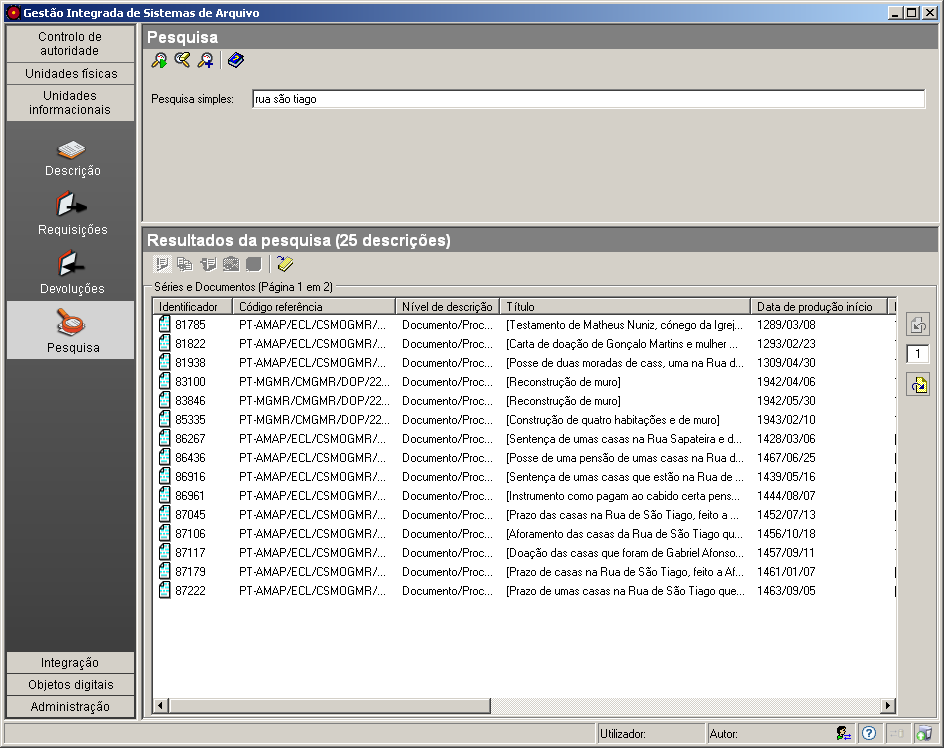
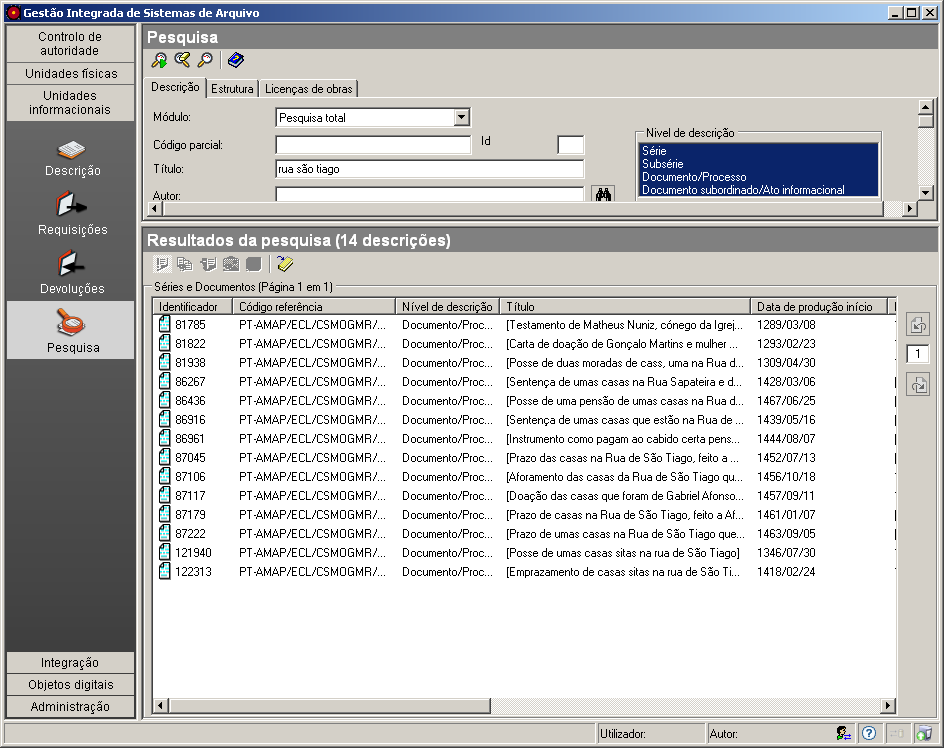
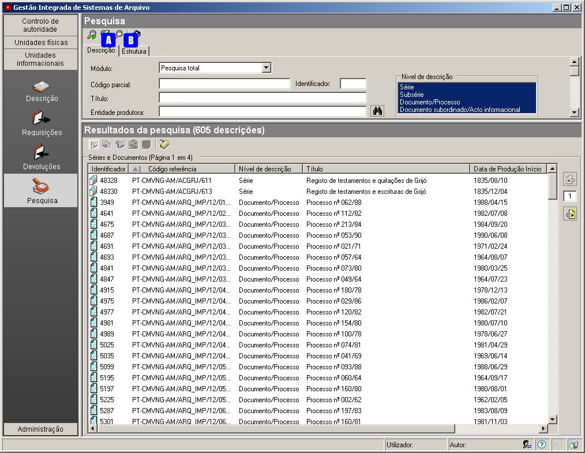
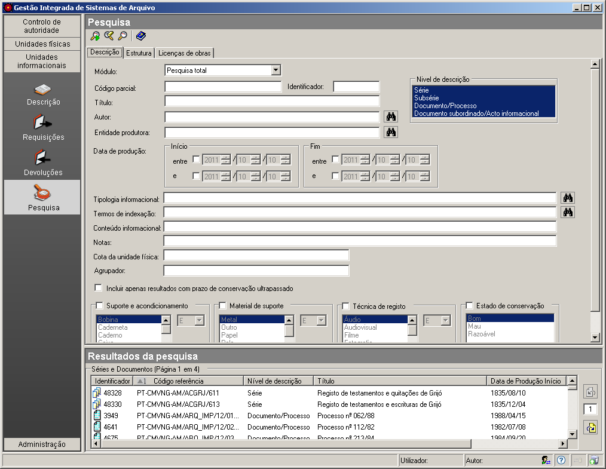
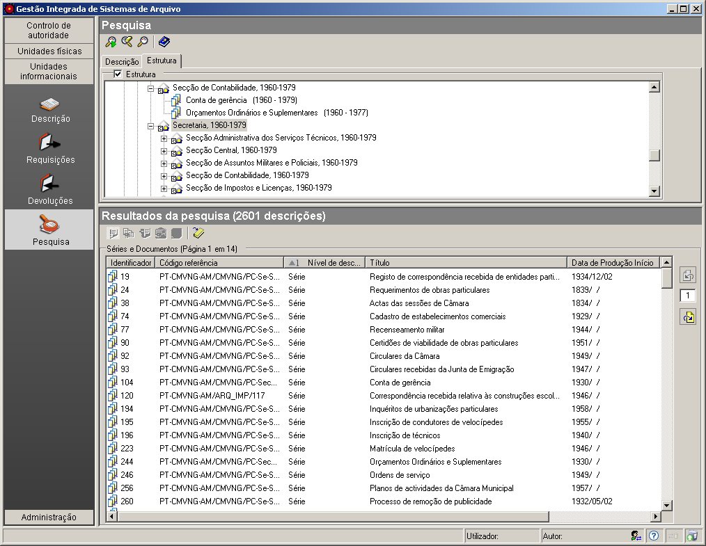
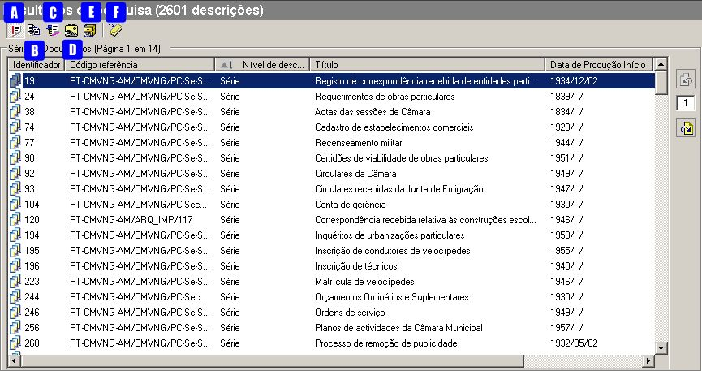
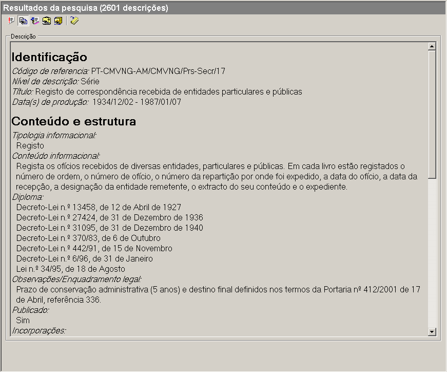
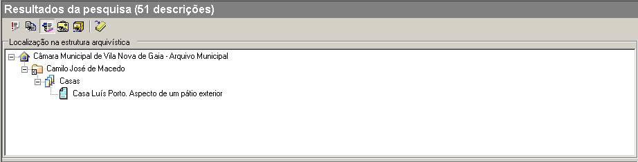
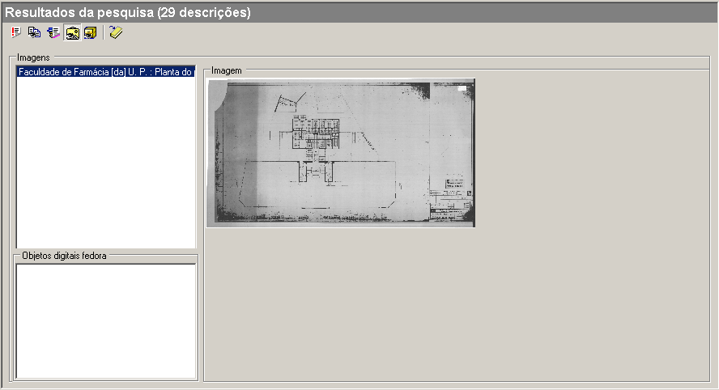
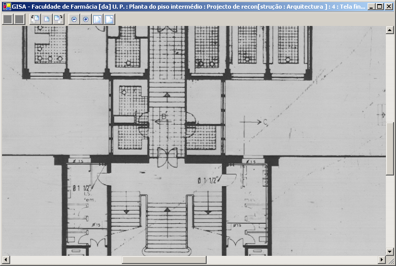
.. |image11| image:: _static/images/ufsassociadaspesquisa.png
   :width: 400px
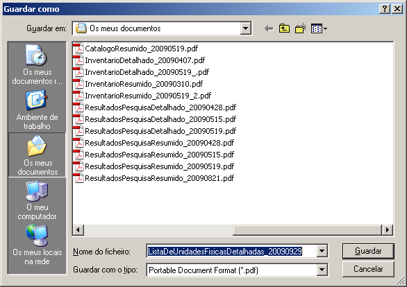
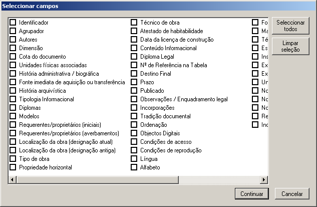

