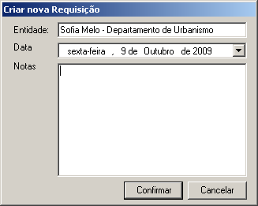
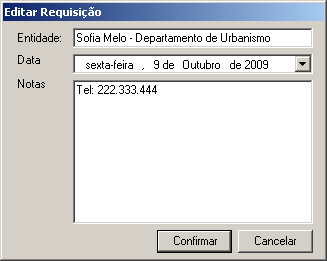
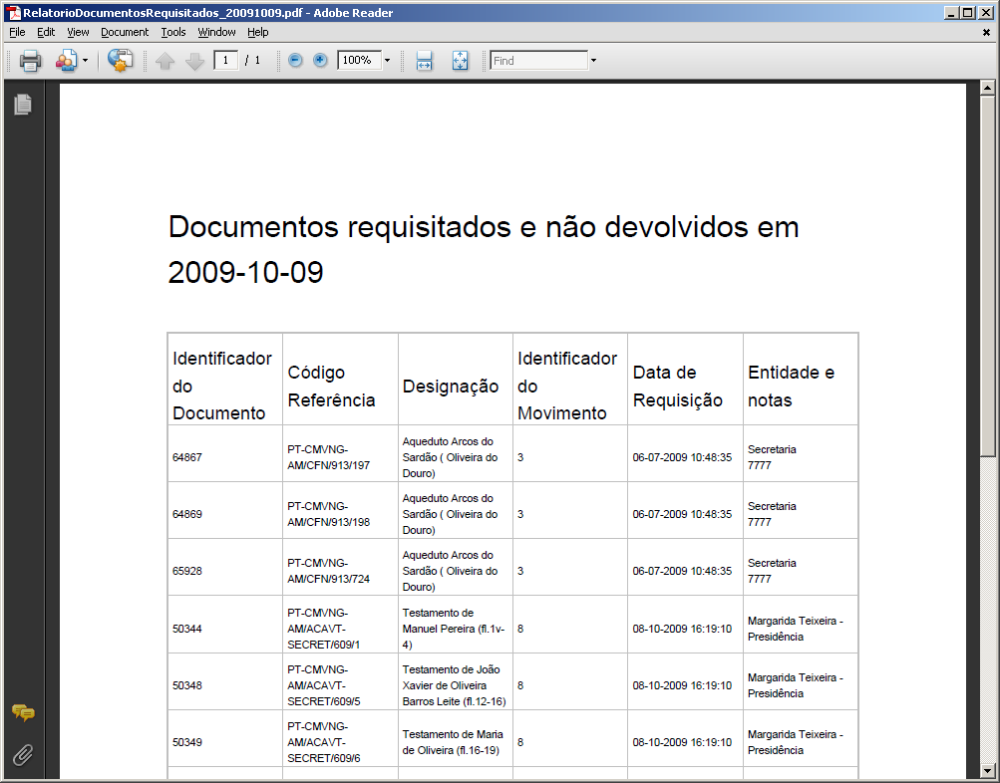
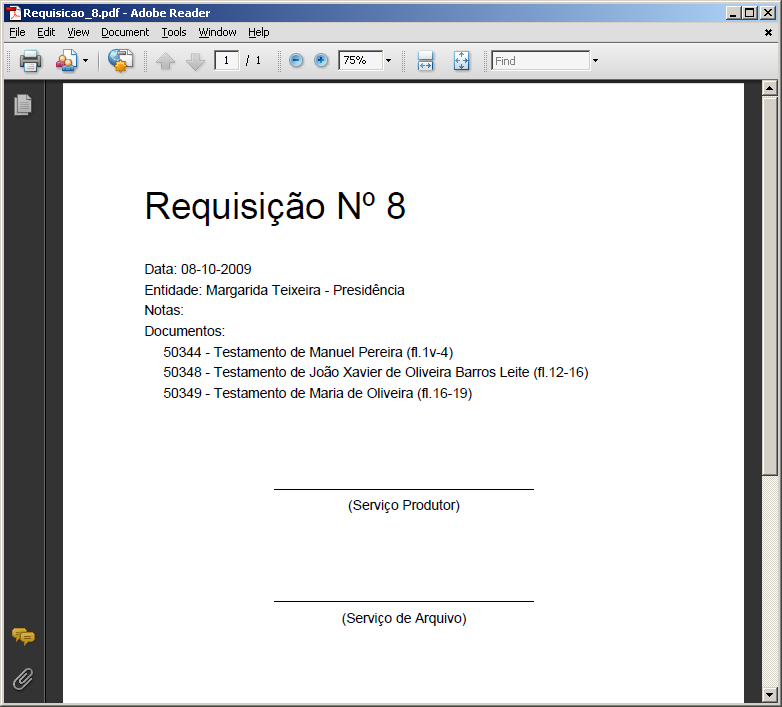

Requisições de documentos
=========================

Pode acontecer que um documento, que está sob a guarda de um Arquivo,
possa ser requisitado por alguma entidade interna ou externa à
instituição, sendo conveniente registar a saída do documento e o
responsável dessa requisição.

O registo de qualquer requisição de documentos é efetuada no módulo
*Requisições* da área *Unidades informacionais*. No sistema, fica
associado a cada documento qual o seu estado, se se encontra em arquivo
ou se está requisitado.

|image0|

A: ``Criar requisição`` - Botão que permite criar uma requisição.

B: ``Editar requisição`` - Botão que permite editar uma requisição.

C: ``Eliminar requisição`` - Botão que permite eliminar uma requisição.

D: ``Filtro`` - Botão que permite filtrar a lista de requisições.

E: ``Imprimir`` - Botão que permite selecionar o tipo de relatório a ser
gerado: movimentos, documentos requisitados ou comprovativo da
requisição selecionada.

F: ``Requisições`` - Lista de todas as requisições criadas apresentando
as seguintes colunas: nº de movimento, data e entidade responsável.

G: ``Apresentar/esconder painel de apoio`` - Botão que apresenta o
painel de navegação para se poder selecionar os documentos a constar na
requisição. O mesmo botão permite esconder o painel de navegação.

H: ``Filtro`` - Botão que permite filtrar a lista dos documentos que
constam na requisição selecionada.

I: ``Documentos requisitados`` - Lista com todos os documentos que
constam na requisição selecionada.

J: ``Apagar item`` - Botão que permite eliminar documentos que constam
na requisição selecionada.

Requisitar documentos
---------------------

Para registar uma requisição, clicar no botão ``Criar requisição``:

|image1|

Introduzir dados relativos à requisição:

-  ``Entidade`` - entidade que passa a ser responsável pelo(s)
   documento(s) requisitado(s).
-  ``Data`` - data da requisição.
-  ``Notas`` - campo onde se coloca por exemplo os contactos ou qualquer
   outra anotação.

Por fim, clicar no botão ``Confirmar`` para confirmar ou ``Cancelar``
para desistir da criação da requisição.

Depois de criada a requisição com um número de movimento gerado pelo
sistema, que identifica inequivocamente a requisição, devem ser
selecionados os documentos a ser requisitados. Assim, clicar no botão
``Apresentar/esconder painel de apoio`` para ser apresentada a estrutura
arquivística para se poder navegar até selecionar o(s) documento(s) a
arrastar para a lista ``Documentos requisitados``. A seleção dos
documentos pode ser múltipla, com a ajuda da tecla ``Shift`` ou
``Ctrl``.

Para apagar algum documento associado à lista
``Documentos requisitados``, é necessário selecioná-lo e clicar no botão
``Apagar item``.

A partir do momento em que um documento é requisitado, deixa de estar
disponível para ser novamente requisitado até que tenha sido devolvido.

Editar requisição
-----------------

Para alterar a entidade, data ou notas de uma requisição, é necessário
primeiro selecionar a requisição na lista de requisições e de seguida
clicar no botão ``Editar``.

|image2|

Eliminar requisição
-------------------

Para eliminar uma requisição, basta selecionar a requisição na lista de
requisições e clicar no botão ``Eliminar``.

Emitir relatórios
-----------------

Todos os movimentos
~~~~~~~~~~~~~~~~~~~

É possível gerar, em formato PDF ou RTF, um ficheiro contendo a lista de
todos os movimentos no Arquivo, efetuados dentro de um intervalo de
datas indicado pelo utilizador.

|image3|

São considerados dois tipos de movimento, as requisições e as
devoluções.

|image4|

Documentos requisitados
~~~~~~~~~~~~~~~~~~~~~~~

É possível gerar, em formato PDF ou RTF, um ficheiro contendo a lista de
todos os documentos requisitados e que ainda não tenham sido devolvidos
nesse momento.

|image5|

Este relatório indica sempre a data pois o seu resultado vai variando ao
longo do tempo.

Comprovativo da requisição
~~~~~~~~~~~~~~~~~~~~~~~~~~

É possível gerar, em formato PDF ou RTF, um ficheiro contendo todos os
dados relativos à requisição que está selecionada: número da requisição,
data, entidade requerente, algumas possíveis notas e os documentos
requisitados.

|image6|

.. |image0| image:: _static/images/requisicoes.jpg
   :width: 400px

.. |image3| image:: _static/images/intervalodatas.png
   :width: 150px
.. |image4| image:: _static/images/movimentos.png
   :width: 400px

