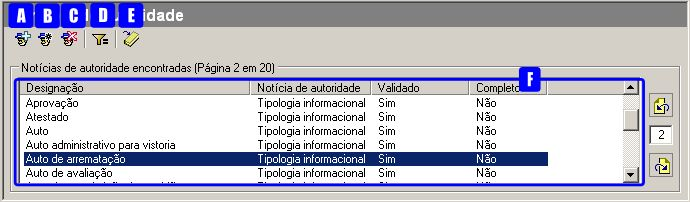
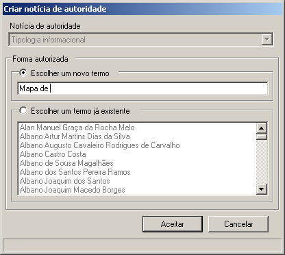
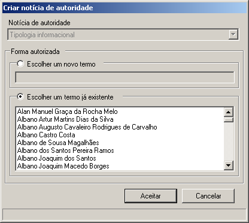
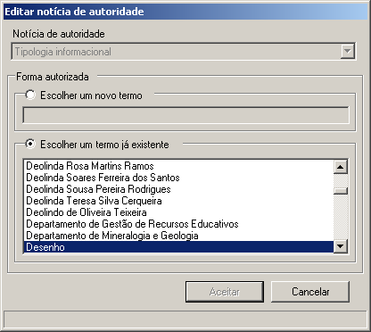
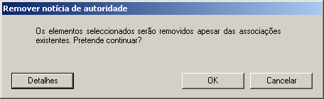
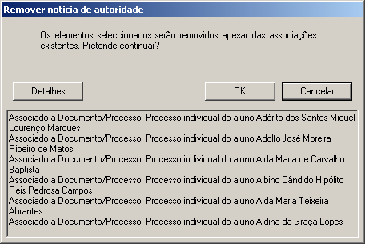
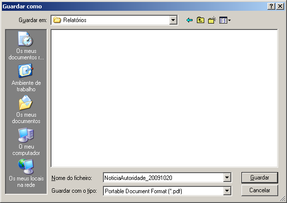
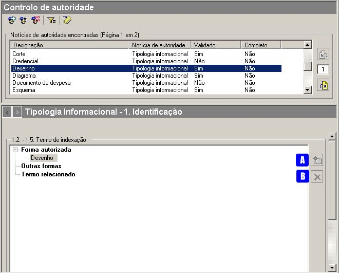
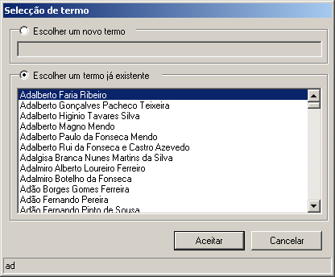
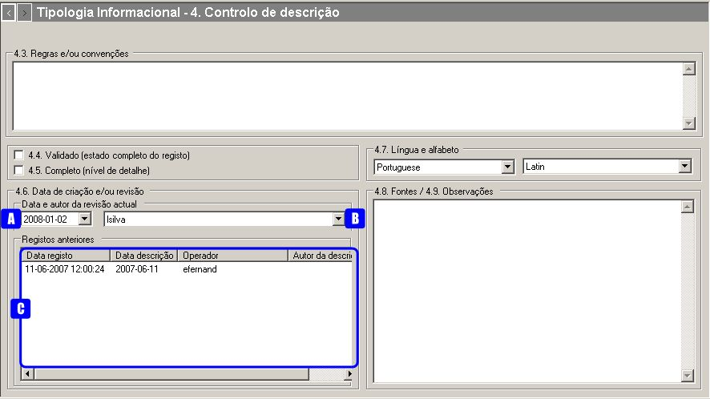

Tipologias informacionais
=========================

A gestão das tipologias informacionais é feita no módulo de **Controlo
de Autoridade**. A área de contexto tem o seguinte aspeto:

|image0|

A: ``Novo termo de autoridade`` - Criar uma nova tipologia
informacional.

B: ``Editar controlo de autoridade`` - Alterar a forma autorizada da
tipologia informacional selecionada na lista.

C: ``Apagar controlo de autoridade`` - Apagar a tipologia informacional
selecionada na lista.

D: ``Filtrar dados`` - Ativar ou desativar a área de filtragem,
permitindo a restrição do número de registos a visualizar. Os registos
de autoridade a visualizar podem ser filtrados por: ``Designação``,
``Notícia de autoridade`` e ``Validado``.

E: ``Gerar relatório`` - Gera PDF ou RTF com a lista das tipologias
informacionais apresentadas, incluindo todos os registos ou parte,
quando filtrada.

F: ``Área de seleção do contexto`` - Lista todas as formas, autorizadas
e não autorizadas, das tipologias informacionais. Os termos que estão em
*itálico* são as formas não autorizadas.

Criação de uma tipologia informacional
--------------------------------------

Para criar uma tipologia informacional usa-se o botão
``Novo termo de autoridade``.

|image1|

A criação de uma tipologia informacional implica o preenchimento
obrigatório da sua forma autorizada com um termo.

**Forma autorizada**

Ao criar um registo de autoridade, pode introduzir-se um *termo novo* ou
escolher um *termo já existente* na lista de termos, como forma
autorizada. A lista de termos é uma lista com todos os termos usados
como formas autorizadas ou não autorizadas nas diferentes notícias de
autoridade. A partir do momento que deixem de ser usados, estes
desaparecem da lista.

|image2|

Ao selecionar ``Escolher um novo termo`` deve ser digitado um termo que
não conste na lista. Ao clicar no botão ``Aceitar`` o termo será
adicionado à lista. Se o botão ``Aceitar`` não estiver ativo é porque o
termo introduzido já consta na lista e aí ter-se-á de selecionar
``Escolher um termo já existente``.

|image3|

Para escolher um termo já existente na lista de termos, seleciona-se a
opção ``Escolher um termo já existente``, que apresenta uma lista com
todos os termos existentes, exceto os que constituem forma autorizada de
outros registos com o mesmo tipo de notícia. Pode digitar-se o início do
termo para este ser localizado rapidamente na lista, sendo apresentado
na barra de rodapé (ver exemplo em cima), o que se for digitando. Depois
de selecionar o termo, clica-se no botão ``Aceitar`` e o novo registo de
autoridade é acrescentado à lista de conteúdos.

Para se criar um termo novo baseado num já existente, seleciona-se a
opção ``Escolher um termo já existente``, escolhe-se o termo desejado e
volta-se a clicar em ``Escolher um novo termo``, passando a ser possível
escrever um novo termo tendo como base o já existente. O botão
``Aceitar`` só fica ativo quando o termo digitado não existir na lista.

Edição de uma tipologia informacional
-------------------------------------

A edição da designação do termo autorizado de uma tipologia
informacional é através do botão ``Editar notícia de autoridade`` depois
de selecionada a sua forma autorizada na
``Área de seleção do contexto``. O botão de edição só fica ativo quando
se seleciona uma forma autorizada (ou seja, não deve estar em itálico).
A janela de edição é a seguinte:

|image4|

Para alterar a forma autorizada, deve escolher-se um outro termo da
lista ou selecionar-se ``Escolher um novo termo`` para o poder alterar.
O procedimento é idêntico ao da criação de um registo de autoridade.

Remoção de uma tipologia informacional
--------------------------------------

Para remover uma tipologia informacional, deve selecionar-se na
``Área de seleção do contexto`` a sua forma autorizada e clicar no botão
``Apagar controlo de autoridade`` ou pressionar a tecla ``DEL``. Tal
como na edição, o botão de remoção só fica ativo quando se seleciona uma
forma autorizada (ou seja, não deve estar em itálico).

Quando se apaga uma tipologia informacional associada a alguma unidade
de descrição, o GISA confirma com o utilizador se este deseja prosseguir
e eliminar também essa(s) associação(ões).

Para remover um registo de autoridade, deve selecionar-se na
``Área de seleção do contexto`` a sua forma autorizada e clicar no botão
``Apagar controlo de autoridade``. Tal como na edição, o botão de
remoção só fica ativo quando se seleciona uma forma autorizada (ou seja,
não deve estar em itálico).

Quando se apaga uma tipologia informacional associado a alguma numa
unidade de descrição, o GISA confirma com o utilizador se este deseja
prosseguir e eliminar também essa(s) associação(ões).

|image5|

O botão ``Detalhes`` mostra as unidades de descrição que referem o
registo de autoridade a ser removido.

|image6|

Ao clicar no botão ``OK``, o registo de autoridade será removido assim
como todas as referências com ele estabelecidas.

Filtragem de tipologias informacionais
--------------------------------------

A lista de tipologias informacionais pode ser filtrada pelos seguintes
campos:

-  ``Designação`` - os termos que aparecem na lista, na sua forma
   autorizada ou não, devem obedecer à expressão introduzida neste
   campo.

\* ``Notícia de autoridade`` - Este campo não é usado pois a lista de
registos já está a ser filtrada por registos do tipo *Tipologia
informacional*.

-  ``Validado``, permitindo visualizar todos os registos de autoridade
   quando a caixa de verificação tem fundo cinza e um visto, ou só
   visualizar os registos de autoridade validados quando a caixa de
   verificação tem fundo branco e um visto, ou então, visualizar os
   registos de autoridade não validados, em que a caixa de verificação
   tem fundo branco e não tem visto.

Para mais detalhe consultar
`Filtros <ambiente_trabalho.html#filtros>`__.

Geração de relatório de tipologias informacionais
-------------------------------------------------

Através do botão ``Gerar relatório`` da barra de ferramentas é possível
gerar um ficheiro do tipo PDF ou RTF com a lista de todos os registos de
autoridade desta área.

|image7|

Nesta janela selecionar a localização, o nome e o tipo de ficheiro a
gerar. Por fim clica-se no botão ``Guardar`` para gerar o ficheiro ou no
botão ``Cancelar`` para desistir.

Detalhes de uma Tipologia Informacional
---------------------------------------

A área de detalhes destinada à descrição de uma *Tipologia
Informacional* tem diferentes zonas de informação que podem ser
preenchidas:

`1. Identificação <tipologia_informacional.html#identificacao>`__

`4. Controlo de
descrição <tipologia_informacional.html#controlo-de-descricao>`__

Identificação
~~~~~~~~~~~~~

A janela ilustra a zona de identificação de um registo de autoridade do
tipo *Tipologia Informacional*:

|image8|

A: ``Adicionar item`` - Permite adicionar formas não autorizadas ao
termo de indexação e estabelecer relações com outros termos. O botão
encontra-se inibido, enquanto não estiver selecionado nenhum tipo de
forma ou tipo de termo.

B: ``Apagar item`` - Apaga qualquer forma (exceto a autorizada) ou termo
relacionado que esteja selecionado. Em vez deste botão também se pode
utilizar a tecla DEL.

**Termo de indexação**

A ``Forma autorizada`` deve representar de forma unívoca a tipologia
informacional e é estabelecida no momento da sua criação. Para cada
tipologia informacional, podem existir, para além da forma autorizada,
outros termos classificados como ``Outras formas``, os quais também
poderão servir como termos de indexação ou pesquisa.

Dentro do tipo ``Outras formas``, pode ser criado um termo,
selecionando-se esta etiqueta e clicando-se no botão ``Adicionar item``:

|image9|

Nesta janela pode escolher-se uma das seguintes hipóteses:

-  ``Escolher um novo termo`` - Neste caso, digitar o termo e clicar no
   botão ``Aceitar``. O botão ``Aceitar`` fica ativo se o termo não
   existir.

\* ``Escolher um termo já existente`` - Para esta opção, digitar o
início do termo a editar para posicionar a lista na zona desejada.
Verificar que ao digitar o texto, este vai aparecendo em rodapé.

Para apagar um termo, basta selecioná-lo e clicar de seguida no botão
``Apagar item``.

No GISA, podem associar-se tipologias indicando que estão de alguma
forma relacionadas, embora em termos conceptuais sejam completamente
diferentes. Podem ser, por exemplo, sequenciais no tempo (pe.
*Requisição* e *Devolução*). Se, por exemplo, se associar ao termo
*Planta* o termo relacionado *Alçado*, automaticamente, o termo *Alçado*
tem como termo relacionado o termo *Planta*.

Esta relação associativa é uma relação bidirecional e para se
estabelecer, deve-se:

-  selecionar uma tipologia informacional na área de contexto,

\* na área de detalhe, selecionar o tipo ``Termo relacionado`` e clicar
no botão ``Adicionar item``, abrindo-se a seguinte janela:

|image10|

-  escolher a tipologia informacional da lista e clicar no botão
   ``Adicionar``.

Controlo de descrição
~~~~~~~~~~~~~~~~~~~~~

|image11|

A: ``Data da revisão atual`` - Botão que permite abrir o calendário para
selecionar a data de descrição, que pode não coincidir com a data de
registo.

B: ``Autor da revisão atual`` - Botão que permite abrir a lista dos
autores para selecionar o autor da descrição.

C: ``Registos anteriores`` - Sempre que se efetua um registo aparece
automaticamente uma linha nova na lista com as colunas:
``Data de registo``, ``Data de descrição``, ``Operador`` e
``Autor da descrição``.

**Regras e/ou convenções**

Este campo serve para identificar as regras e/ou convenções aplicadas na
criação do registo de autoridade.

**Validado**

Esta caixa de verificação, quando assinalada, indica que a descrição do
registo de autoridade está finalizado e revisto.

**Completo**

Esta caixa de verificação indica o nível de detalhe, que será elevado
quando ela estiver assinalada.

**Data de criação e/ou revisão**

Sempre que for criado ou alterado um registo de autoridade deve
indicar-se a data em que foi feita a descrição e o autor dessa
descrição. Por omissão, a data e hora assumidas são as do computador e o
autor é o pré-definido no GISA, existente na barra de estado. Caso sejam
diferentes, deve introduzir-se outra data através de um calendário e
outro autor, escolhendo da lista de autores existentes (usando os botões
``Data da revisão atual`` e ``Autor da revisão atual``).

Sempre que for criado ou alterado um registo de autoridade, na lista
``Registos anteriores`` aparece uma linha com as seguintes colunas:

-  ``Data de registo``, a data em que foi efetuada a criação ou
   alteração da Entidade Produtora.
-  ``Data de descrição``, data introduzida no campo anterior referente à
   data em que foi feita a descrição (pode ser anterior à
   ``Data de regist``\ o).
-  ``Operador``, responsável pela introdução/alteração dos dados (no
   caso da versão monoposto não existe operador).
-  ``Autor da descrição``, responsável pela descrição existente, que
   pode ser diferente do operador.

**Língua e alfabeto**

Serve para indicar a língua e o alfabeto utilizados.

**Fontes/Observações**

Neste campo indica-se como foi criado o registo de autoridade, incluindo
as fontes consultadas para a sua criação e outras notas importantes à
manutenção do registo.

.. |image10| image:: _static/images/termorelacionado.png
   :width: 400px

