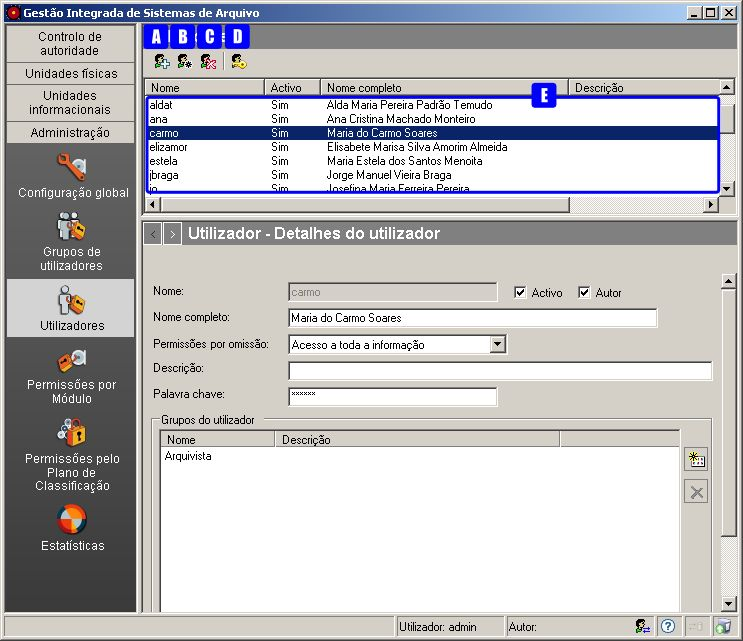
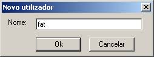
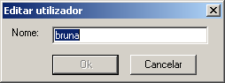
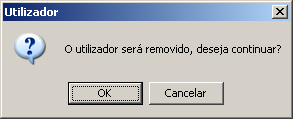
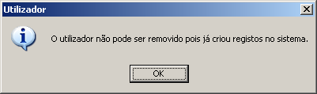
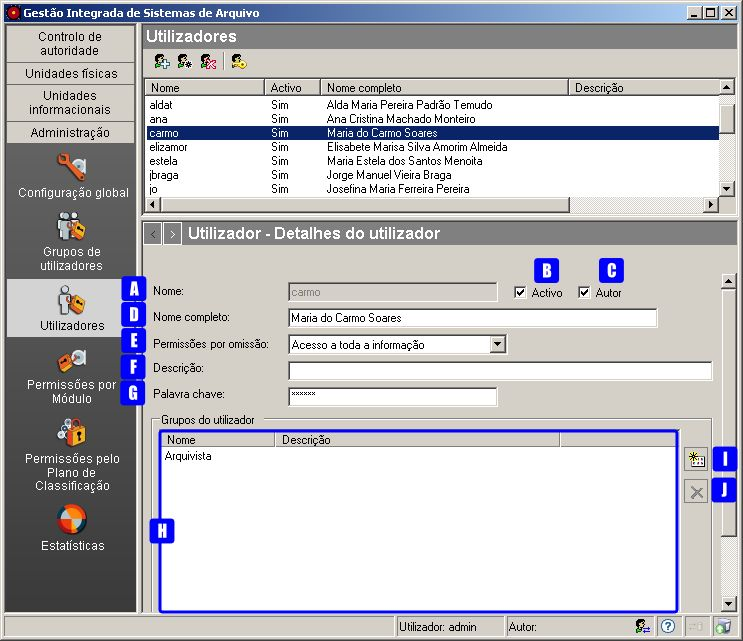
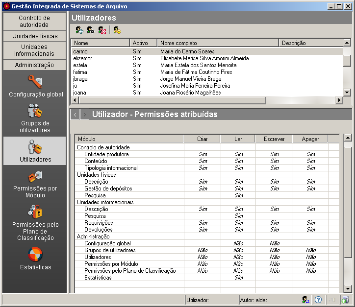

Utilizadores
============

A gestão de utilizadores é feita no módulo *Utilizadores* da
*Administração*.

Na área de contexto desta janela é mostrada a lista de utilizadores
existentes e é possível criar, editar e apagar utilizadores através dos
botões existentes na barra de ferramentas:

|image0|

A: ``Novo utilizador`` - Botão para criar um utilizador novo.

B: ``Editar utilizador`` - Botão para editar o nome de um utilizador.

C: ``Apagar utilizador`` - Botão para apagar o nome de um utilizador.

D: ``Alterar palavra chave de administração`` - Botão que permite
alterar a palavra passe do administrador, isto é, do utilizador
pré-definido no sistema com permissões totais. O nome deste utilizador é
*admin* e tem uma palavra-chave prédefinida, a qual se aconselha que
seja alterada de imediato e memorizada. Este botão só se encontra
disponível se a sessão for iniciada por esse utilizador.

E: ``Lista de utilizadores`` - Lista de utilizadores existentes no
sistema.

Criar utilizador
----------------

Para criar um utilizador, clica-se no botão ``Novo utilizador``,
aparecendo a seguinte janela:

|image1|

Introduzir um nome sem espaços e clicar no botão ``Ok``. Caso o botão
``Ok`` não fique ativo, é porque já existe algum grupo de utilizadores
ou utilizador com o mesmo nome.

Editar nome de utilizador
-------------------------

Para editar o nome de um utilizador, seleciona-se esse utilizador da
``Lista de utilizadores`` e clica-se no botão ``Editar utilizador``:

|image2|

Altera-se o nome e clica-se no botão ``Ok`` para assumir o novo ou
``Cancelar`` para desistir. Caso o botão ``Ok`` não fique ativo, é
porque já existe algum grupo de utilizadores ou utilizador com o mesmo
nome.

Tem de se ter em conta que, se já existirem registos no sistema com esse
utilizador, esses registos passarão a referir o novo nome. Numa situação
destas, a aplicação avisa antes da edição apresentando a seguinte
janela:

|image3|

Remover utilizador
------------------

Para remover um utilizador, seleciona-se o utilizador da
``Lista de utilizadores`` e clica-se no botão ``Apagar utilizador``. Tem
de se ter em conta que não é possível remover um utilizador que já
efetuou registos no sistema. Se o utilizador não efetuou qualquer
registo, é apresentada a seguinte janela:

|image4|

Clica-se no botão Ok para remover ou Cancelar para desistir.

Se o utilizador já tiver registos no sistema, é apresentado o seguinte
aviso e não é permitida a remoção:

|image5|

Editar detalhes de um utilizador
--------------------------------

Ao selecionar um utilizador na área de contexto, é possível editar os
dados a ele associados na área de detalhes.

|image6|

A: ``Nome`` - Campo de visualização do nome do utilizador, atribuído no
momento da criação. Para alterar o nome deve usar-se o botão
``Editar utilizador`` existente na barra de ferramentas.

B: ``Ativo`` - Caixa de verificação que indica se o referido utilizador
está ou não ativo. Quando alguém deixa de ser utilizador do GISA, mas já
efetuou registos, deve deixar de constar da lista de utilizadores
ativos.

C: ``Autor`` - Caixa de verificação que indica se o referido utilizador
também é autor de descrições ou não. Todos os utilizadores que tiverem
um visto nesta caixa de verificação, aparecerão na lista do campo
``Autor da revisão atual`` de todas as zonas de
``Controlo de descrição`` existentes na aplicação.

D: ``Nome completo`` - Campo onde se deve preencher o nome completo do
utilizador.

E: ``Permissões por omissão`` - Podem definir-se logo à partida as
permissões de acesso aos níveis da estrutura arquivística. Existem duas
opções:

-  ``Acesso a toda a informação`` - todos os níveis ficam com permissões
   totais, ou seja, todas as operações sobre os níveis assumem
   inicialmente o valor ***Sim***.
-  ``Acesso apenas a informação publicada`` - todos os níveis publicados
   ficam com permissões de leitura e o restantes níveis sem permissões.
   Ou seja, apenas a operação ``Ler`` dos níveis publicados assume o
   valor ***Sim***, pois todas as outras operações destes níveis e todas
   as operações dos restantes níveis assumem o valor ***Não***.

F: ``Descrição`` - Neste campo pode introduzir-se uma descrição que
caracterize o utilizador selecionado.

G: ``Palavra chave`` - Palavra chave necessária para que o utilizador
possa entrar na aplicação.

H: ``Grupos do utilizador`` - Lista de todos os grupos de utilizadores
aos quais o utilizador selecionado pertence. Esta lista pode ser
alterada, através dos botões existentes no lado direito (I e J).

I: ``Adicionar item`` - Botão que permite associar grupos de
utilizadores ao utilizador que está selecionado.

J: ``Apagar item`` - Botão que permite retirar a associação do grupo de
utilizadores selecionado ao utilizador em causa.

As permissões dos utilizadores, sobre os módulos ou sobre os níveis de
descrição, podem depender das permissões dos grupos aos quais pertencem.
As regras de cálculo são apresentadas na página\ `Cálculo de
permissões <permissoes_calculo.html>`__.

Permissões por módulo de um utilizador
--------------------------------------

Para editar permissões de um utilizador nos diferentes módulos do GISA,
selecionar na área de contexto o utilizador desejado e escolher o painel
de ``Utilizador - Permissões atribuídas`` através dos botões de
navegação:

|image7|

Quando se cria um utilizador novo, este não possui qualquer tipo de
acesso aos módulos, ou seja, por omissão, as operações sobre os módulos
assumem o valor ***Não***. Pode atribuir-se **Sim** explícito às
permissões e posteriormente, a qualquer momento, voltar a retirar com
**Não** explícito ou repor o `valor por
omissão <permissoes_omissao.html#grupos-ou-utilizadores-novos>`__ ou
outro valor implícito, resultado de `cálculo de
permissões <permissoes_calculo.html>`__.

Na área de detalhes deste painel, é possível definir, para cada módulo,
permissões do utilizador sobre as operações que este pode executar:
``Criar``, ``Ler``, ``Escrever`` e ``Apagar``.

Para se definir uma permissão, seleciona-se a linha do módulo e na
coluna correspondente à operação clica-se até se obter o valor
pretendido: **Não**, **Sim** ou ***Não***.

O módulo `Permissões por Módulo <permissoes_modulo.html>`__ também
permite definir as permissões dos utilizadores ou grupos sobre os
módulos, a partir de um determinado módulo.

.. |image3| image:: _static/images/editarutilizadoraviso.png
   :width: 300px

